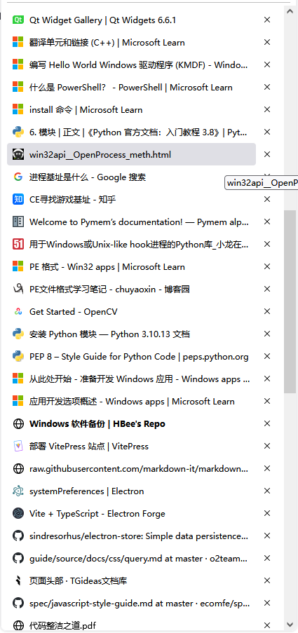

# Windows 软件备份

## 保留在 D 盘

- Game
  - [ ] dark star
  - [ ] CS 1.5
  - [ ] 英雄无敌 4
  - [ ] kk 对战平台
  - [ ] NightofRevenge
  - [ ] parasite_in_city
  - [ ] 大富翁 6
  - [ ] 魔兽 3
  - [ ] 梦想世界 3
  - [ ] DNF
  - [ ] Steam
  - [ ] 暴雪战网
- IM
  - [ ] QQ
  - [ ] WeChat
  - [ ] DingDing
  - [ ] 企业微信
- Collaborative
  - [ ] WPS Office —— 需要保留的文档用这个同步
  - [ ] 向日葵远程桌面
- [ ] Privacy
- [ ] 搜狗输入法
- [ ] Firefox

### Edge 标签页

### Firefox 标签页

## 转移到 C 盘

所有 IT 相关的都转移到 C 盘。

- [ ] code
- hardware
  - [ ] aida64extreme_build_5157_xbnj9z3mdy
  - [ ] cpu-z_1.93-cn
  - [ ] CrystalDiskMark7_0_0hShizuku
- [ ] VSCode
- network
  - [ ] tracetcp
  - [ ] tcping64
  - [ ] bestTrace
  - [ ] Clash for Windows —— 配置文件在用户目录下 `.config`
  - [ ] Postman
  - [ ] Fiddler Everywhere
- 开发环境
  - C++
    - [ ] Visual Studio 生成工具
    - [ ] CMake
    - [ ] Qt
  - JS
    - [ ] pnpm
    - [ ] nodejs —— 用 pnpm 管理，不使用 nvm
  - [ ] 小程序
  - [ ] Docker
- [ ] Git
- 逆向
  - [ ] cheat-engine-7.5
  - [ ] x96dbg
- windows-tools
  - [ ] ProcessMonitor

::: warning
请注意：所有软件配置文件都在用户目录下，清理硬盘的时候需要注意备份。
:::

## 如果可能的话，虚拟机单独一个盘
