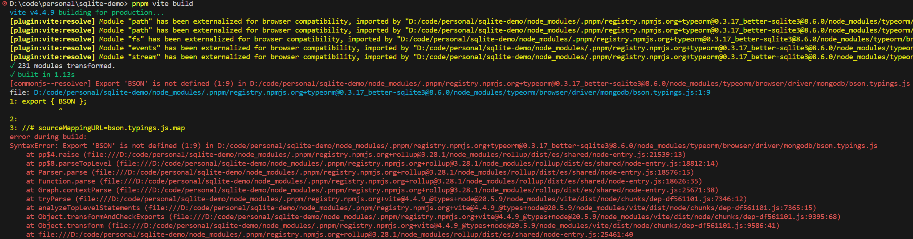
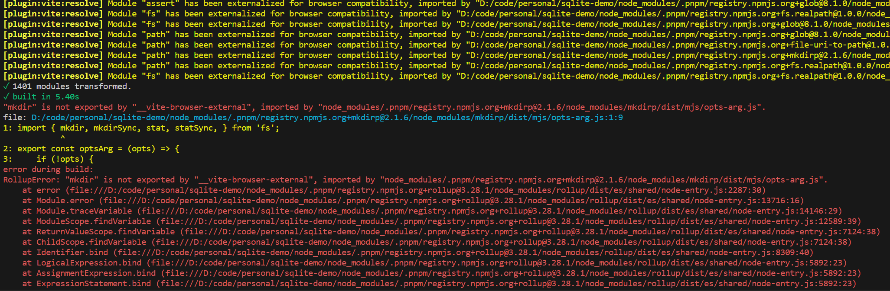
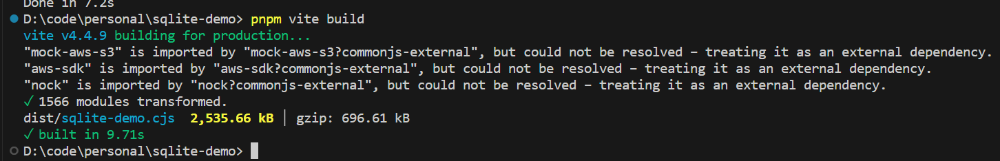

# 使用 Vite 遇到的坑

## TypeORM and sqlite3

`vite` 打包使用 `typeorm` 与 `sqlite3` 的应用时，遇到了以下错误：



源码：

```ts
import 'reflect-metadata'
import { DataSource } from 'typeorm'

export const dataSource = new DataSource({
  type: 'better-sqlite3',
  database: './demo.db',
  enableWAL: true,
})

dataSource.initialize()
```

`vite` 的配置如下：

```ts
import { defineConfig } from 'vite'
import { resolve } from 'node:path'

export default defineConfig({
  build: {
    lib: {
      entry: resolve(__dirname, 'index.ts'),
      formats: ['cjs'],
    },
  },
  resolve: {
    // Some libs that can run in both Web and Node.js, such as `axios`, we need to tell Vite to build them in Node.js.
    browserField: false,
    mainFields: ['module', 'jsnext:main', 'jsnext'],
  },
})
```

`typeorm` 的 `package.json` 部分内容：

```json
{
  "name": "typeorm",
  "private": false,
  "version": "0.3.17",
  "description": "Data-Mapper ORM for TypeScript, ES7, ES6, ES5. Supports MySQL, PostgreSQL, MariaDB, SQLite, MS SQL Server, Oracle, MongoDB databases.",
  "license": "MIT",
  "readmeFilename": "README.md",
  "author": {
    "name": "Umed Khudoiberdiev",
    "email": "pleerock.me@gmail.com"
  },
  "engines": {
    "node": ">= 12.9.0"
  },
  "exports": {
    ".": {
      "types": "./index.d.ts",
      "node": {
        "import": "./index.mjs",
        "require": "./index.js",
        "types": "./index.d.ts"
      },
      "browser": {
        "require": "./index.js",
        "import": "./browser/index.js",
        "default": "./index.js"
      }
    },
    "./browser": {
      "types": "./index.d.ts",
      "default": "./browser/index.js"
    },
    "./*.js": "./*.js",
    "./*": {
      "require": "./*.js",
      "import": "./*"
    }
  },
  "main": "./index.js",
  "module": "./index.mjs",
  "types": "./index.d.ts",
  "browser": {
    "./browser/connection/ConnectionOptionsReader.js": "./browser/platform/BrowserConnectionOptionsReaderDummy.js",
    "./browser/connection/options-reader/ConnectionOptionsXmlReader.js": "./browser/platform/BrowserConnectionOptionsReaderDummy.js",
    "./browser/connection/options-reader/ConnectionOptionsYmlReader.js": "./browser/platform/BrowserConnectionOptionsReaderDummy.js",
    "./browser/driver/aurora-data-api/AuroraDataApiDriver.js": "./browser/platform/BrowserDisabledDriversDummy.js",
    "./browser/driver/better-sqlite3/BetterSqlite3Driver.js": "./browser/platform/BrowserDisabledDriversDummy.js",
    "./browser/driver/cockroachdb/CockroachDriver.js": "./browser/platform/BrowserDisabledDriversDummy.js",
    "./browser/driver/mongodb/MongoDriver.js": "./browser/platform/BrowserDisabledDriversDummy.js",
    "./browser/driver/mongodb/MongoQueryRunner.js": "./browser/platform/BrowserDisabledDriversDummy.js",
    "./browser/driver/mongodb/typings.js": "./browser/platform/BrowserDisabledDriversDummy.js",
    "./browser/driver/mongodb/bson.typings.js": "./browser/platform/BrowserDisabledDriversDummy.js",
    "./browser/driver/mysql/MysqlDriver.js": "./browser/platform/BrowserDisabledDriversDummy.js",
    "./browser/driver/oracle/OracleDriver.js": "./browser/platform/BrowserDisabledDriversDummy.js",
    "./browser/driver/postgres/PostgresDriver.js": "./browser/platform/BrowserDisabledDriversDummy.js",
    "./browser/driver/sap/SapDriver.js": "./browser/platform/BrowserDisabledDriversDummy.js",
    "./browser/driver/sqlite/SqliteDriver.js": "./browser/platform/BrowserDisabledDriversDummy.js",
    "./browser/driver/sqlserver/SqlServerDriver.js": "./browser/platform/BrowserDisabledDriversDummy.js",
    "./browser/entity-manager/MongoEntityManager.js": "./browser/platform/BrowserDisabledDriversDummy.js",
    "./browser/logger/FileLogger.js": "./browser/platform/BrowserFileLoggerDummy.js",
    "./browser/platform/PlatformTools.js": "./browser/platform/BrowserPlatformTools.js",
    "./browser/repository/MongoRepository.js": "./browser/platform/BrowserDisabledDriversDummy.js",
    "./browser/util/DirectoryExportedClassesLoader.js": "./browser/platform/BrowserDirectoryExportedClassesLoader.js",
    "./index.js": "./browser/index.js",
    "./index.mjs": "./browser/index.js"
  }
}
```

从报错信息来看，`vite` 引用了 `typeorm` 用于浏览器环境的文件从而导致报错。这是因为 `vite` 优先使用情景导出，也即 `exports` 字段。而且 `vite` 默认允许的情景是：`import`、`module`、`browser`、`default`，所以这里 `vite` 使用的是以下入口：

```json{15,23,25}
{
  "name": "typeorm",
  "private": false,
  "version": "0.3.17",
  "description": "Data-Mapper ORM for TypeScript, ES7, ES6, ES5. Supports MySQL, PostgreSQL, MariaDB, SQLite, MS SQL Server, Oracle, MongoDB databases.",
  "license": "MIT",
  "readmeFilename": "README.md",
  "author": {
    "name": "Umed Khudoiberdiev",
    "email": "pleerock.me@gmail.com"
  },
  "engines": {
    "node": ">= 12.9.0"
  },
  "exports": {
    ".": {
      "types": "./index.d.ts",
      "node": {
        "import": "./index.mjs",
        "require": "./index.js",
        "types": "./index.d.ts"
      },
      "browser": {
        "require": "./index.js",
        "import": "./browser/index.js",
        "default": "./index.js"
      }
    },
    "./browser": {
      "types": "./index.d.ts",
      "default": "./browser/index.js"
    },
    "./*.js": "./*.js",
    "./*": {
      "require": "./*.js",
      "import": "./*"
    }
  }
}
```

解决办法是修改 `vite` 配置如下：

```ts
import { defineConfig } from 'vite'
import { resolve } from 'node:path'

export default defineConfig({
  build: {
    lib: {
      entry: resolve(__dirname, 'index.ts'),
      formats: ['cjs'],
    },
  },
  resolve: {
    // Some libs that can run in both Web and Node.js, such as `axios`, we need to tell Vite to build them in Node.js.
    browserField: false,
    mainFields: ['module', 'jsnext:main', 'jsnext'],
    conditions: ['import', 'module', 'node', 'default'], // [!code ++]
  },
})
```

此时，我们重新打包一次，发现出现了一大堆警告，并且出现了新的报错：



这是因为 `vite` 默认是打包用于浏览器的代码的。当你在浏览器中使用 `node` 内置模块时，`vite` 就会输出警告，因为 `vite` 不会自动 polyfill `node` 内置模块。不过，这里我们要打包的是 `node` 应用，不需要 polyfill，所以我们可以通过外部化依赖解决这个问题。

修改 `vite` 配置如下：

```ts
import { defineConfig } from 'vite'
import { resolve } from 'node:path'
import { isBuiltin } from 'node:module' // [!code ++]

export default defineConfig({
  build: {
    lib: {
      entry: resolve(__dirname, 'index.ts'),
      formats: ['cjs'],
    },
    rollupOptions: { external: (id) => isBuiltin(id) }, // [!code ++]
  },
  resolve: {
    // Some libs that can run in both Web and Node.js, such as `axios`, we need to tell Vite to build them in Node.js.
    browserField: false,
    mainFields: ['module', 'jsnext:main', 'jsnext'],
    conditions: ['import', 'module', 'node', 'default'],
  },
})
```

让我们再尝试打包，此时能够正常打包了，但 `vite` 仍然输出了一些提示：



这些提示是来源于 `sqlite3` 的，目前还不清楚原因，解决办法是使用 `better-sqlite3` 替代 `sqlite3` 或外部化 `sqlite3`。

但是问题还没结束，尝试运行打包后的文件会报错：`ReferenceError: Cannot access 'TypeORM' before initialization`。原因暂不清楚，解决办法是外部化 `typeorm`。还需要注意一点，由于我们外部化了 `typeorm`，而且打包之后的文件是 js 文件，在使用 `typeorm` 的 `Column` 修饰器时需要显式指定列的类型，否则会报错：

> ColumnTypeUndefinedError: Column type for PasswordRecord#target is not defined and cannot be guessed. Make sure you have turned on an "emitDecoratorMetadata": true option in tsconfig.json. Also make sure you have imported "reflect-metadata" on top of the main entry file in your application (before any entity imported).If you are using JavaScript instead of TypeScript you must explicitly provide a column type.

解决完这些问题之后，我们应该就能正常打包以及运行应用了。

## TypeORM migrations

使用 `dataSource.runMigrations()` 运行迁移时报错：`TypeORMError: JS migration name is wrong. Migration class name should have a JavaScript timestamp appended.`。

::: tip 解决办法
设置迁移类的 `name` 属性值后置时间戳。如果你是用 typeorm cli 生成的迁移类，那你只需把类名作为 `name` 的值。
:::

::: details 原因
`typeorm` 需要迁移的名称后置时间戳，默认情况下，迁移类的 `name` 会使用类名。如果你是通过 typeorm cli 生成的迁移类，那类名已经后置了时间戳。但是 `vite` 在构建的时候默认会最小化混淆代码，从而导致类名改变。
:::

## References

- [resolve-conditions](https://cn.vitejs.dev/config/shared-options.html#resolve-conditions)
- [module-externalized-for-browser-compatibility](https://cn.vitejs.dev/guide/troubleshooting.html#module-externalized-for-browser-compatibility)
