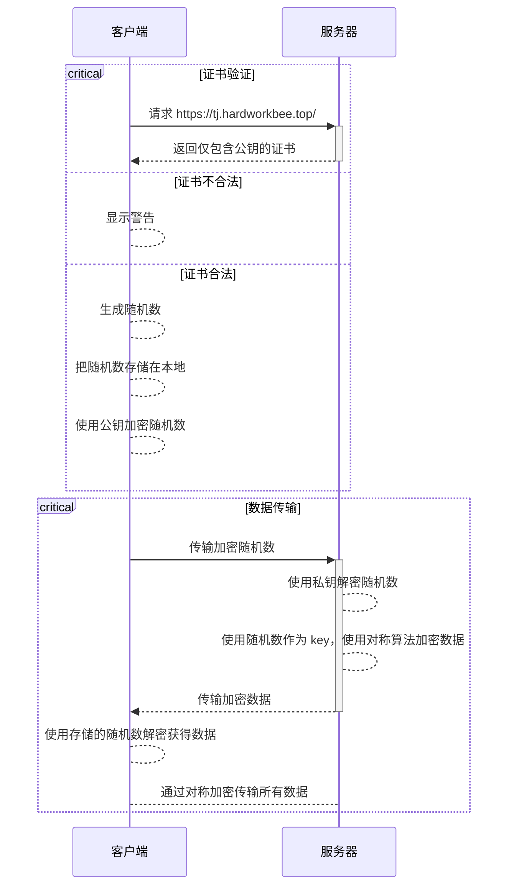

# HTTPS

HTTPS（**超文本传输安全协议**）是 [HTTP](https://developer.mozilla.org/zh-CN/docs/Web/HTTP) 协议的加密版本。它使用 [SSL](https://developer.mozilla.org/zh-CN/docs/Glossary/SSL) 或 [TLS](https://developer.mozilla.org/zh-CN/docs/Glossary/TLS) 加密客户端和服务器所有通信。这使得客户端和服务器可以安全地交换敏感数据。

## 数据传输过程

HTTPS 连接过程可以分为证书验证和数据传输，具体看下图：

## 浏览器如何验证证书合法性

首先我们需要了解一下 CA（Certificate Authority）这个概念。

### CA（Certificate Authority）

CA（**数字证书认证机构**）是负责发放和管理 [数字证书](https://zh.wikipedia.org/zh-cn/%E6%95%B0%E5%AD%97%E8%AF%81%E4%B9%A6)（后文简称证书）的权威机构，并作为电子商务交易中受信任的第三方，承担公钥体系中公钥的合法性检验的责任。一般，我们日常使用的证书就是由 CA 发放的。

证书的内容包括：电子签证机关的信息、公钥用户信息、公钥、权威机构的签字和有效期等等。目前，证书的格式和验证方法普遍遵循 [X.509](https://zh.wikipedia.org/zh-cn/X.509) 国际标准。

### 验证步骤

1. 验证证书域名、有效期等信息是否正确
2. 判断证书来源是否合法。每份签发证书都可以根据验证链查找到对应的根证书，操作系统、浏览器会在本地存储 CA 的根证书，利用本地根证书可以对对应 CA 签发的证书完成来源验证
3. 判断证书是否被篡改。需要与 CA 服务器进行校验
4. 判断证书是否已吊销。通过 CRL（Certificate Revocation List 证书注销列表）和 OCSP（Online Certificate Status Protocol 在线证书状态协议）实现，其中 OCSP 可用于第 3 步中以减少与 CA 服务器的交互，提高验证效率

### 自签名证书

实际上，证书并不是只能由 CA 生成，任何人都可以生成证书，也就是**自签名证书（self-signed certificate）**。这种证书使用发行者自己的私钥签署，在加密功能上等同于 CA 签署的证书，但通常并不具备验证网站身份的功能以及可信性。由于这种证书不是来源于 CA，通常浏览器在遇到这种证书时会出现安全提示。虽然可以经过一些设置使得浏览器信任该证书，但是这样做存在遭受中间人攻击的风险。所以，一般只会在测试的时候才使用自签名证书。不过，也有部分自签名证书是公认被信赖的，即根证书，是信任链的起点，会默认被多数客户端信任。

## 如何在我的网站上使用 HTTPS（TODO）

## References

- [HTTPS](https://developer.mozilla.org/zh-CN/docs/Glossary/HTTPS)
- [HTTPS 原理分析](https://blog.leapmie.com/archives/418)
- [浅谈 HTTPS（SSL/TLS）原理 - 简书 (jianshu.com)](https://www.jianshu.com/p/41f7ae43e37b)
- [CA](https://zh.wikipedia.org/zh-cn/%E8%AF%81%E4%B9%A6%E9%A2%81%E5%8F%91%E6%9C%BA%E6%9E%84)
- [自签名证书](https://zh.wikipedia.org/zh-cn/%E8%87%AA%E7%AD%BE%E5%90%8D%E8%AF%81%E4%B9%A6)
- [根证书](https://zh.wikipedia.org/zh-cn/%E6%A0%B9%E8%AF%81%E4%B9%A6)
