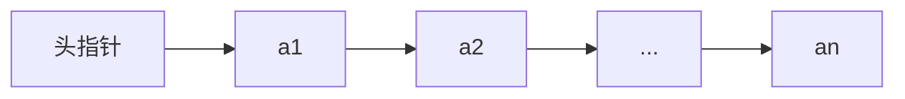
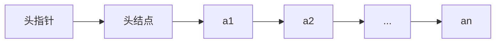
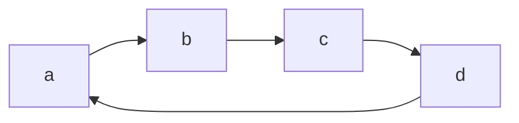
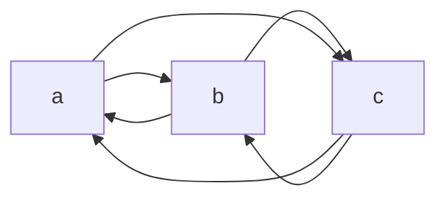

# 线性表

线性表是最基本且最常用的一种线性结构，同时也是其他数据结构的基础。

## 线性表的定义和特点

同一线性表中的元素必定具有相同的特性，即属于同一数据对象，相邻数据元素之间存在序偶关系。

由 $n(n \geqslant 0)$ 个数据特性相同的元素构成的有限序列称为**线性表**。

线性表中元素的个数 $n(n \geqslant 0)$ 定义为线性表的长度，$n=0$ 时称为**空表**。

对于非空的线性表或线性结构，其特点是：

- 存在唯一一个“第一个”的数据元素
- 存在唯一一个“最后一个”的数据元素
- 除第一个之外，结构中的每个数据元素均只有一个前驱
- 除最后一个之外，结构中的每个数据元素均只有一个后继

## 线性表的顺序表示和实现

线性表的顺序表示指的是用一组地址连续的存储单元依次存储线性表的数据元素。通常，称这种存储结构的线性表为**顺序表（Sequential List）**。其特点是，逻辑上相邻的元素，其物理次序也是相邻的。

假设线性表的每个元素占用 $l$ 个存储单元，并以第一个单元的存储地址作为元素存储起始位置。则线性表的第 $i$ 个元素的存储位置为：

$$
\begin{aligned}
LOC(a_i)=LOC(a_1)+(i-1)l
\end{aligned}
$$

由此，只要确定了存储线性表的起始位置，线性表中任一元素都可随机存取，所以线性表的顺序存储结构是一种**随机存储**的存储结构。

由于高级程序设计语言中的数组类型也有随机存储特性，因此，通常使用数组来表示数据结构中的顺序存储结构。

### 顺序表中基本操作实现

#### 初始化

顺序表的初始化操作是构造一个空的顺序表。

```ts
const list = []
```

#### 取值

取值操作是根据指定的位置序号 i，获取顺序表中第 i 个元素的值。由于顺序存储结构具有随机存取的特点，可以直接通过数组下标定位得到。

```ts
list[i]
```

顺序表取值算法的时间复杂度为 $O(1)$。

#### 查找

查找操作是根据指定的元素值 e，查找顺序表中第一个与 e 相等的元素。若查找成功，返回该元素的序号 i，若查找失败，返回 -1。

```ts
list.findIndex((ele) => ele === e)
```

当在顺序表中查找第一个元素时，其时间主要耗费在数据的比较上，而比较的次数取决于被查元素在表中的位置。

在查找时，为确定元素在顺序表中的位置，需和给定值进行比较的元素个数的期望值称为查找算法在查找成功时的**平均查找长度（Average Search Length，ASL）**。

假设 $p_i$ 是查找第 $i$ 个元素的概率，$C_i$ 为找到元素时，已经比较过的元素数量，则在长度为 $n$ 的线性表中，查找成功时的 ASL 为：

$$
ASL=\sum_{i+1}^{n} \ p_iC_i
$$

从顺序表的查找的过程可见，$C_i$ 取决于所查元素在表中的位置。例如，查找表中第一个记录时仅需比较一次；而查找表中最后一个记录时，则需比较 $n$ 次。一般情况下 $C_i$ 等于 $i$。假设每个元素的查找概率相等，即

$$
p_i=1/n
$$

则 ASL 可简化为

$$
ASL=\frac{1}{n} \sum_{i=1}^{n}i=\frac{n+1}{2}
$$

由此可见，顺序表按值查找算法的平均时间复杂度为 $O(n)$。

#### 插入

线性表的插入操作是指在表的第 $i$ 个位置插入一个新的元素 $e$，使长度为 $n$ 的线性表

$$
(a_1,\ldots,a_i-1,a_i,\ldots,a_n)
$$

变为长度为 $n+1$ 的线性表

$$
(a_1,\ldots,a_i-1,e,a_i,\ldots,a_n)
$$

在线性表的顺序存储结构中，由于逻辑上相邻的元素在物理位置上也是相邻的，因此，除非在表尾插入，否则必须移动元素才能反映这个逻辑关系的变化。

```ts
list.splice(i, 0, e)
```

插入元素时，其时间主要耗费在移动元素上，而移动元素的个数取决于插入的位置。

假设 $p_i$ 是在第 $i$ 个元素之前插入一个元素的概率，$E_{ins}$ 为长度为 $n$ 的线性表中插入一个元素时所需移动元素次数的期望值（平均次数），则有

$$
E_{ins}=\sum_{i=1}^{n+1} \ p_i(n-i+1)
$$

假设在线性表的任何位置上插入元素的概率相等，即

$$
p_i=\frac{1}{n+1}
$$

则 $E_{ins}$ 可简化为

$$
E_{ins}=\frac{1}{n+1} \sum_{i=1}^{n+1}(n-i+1)=\frac{n}{2}
$$

由此可见，顺序表插入算法的平均时间复杂度为 $O(n)$。

#### 删除

线性表的删除操作是指将表的第 $i$ 个元素删除，将长度为 $n$ 的线性表

$$
(a_1,\ldots,a_i-1,a_i,a_{i+1},\ldots,a_n)
$$

变为长度为 $n-1$ 的线性表

$$
(a_1,\ldots,a_i-1,a_{i+1},\ldots,a_n)
$$

为了在存储结构上反映这个变化，同样需要移动元素。

```ts
list.splice(i, 1)
```

删除元素时，其时间主要耗费在移动元素上，而移动元素的个数取决于删除位置。

假设 $p_i$ 是删除第 $i$ 个元素的概率，$e_{del}$ 为删除一个元素需要移动元素次数的期望值（平均次数），则有

$$
e_{del}=\sum_{i=1}^{n} \ p_i(n-i)
$$

假设在线性表任何位置删除元素的概率是相等的，即

$$
p_i=\frac{1}{n}
$$

则 $e_{del}$ 可简化为

$$
e_{del}=\frac{1}{n} \sum_{i=1}^{n}(n-i)=\frac{n-1}{2}
$$

由此可见，顺序表删除算法的平均时间复杂度为 $O(n)$。

#### 优势

存取操作时间复杂度是 $O(1)$。

#### 劣势

插入和删除操作有可能需要移动大量元素，平均时间复杂度是 $O(n)$。

## 线性表的链式表示和实现

链式表示指的是用一组任意的存储单元存储线性表的元素（这组存储单元可以是连续或不连续）。因此，为了表示每个元素 $a_i$ 与其直接后继元素 $a_{i+1}$ 之间的逻辑关系，除了存储其本身信息之外，还需存储其直接后继的位置。这两部分信息组成元素 $a_i$ 的存储映像，称为**结点（node）**。它包括两个域：

- **数据域** —— 存储数据元素信息
- **指针域** —— 存储直接后继位置

指针域中存储的信息称作**指针**或**链**。 $n$ 个结点（$a_i(1 \leqslant i \leqslant n)$ 的存储映像）链结成一个**链表**，即为线性表

$$
(a_1,a_2,\ldots,a_n)
$$

的链式存储结构。由于此链表的每个结点中只包含一个指针域，故又称**线性链表**或**单链表**。

根据链表结点所含指针个数、指针指向和指针连接方式，可将链表分为单链表、循环链表、双向链表、二叉链表、十字链表、邻接表、邻接多重表等。其中单链表、循环链表和双向链表用于实现线性表的链式存储结构，其他形式多用于实现树和图等非线性结构。

单链表的存取必须从头指针^[指向链表中第一个结点的指针]开始进行，头指针指示链表中第一个结点（也称首元结点^[链表中存储第一个元素的结点]）的存储位置。



一般情况下，为了处理方便，在单链表的第一个结点之前增加一个结点，称之为**头结点**^[首元结点之前增加的一个结点，其指针域指向首元结点]。



链表增加头结点的作用如下。

- 便于首元结点的处理 —— 增加了头结点后，首元结点的地址保存在头结点的指针域中，则对链表的第一个元素的操作与其它元素相同，无需进行特殊处理
- 便于空表和非空表的统一处理 —— 当链表不设头结点时，头指针指向首元结点，若单链表是空表，头指针为空。增加头结点后，无论链表是否为空，头指针都是指向头结点的非空指针。

单链表是非随机存取的存储结构，要取得第 $i$ 个元素必须从头指针出发顺链进行查找，也称为**顺序存取**的存取结构。

### 单链表基本操作实现

#### 初始化

单链表的初始化操作就是构造一个空表。

<<< ./list.ts#init

#### 取值

根据结点位置 $index$，从首元结点顺着链域 next 逐个结点向下访问。

<<< ./list.ts#get

假设每个位置上元素取值概率相等，即

$$
p_i=1/n
$$

则

$$
ASL=\frac{1}{n} \sum_{i=1}^{n}(i-1)=\frac{n-1}{2}
$$

可见，单链表取值算法的平均时间复杂度为 $O(n)$。

#### 查找

从首元结点出发，依次将结点值和给定值 e 进行比较，返回查找结果。

<<< ./list.ts#find

该算法的执行时间与顺序表的查找类似，其平均时间复杂度为 $O(n)$。

#### 插入

假设在单链表元素 a 和 b 之间插入元素 x。首先生成一个数据域为 x 的结点，然后让其指针域指向 b，最后修改 a 的指针域，令其指向 x。

<<< ./list.ts#insert

为了在第 $i$ 个结点之前插入一个新结点，必须先找到第 $i-1$ 个结点，其时间复杂度与取值操作相同，为 $O(n)$。

#### 删除

首先找到要删除元素的前驱结点，然后把前驱结点的指针域指向删除元素的后驱结点，最后释放删除元素占用的空间。

<<< ./list.ts#delete

#### 创建单链表

初始化操作只是创建一个链表结点，而上面链表的其它算法都是假定链表已经存在多个结点。那么，如何创建多个结点的链表呢？

根据结点插入位置不同，链表的创建方法可分为以下两种方法。

##### 前插法

将新结点逐个插入链表的头部。

<<< ./list.ts#createListHead

显然，算法时间复杂度为 $O(n)$。

##### 后插法

将新结点逐个插入到链表尾部。

<<< ./list.ts#createListReverse

显然，时间复杂度为 $O(n)$。

### 循环链表

**循环链表（Circular Linked List）** 是另一种形式的链式存储结构。其特点是表中最后一个结点的指针域指向第一个结点，整个链表形成一个环。如此，从表中任一结点出发均可找到表中其它结点。



### 双向链表

以上讨论的链式存储结构的结点中只有一个直接后继的指针域，为此，从某个结点出发只能顺指针向后寻查其它结点。若要查找结点的直接前驱，则必须从表头出发。也就是说，在单链表中，查找直接后继结点的时间复杂度为 $O(1)$，而查找直接前驱的时间复杂度为 $O(n)$。**双向链表（Double Linked List）** 可以解决这个缺点。

双向链表的结点中有两个指针域，一个指向直接后继，另一个指向直接前驱。

和单链的循环表类似，双向链表也可以有循环表。



## 顺序表和链表的比较

### 空间性能

#### 存储空间的分配

顺序表必须预先分配，元素个数扩充受一定限制，易造成存储空间浪费或空间溢出现象；而链表不需要为其预先分配空间，只要内存允许，链表中的个数就没有限制。

因此，当线性表的长度变化较大，难以预估存储规模时，宜采用链表作为存储结构。

#### 存储密度的大小

$$
存储密度=\frac{元素本身占用的存储量}{结点结构占用的存储量}
$$

链表的每个结点除了设置数据域来存储元素外，还要额外设置指针域，用来存储指示元素之间逻辑关系的指针，从存储密度上来讲，这是不经济的。

存储密度越大，存储空间的利用率越高。显然，顺序表的存储密度为 1，而链表的存储密度小于 1。

因此，当线性表的长度变化不大，易于事先确定大小时，为了节约存储空间，宜采用顺序表作为存储结构。

### 时间性能

#### 存取元素的效率

顺序表是随机存取结构，存取操作时间复杂度为 $O(1)$；而链表是顺序存取表结构，要访问第 $i$ 个位置的元素，只能从表头开始查找，时间复杂度为 $O(n)$。

因此，若线性表的主要操作是和元素位置密切相关的存取操作，很少做插入或删除时，宜采用顺序表作为存储结构。

#### 插入和删除的效率

对于链表，在插入或删除元素后，无需移动数据，只需要修改指针指向，因此，时间复杂度为 $O(1)$；而对于顺序表，进行插入或删除时，平均要移动表中近一半的结点，时间复杂度为 $O(n)$。

因此，对于频繁插入或删除的线性表，宜采用链表作为存储结构。
