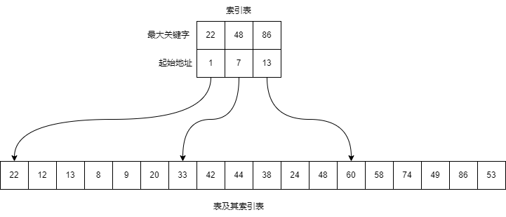

# 线性表的查找

## 顺序查找

**顺序查找**（Sequential Search）的查找过程为：从表的一端开始，依次将记录的关键字和给定值进行比较，若某个记录的关键字和给定值相等，则查找成功；否则，若扫描整个表后，仍未找到记录，则查找失败。

顺序查找既适用于线性表的顺序存储结构，也适用于线性表的链式存储结构。

算法如下：

<<< ./sequential-search.ts

上述算法使用了 [线性表中的链表结构](../../linear-list/index.md#单链表基本操作实现)。

平均查找长度为

$$
ASL=\frac{1}{n}\sum_{i=1}^{n}i=\frac{n+1}{2}
$$

时间复杂度为 $O(n)$。

### 优点

- 简单易实现；
- 对表结构无任何要求；
- 不用关心记录是否有序。

### 缺点

- 平均查找长度较大，查找效率较低。

### 总结

当 $n$ 很大时，不宜采用顺序查找。

## 折半查找

**折半查找**（Binary Search）也称**二分查找**，是一种效率较高的查找方法。

查找过程：从表的中间记录开始，如果给定值和中间记录的关键字相等，则查找成功；如果给定值大于或者小于中间记录的关键字，则在表中大于或小于中间记录的那一半中查找，这样重复操作，直到查找成功，或者在某一区间为空，则代表查找失败。

该查找过程可用二叉树来描述。树中每一结点对应表中一个记录，结点值存储对应记录在表中的位置。把当前查找区间的中间位置作为根，左子表和右子表分别作为根的左子树和右子树，由此得到的二叉树称为折半查找的**判定树**。

折半查找要求线性表必须采用顺序存储结构，而且表中元素按关键字有序排列。

算法如下：

<<< ./binary-search.ts

借助于判定树，很容易求得折半查找的平均查找长度。为了讨论方便，假定有序表的长度 $n=2^h-1$，则判定树是深度为 $h=\log_{2}(n+1)$ 的满二叉树。树中层次为 $h$ 的结点有 $2^{h-1}$ 个。假设表中每个记录的查找概率相等 $(P_i=\frac{1}{n})$，则查找成功时的平均查找长度为

$$
ASL=\sum_{i=1}^{n}P_iC_i=\frac{1}{n}\sum_{j=1}^{h}j \cdot 2^{j-1}=\frac{n+1}{n}\log_{2}(n+1)-1
$$

当 $n$ 较大时，可有下列近似结果

$$
ASL=\log_{2}(n+1)-1
$$

时间复杂度为 $O(\log_{2}n)$。

### 优点

- 比较次数少，查找效率高。

### 缺点

- 必须使用顺序存储结构；
- 必须是有序表。

### 总结

查找前需要排序，而排序本身是一种费时的运算。同时为了保持顺序表的有序性，对有序表进行插入和删除时，平均比较和移动表中一半记录，这也是一种费时的运算。因此，折半查找不适用于数据元素经常变动的线性表。

## 分块查找

**分块查找**（Blocking Search）又称**索引顺序查找**，这是一种性能介于顺序查找和折半查找之间的方法。在此方法中，除表本身外，还需要建立一个索引表。

如上图所示，表中含有 18 个记录，可分成 3 个子表 $(R_1,R_2,\ldots,R_6)$、$(R_7,R_8,\ldots,R_{12})$、$(R_{13},R_{14},\ldots,R_{18})$，对每个子表（或称块）建立一个索引项，其中包括两项内容：关键字项（其值为该子表内最大关键字）和指针项（指示该子表的第一个记录在表中的位置）。索引表按关键字有序，则表或者有序或者分块有序。

**分块有序**：第二个子表中所有记录的关键字均大于第一个子表中的最大关键字，第三个子表中的所有关键字均大于第二个子表中的最大关键字，依此类推。

查找过程：先确定待查记录所在的块，然后在块中顺序查找。如果此块中没有关键字等于给定值的记录，则查找失败。

由于索引表是按关键字有序，所以顺序查找和折半查找都可用于确定块，而块中的记录是无序的，在块中只能使用顺序查找。

因此，分块查找算法为顺序查找和折半查找两种的算法的简单结合。

平均查找长度为

$$
ASL_{bs}=L_b+L_w
$$

$L_b$ 为确定所在块的平均查找长度，$L_w$ 为在块中查找记录的平均查找长度。

一般情况下，为进行分块查找，可以将长度为 $n$ 的表均匀地分成 $b$ 块，每块含有 $s$ 个记录，即 $b=\lceil \frac{n}{s} \rceil$；又假设表中每个记录的查找概率相等，则每块查找的概率为 $\frac{1}{b}$，块中每个记录的查找概率为 $\frac{1}{s}$。

若使用顺序查找确定块，则分块查找的平均查找长度为

$$
ASL_{bs}=L_b+L_w=\frac{1}{b}\sum_{j=1}^{b}j+\frac{1}{s}\sum_{i=1}^{s}i=\frac{b+1}{2}+\frac{s+1}{2}=\frac{1}{2}(\frac{n}{s}+s)+1
$$

可见，此时的平均查找长度不仅和表长 $n$ 有关，而且和每一块中的记录个数 $s$ 有关。在给定 $n$ 的前提下，$s$ 是可以选择的。容易证明，当 $s$ 取 $\sqrt{n}$ 时，$ASL_{bs}$ 取最小值 $\sqrt{n}+1$。这个值比顺序查找有了很大改进，但远不及折半查找。

若用折半查找确定块，则分块查找的平均查找长度为

$$
ASL_{bs}\approx\log_{2}(\frac{n}{s}+1)+\frac{s}{2}
$$

### 优点

在表中插入和删除元素时，只要找到该元素对应的块，就可以在该块内进行插入和删除运算。由于块内是无序的，故插入和删除比较容易，无需进行大量移动。

### 缺点

- 要增加一个索引表的存储空间；
- 需要对索引表进行排序。

### 总结

如果线性表既要快速查找又经常动态变化，可以使用分块查找。
