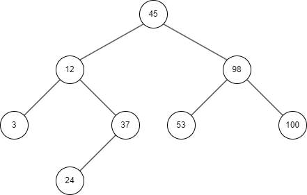
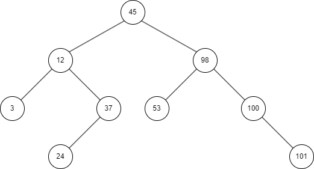
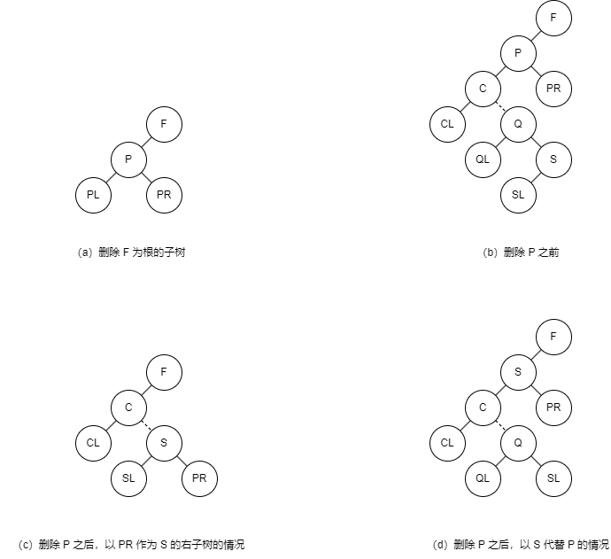

# 树表的查找

前面介绍的方法都是用线性表作为查找表的组织形式，其中折半查找效率较高。但由于折半查找要求表中记录按关键字有序排列，且不能用链表做存储结构，因此，当表的插入或删除操作频繁时，为维护表的有序性，需要移动表中很多记录，花费的时间抵消了折半查找的优点。所以，线性表的查找更适合用于静态查找表，若要对动态查找表进行高效率的查找，可采用以下几种二叉树作为查找表的组织形式。

## 二叉排序树

**二叉排序树**（Binary Sort Tree）又称**二叉查找树**，它是一种对排序和查找都很有用的特殊二叉树。

### 定义

二叉排序树是一颗空树或者是具有下列性质的二叉树：

- 若它的左子树不为空，则左子树上所有结点的值均小于它的根结点的值；
- 若它的右子树不为空，则右子树上所有结点的值均大于它的根结点的值；
- 它的左、右子树均为二叉排序树。

由定义可以得出二叉排序树的一个重要性质：中序遍历一颗二叉排序树时可以得到一个结点值递增的有序序列。

下面将使用二叉链表作为存储结构来讨论二叉排序树的操作。

### 查找

二叉排序树的查找过程和折半查找类似。

1. 若二叉排序树为空，则查找失败，返回 `null`；
2. 若二叉排序树非空，则将给定值 `key` 与根结点的数据项 `T->data` 进行比较：

- 若 `key` 等于 `T->data`，则查找成功，返回根结点；
- 若 `key` 小于 `T->data`，则递归查找左子树；
- 若 `key` 大于 `T->data`，则递归查找右子树。

算法如下：

<<< ./search-bst.ts

以下图为例：



我们要查找数据项为 100 的结点。首先把 100 与根结点的数据项作比较，因为 100 > 45，所以查找以 45 为根的右子树，此时右子树不为空，且 100 > 98，则继续查找以 98 为根的右子树，此时 100 与右子树根的结点数据项相等，查找成功，返回结点对象。

假设我们要查找数据项为 40 的结点，和上述过程类似，在给定值与 45、12、37 相继比较之后，继续查找以结点 37 为根的右子树，此时右子树为空，查找失败，返回 `null`。

从上述两个例子可见，在二叉排序树上查找其关键字等于给定值的结点的过程，恰是走了一条从根结点到该结点的路径的过程，和给定值比较的关键字个数等于路径长度加 1（或结点所在层数）。因此，和折半查找类似，与给定比较的关键字个数不超过树的深度。然而，折半查找长度为 $n$ 的顺序表的判定树是唯一的，而含有 $n$ 个结点的二叉排序树却不唯一。

如下图：


（a）树的深度为 3，而（b）树的深度为 6。从平均查找长度来看，假设 6 个结点的查找概率相等，为 $\frac{1}{6}$，则（a）树的平均查找长度为

$$
ASL_a=\frac{1}{6}[1+2+2+3+3+3]=\frac{14}{6}
$$

（b）的平均查找长度为

$$
ASL_a=\frac{1}{6}[1+2+3+4+5+6]=\frac{21}{6}
$$

因此，含有 $n$ 个结点的二叉排序树的平均查找长度与数的形态有关。
当先后插入的关键字有序时，构成的二叉排序树变为单支树。树的深度为 $n$，其平均查找长度为 $\frac{n+1}{2}$（和顺序查找相同），这是最差的情况。显然，最好的情况是，二叉排序树的形态和折半查找的判定树相似，其平均查找长度和 $\log_2n$ 成正比。若考虑把 $n$ 个结点按各种可能的次序插入到二叉排序树中，则有 $n!$ 棵二叉排序树（其中有的形态相同）。可以证明，综合所有可能的情况，平均而言，二叉排序树的平均查找长度仍然和 $\log_2n$ 是同数量级的。

可见，二叉排序树上的查找和折半查找相差不大。但就维护表的有序性而言，二叉排序树更加有效，因为无需移动记录，只需修改指针即可完成对结点的插入和删除操作。因此，对于需要经常进行插入、删除和查找运算的表，采用二叉排序树比较好。

### 插入

二叉排序树的插入操作是以查找为基础的。要将一个关键字值为 `key` 的结点 `node` 插入到二叉排序树中，则需要从根结点向下查找，当树中不存在关键字等于 `key` 的结点时才进行插入。新插入的结点一定是叶子结点，并且是查找失败时查找路径上的最后一个结点的左孩子或右孩子结点。

算法步骤：

1. 若二叉排序树为空，则待插入结点 `node` 作为根结点插入到空树中；
2. 若二叉排序树非空，则将 `key` 与根结点的数据项进行比较：

- 若 `key` 小于根结点的数据项，则将 `node` 插入左子树；
- 若 `key` 大于根结点的数据项，则将 `node` 插入右子树。

算法如下：

<<< ./insert-bst.ts

继续以该图为例：


我们要插入一个关键字为 101 的结点，由于插入前二叉排序树非空，故将 101 与 45 进行比较，因 101 > 45，则应将 101 插入到 45 的右子树上；再和 98 比较，因 101 > 98，则应将 101 插入到 98 的右子树上；依次类推，直到最后 101 > 100，且 100 的右子树为空，101 作为 100 的右孩子插入到树中。



二叉排序树插入的基本过程是查找，所以时间复杂度与查找一样，是 $O(\log_2n)$。

### 创建

二叉排序树的创建是从空的二叉排序树开始的，每输入一个结点，经过查找操作，将新结点插入到当前二叉排序树的合适位置。

算法步骤：

1. 接收一个关键字数组；
2. 初始化空的二叉排序树；
3. 从数组中读取下一个关键字，并以此关键字创建结点；
4. 把结点插入到树中；
5. 如果读取完毕则算法结束。

算法如下：

<<< ./create-bst.ts

假设有 $n$ 个结点，则需要 $n$ 次插入操作，而插入一个结点的算法时间复杂度为 $O(\log_2n)$，所以创建二叉排序树算法的时间复杂度为 $O(n\log_2n)$。

### 删除

被删除的结点可能是二叉排序树中的任何结点，删除结点后，要根据其位置不同修改其双亲结点及其相关结点的指针，以保持二叉排序树的特性。

算法步骤：

1. 首先从二叉排序树的根结点开始查找关键字为 `key` 的待删结点，如果树中不存在此结点，则不做任何操作；否则，假设被删结点为 P，其双亲结点为 F，PL 和 PR 分别表示其左子树和右子树（见下图 a）。则只需修改其双亲结点的指针即可。

```js
F.lchild = null
```

2. 若 P 结点只有左子树 PL 或者只有右子树 PR，此时只要令 PL 或 PR 直接成为其双亲结点 F 的左子树即可。

```js
F.lchild = P.lchild
// 或 F.lchild=P.rchild
```

3. 若结点 P 的左子树和右子树均非空。从图 b 可知，在删去结点 P 之前，中序遍历该二叉树得到的序列为 $\{\ldots C_LC\ldots Q_LQS_LSPP_RF\ldots\}$，在删去 P 之后，为保持其它结点相对位置不变，可以有两种处理方法：

- 令 P 的左子树为 F 的左子树，而 P 的右子树为 S 的右子树，如图 c 所示。

```js
F.lchild = P.lchild
S.rchild = P.rchild
```

- 令 P 的直接前驱（或直接后继）替代 P，然后再从二叉排序树中删除它的直接前驱（或直接后继）。如图 d 所示，当以直接前驱 S 替代 P 时，由于 S 只有左子树 SL，则在删除 S 之后，只要令 SL 为 S 的双亲 Q 的右子树即可。

```js
P.data = S.data
Q.rchild = S.lchild
```



显然，前一种处理方法可能增加树的深度，而后一种方法是以被删结点左子树中关键字最大的结点替代被删结点，然后从左子树中删除这个结点，此结点一定没有右子树（否则它就不是左子树中关键字最大的结点），这样不会增加树的深度，所以常采用这种处理方案。

算法如下：

<<< ./delete-bst-node.ts

与二叉排序树插入一样，二叉排序树删除的基本过程也是查找，所以时间复杂度仍是 $O(log_2n)$。

## 平衡二叉树

### 定义

二叉排序树查找算法的性能取决于树的结构，而树的结构则取决于其数据集。如果数据是有序排列的，则二叉排序树是线性的，查找的时间复杂度为 $O(n)$；反之，如果二叉排序树的结构合理，则查找的时间复杂度为 $O(log_2n)$。事实上，树的高度越小，查找速度越快。因此，希望二叉树的高度尽可能小。

**平衡二叉树**（Balanced Binary Tree 或 Height-Balanced Tree），因由前苏联数学家 Adelson-Velskii 和 Landis 提出，所以又称 **AVL 树**。

平衡二叉树是空树或者具有以下特征的二叉排序树：

- 左子树和右子树的深度之差的绝对值不超过 1；
- 左子树和右子树也是平衡二叉树。

若将二叉树上结点的**平衡因子**（Balanced Factor，BF）定义为该结点左子树和右子树的深度之差，则平衡二叉树上所有结点的平衡因子只可能是 -1、0、1。只要二叉树上有一个结点的平衡因子的绝对值大于 1，则该二叉树是不平衡的。


因为 AVL 树上任何结点的左右子树的深度之差都不超过 1，则可以证明它的深度和 $\log_2n$ 是同数量级的（其中 $n$ 为结点个数）。由此，其查找的时间复杂度为 $O(\log_2n)$。

### 平衡调整方法

首先按照二叉排序树的创建方法一样插入结点，若插入结点后破坏了平衡二叉树的特性，需对平衡二叉树进行调整。调整方法是：找到离插入结点最近且平衡因子绝对值超过 1 的祖先结点，以该结点为根的子树称为**最小不平衡子树**，可将重新平衡的范围局限于这颗子树。

先看一个具体例子。假设表中的关键字序列为 $(13,24,37,90,53)$。


1. 如图 a ~ c 所示，空树和 1 个结点的树显然都是平衡二叉树。在插入 24 之后仍是平衡的，只是根结点的平衡因子 BF 由 0 变为-1.
2. 如图 d ~ e 所示，在继续插入 37 之后，结点 13 的 BF 值变为-2，二叉树不平衡。此时，可以对树做一个向左逆时针“旋转”的操作，令结点 24 为根，结点 13 为其左子树，这样，结点 13 和结点 24 的 BF 均为 0，而且仍保持二叉排序树的特性。
3. 如图 f ~ h 所示，在继续插入 90 和 53 之后，结点 37 的 BF 变为-2，二叉树又不平衡，需进行调整。但此时由于结点 53 是结点 90 的左子树，因此不能如上左简单调整。离插入结点最近的最小不平衡子树是以结点 37 为根的子树。这时，必须以 53 作为根结点，使 37 成为其左子树的根，90 成为其右子树的根。这好比对树做了两次“旋转”操作，先向右顺时针旋转，后向左逆时针旋转，使其变为平衡二叉树。

一般情况下，假设最小不平衡子树的根结点为 A，则失去平衡后进行调整的规律可归纳为以下 4 种情况。

#### LL 型


如上图所示，在 A 左子树根结点的左子树上插入结点，A 的 BF 变为 2，树变为不平衡，需进行一次向右的顺时针旋转操作。


#### RR 型


如上图所示，在 A 右子树根结点的右子树上插入结点，A 的 BF 变为 -2，树变为不平衡，需进行一次向左的逆时针旋转操作。


#### LR 型


如上图所示，在 A 左子树根结点的右子树上插入结点，A 的 BF 变为 2，树变为不平衡，需进行两次旋转操作。第一次对 B 及其右子树进行逆时针旋转，C 转上去成为 B 的根，这时变成了 LL 型，所以第二次进行 LL 型的顺时针旋转即可恢复平衡。如果 C 原来有左子树，则调整 C 的左子树为 B 的右子树。


#### RL 型


如上图所示，在 A 右子树根结点的左子树上插入结点，A 的 BF 变为 -2，树变为不平衡，则旋转方法和 LR 型相对称，先顺时针右旋，再逆时针左旋。


上述 4 种情况中，LL 型和 RR 型对称，LR 型和 RL 型对称。旋转操作的正确性容易由“保持二叉排序树的特性：中序遍历所得关键字序列自小至大有序”证明。同时，无论哪一种情况，在经过平衡旋转处理之后，以 B 或 C 为根的新子树为平衡二叉树，而且他们的深度和插入之前以 A 为根的子树相同。因此，当平衡的二叉排序树因插入结点而失去平衡时，仅需对最小不平衡子树进行平衡旋转处理即可。因为经过旋转处理之后的子树深度和插入之前相同，因而不影响插入路径上所有祖先结点的 BF。

### 插入

在平衡二叉排序树 BBST 上插入一个新的数据元素 e 的递归算法步骤如下：

1. 若 BBST 为空树，则插入一个数据元素为 e 的新结点作为 BBST 的根结点，树的深度加 1；
2. 若 e 的关键字和 BBST 的根结点的关键字相等，则不插入；
3. 若 e 的关键字小于 BBST 的根结点的关键字，而且在 BBST 的左子树中不存在和 e 有相同关键字的结点，则将 e 插入到 BBST 的左子树上，并且当插入之后的左子树深度 +1 时，按照下列不同情况处理：

- BBST 的根结点 BF 为 -1（右子树的深度大于左子树）：则将根结点的 BF 改为 0，BBST 深度不变；
- BBST 的根结点 BF 为 0（左、右子树的深度相等）：则将根结点 BF 变为 1，BBST 深度 +1；
- BBST 的根结点 BF 为 1（左子树的深度大于右子树）：若 BBST 的左子树根结点 BF 为 1，则需进行单向右旋平衡处理，并且在右旋处理之后，将根结点和其右子树根结点 BF 改为 0，树的深度不变；
- 若 BBST 的左子树根结点 BF 为 -1，则需进行先向左、后向右的双向旋转平衡处理，并且在旋转处理之后。修改根结点和其左、右子树根结点 BF，树的深度不变。

4. 若 e 的关键字大于 BBST 的根结点关键字，而且在 BBST 的右子树中不存在和 e 有相同关键字的结点，则将 e 插入的 BBST 的右子树上，并且当插入之后的右子树深度 +1 时，按照不同情况处理。其处理操作和步骤三相对称。
