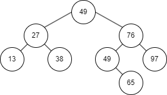

# 交换排序

交换排序的基本思想：两两比较待排序记录的关键字，一旦发现两个记录不满足次序要求时则进行交换，直到整个序列全部满足要求为止。

## 冒泡排序

**冒泡排序**（Bubble Sort）是一种最简单的交换排序方法，它通过两两比较相邻记录的关键字，如果发生逆序，则进行交换，从而使关键字小的记录如气泡一般逐渐往上“漂浮”（左移），或者使关键字大的记录如石块一样逐渐向下“坠落”（右移）。

算法步骤：

1. 设待排序记录存放在数组 $r[0 \ldots n-1]$ 中。首先将第一个记录的关键字和第二个记录的关键字进行比较，若为逆序（即 `r[0].key > r[1].key`），则交换两个记录。然后比较第二个记录和第三个记录的关键字。依次类推，直至 `r[n-2]` 和 `r[n-1]` 的关键字进行过比较为止。上述过程称作第一趟起泡排序，其结果使得关键字最大的记录被安置到最后一个记录的位置上。
2. 然后进行第二趟起泡排序，对前 $n-2$ 个记录进行同样操作，其结果是使关键字次大的记录被安置到 `r[n-2]` 上。
3. 重复上述比较和交换过程，第 $i$ 趟是从 `r[0]` 到 `r[n-i]` 依次比较相邻两个记录的关键字，并在逆序时交换相邻记录，其结果是这 $n-i+1$ 个记录中关键字最大的记录被交换到 `r[n-i]` 上。直到在某一趟排序过程中没有进行过交换记录的操作，说明序列已全部达到排序要求，则完成排序。

算法如下：

<<< ./bubble-sort.ts

### 时间复杂度

最好情况（初始序列为正序）：只需进行一趟排序，在排序过程中进行 $n-1$ 次关键字比较，且不移动记录。

最坏情况（初始序列为逆序）：需进行 $n-1$ 趟排序，总的关键字比较次数 $KCN$ 和记录移动次数 $RMN$ （每次交换都需要移动 3 次记录）分别为

$$
\begin{align}
KCN=\sum_{i=n}^{2}(i-1)=\frac{n(n-1)}{2} \approx \frac{n^2}{2} \\
RMN=3\sum_{i=n}^{2}(i-1)=\frac{3n(n-1)}{2} \approx \frac{3n^2}{2}
\end{align}
$$

其中 $i$ 为需要比较的记录个数。

所以，在平均情况下，冒泡排序关键字的比较次数和记录移动次数分别约为 $\frac{n^2}{4}$ 和 $\frac{3n^2}{4}$，时间复杂度为 $O(n^2)$。

### 空间复杂度

冒泡排序需要一个辅助空间用做暂存记录，所以空间复杂度为 $O(1)$。

### 特点

- 稳定；
- 顺序存储结构和链式存储结构都可以；
- 移动记录次数较多，算法平均时间性能比直接插入排序差。当初始记录无序，$n$ 较大时，此算法不宜采用。

## 快速排序

快速排序（Quick Sort）是由冒泡排序改进而得的。在冒泡排序中，只对相邻两个记录进行比较，因此每次交换两个相邻记录时只能消除一个逆序。如果能通过两个（不相邻）记录的一次交换，消除多个逆序，则会大大加快排序的速度。

算法步骤：

在待排序的 $n$ 个记录中任取一个记录（通常取第一个记录）作为枢轴（或支点），设其关键字为 `pivotkey`。经过一趟排序后，把所有关键字小于 `pivotkey` 的记录交换到前面，把所有关键字大于 `pivotkey` 的记录交换到后面，结果将待排序记录分成两个子表，最后将枢轴放置在分界处的位置。然后，分别对左、右子表重复上述过程，直到每一子表只有一个记录时，排序完成。

其中，一趟快速排序的具体步骤如下：

1. 选择待排序表中的第一个记录作为枢轴，将枢轴记录暂存在辅助空间上。设置两个变量 `low` 和 `high`，初始时分别指向表的下界和上界（`low = 0;high = L.length - 1;`）；
2. 从表的最右侧位置依次向左查找，找到第一个关键字小于 `pivotkey` 的记录，将其移到 `low` 处。具体操作：当 `low < high` 时，若 `high` 所指记录的关键字大于等于 `pivotkey`，则向左移动 `high`；否则将 `high` 所指记录与枢轴记录交换；
3. 然后再从表的最左侧位置，依次向右查找第一个关键字大于 `pivotkey` 的记录和枢轴记录交换。具体操作：当 `low < high` 时，若 `low` 所指记录的关键字小于等于 `pivotkey`，则向右移动 `low`；否则将 `low` 所指记录与枢轴记录交换；
4. 重复步骤 2 和 3，直到 `low` 与 `high` 相等为止。此时 `low` 或 `high` 的位置即为枢轴在此趟排序中的最终位置，原表被分成两个子表。

在上述过程中，记录的交换都是与枢轴之间发生，每次交换都要移动 3 次记录，可以先将枢轴记录暂存在辅助空间上，排序过程中只移动要与枢轴交换的记录，即只做 `r[low]` 或 `r[high]` 的单向移动，直到一趟排序结束后再将枢轴记录移到正确位置上。

算法如下：

<<< ./quick-sort.ts

由上述可知，快速排序的过程可递归进行。以关键字序列 $\{49,38,65,97,76,13,27,49\}$ 为例，其递归树如下。

### 时间复杂度

从快速排序算法的递归树可知，快速排序的趟数取决于递归树的深度。

最好情况：每一趟排序后都能将记录序列均匀地分割成两个长度大致相等的子表，类似折半查找。在 $n$ 个元素的序列中，对枢轴定位所需时间为 $O(n)$。若设 $T(n)$ 是对 $n$ 个元素的序列进行排序所需的时间，而且每次对枢轴定位后，正好把序列划分为长度相等的两个子表，此时，设 $Cn$ 是一个常数，表示 $n$ 个元素进行一趟快速排序的时间，则总的排序时间为

$$
\begin{align}
T(n) & =Cn+2T(\frac{n}{2}) \\
& \leqslant n+2T(\frac{n}{2}) \\
& \leqslant n+2(\frac{n}{2}+2T(\frac{n}{4}))=2n+4T(\frac{n}{4}) \\
& \leqslant 2n+4(\frac{n}{4}+2T(\frac{n}{8}))=3n+8T(\frac{n}{8}) \\
& \ldots \\
& \leqslant kn+2^kT(\frac{n}{2^k}) \\

& \because k=\log_2n \\
& \therefore T(n) \leqslant n\log_2n+nT(1) \approx O(n\log_2n)
\end{align}
$$

最坏情况：在待排序序列已经排好序的情况下，其递归树为单支树，每次划分只得到一个比上一次少一个记录的子序列。这样，必须经过 $n-1$ 趟才能将所有记录定位，而且第 $i$ 趟需要经过 $n-i$ 次比较。这样，总的关键字比较次数 $KCN$ 为

$$
KCN=\sum_{i=1}^{n-1}n-i=\frac{n(n-1)}{2} \approx \frac{n^2}{2}
$$

这种情况下，快速排序的速度与简单排序相当。枢轴记录的合理选择可避免这种最坏情况的出现，如利用“三者取中”规则：比较当前表中第一个记录、最后一个记录和中间一个记录的关键字，取关键字剧中的记录作为枢轴记录，事先调换到第一个记录的位置。

理论上可以证明，平均情况下，快速排序的时间复杂度为 $O(n\log_2n)$。

### 空间复杂度

快速排序是递归的，执行时需要有一个栈来存放相应的数据。最大递归调用次数与递归树的深度一致，所以最好情况下的空间复杂度为 $O(\log_2n)$，最坏情况下为 $O(n)$。

### 特点

- 记录非顺次的移动导致排序方法是不稳定的；
- 排序过程中需要定位表的下界和上界，所以适合用于顺序结构，很难用于链式结构；
- 当 $n$ 较大时，在平均情况下快速排序是所有内部排序方法中速度最快的一种，所以其适合初始记录无序、$n$ 较大时的情况。
