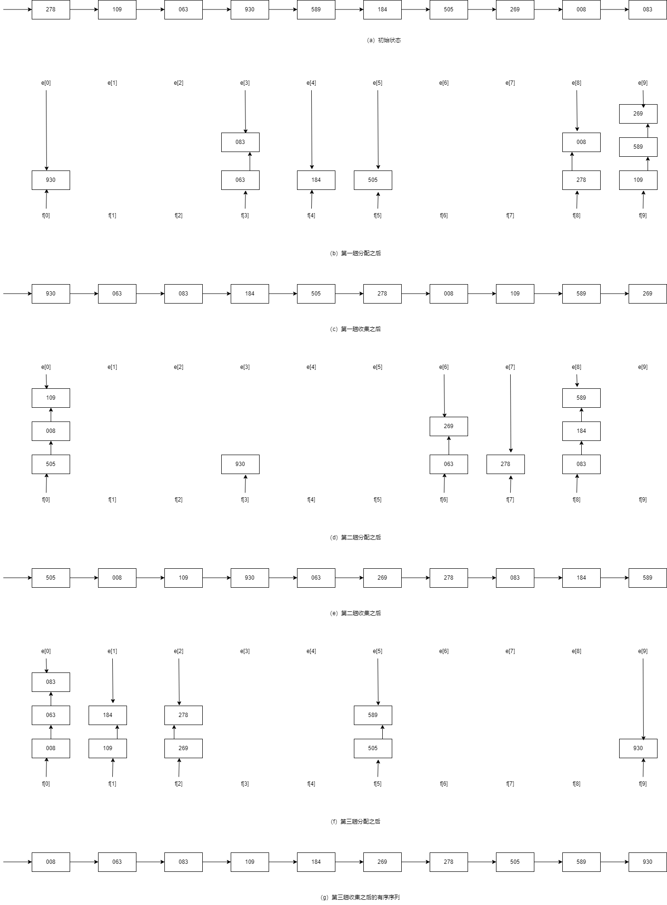

# 基数排序

前面所讲的排序都是基于关键字比较，而分配类的排序不需要比较关键字大小，它是根据关键字中各位的值，通过对待排序记录进行若干遍“分配”与“收集”来实现排序的，是一种借助于多关键字排序的思想对单关键字排序的方法。**基数排序**（Radix Sorting）是典型的分配类排序。

## 多关键字排序

先看一个具体例子。

已知扑克牌中 52 张牌的次序关系为：先按花色黑桃、红桃、梅花、方格的顺序放置，同花色的按点数 $2<3<\ldots<A$ 的顺序放置。

每一张牌有两个关键字：花色和点数，且花色的地位高于点数，在比较任意两张牌的大小时，必须先比较花色，再比较点数。

因此，将扑克牌整理成如上所述次序关系时，有以下两种方法：

- **最高位优先法**：先按不同花色分成有次序的 4 堆，每一堆的牌均具有相同的花色，然后分别对每一堆按点数大小整理有序；
- **最低位优先法**：这是一种分配与收集交替进行的方法。先按不同点数分成 13 堆，然后将这 13 堆牌自小至大叠在一起（3 在 2 之上，4 在 3 之上，......，最上面的是 4 张 A）。再重新对这些牌按不同花色分成 4 堆，最后将这 4 堆牌按花色的次序再收集到一起，此时同样得到一副满足如上次序关系的牌。

## 链式基数排序

基数排序的思想类似于上述“最低位优先法”的洗牌过程，是借助“分配”和“收集”两种操作对单逻辑关键字进行排序的一种内部排序方法。有的逻辑关键字可以看成由若干个关键字复合而成的。例如，若关键字是数值，且其值都在 $0 \leqslant K \leqslant 999$ 范围内，则可把每一个十进制数字看成一个关键字，即可认为 $K$ 由 3 个关键字（$K^0,k^1,K^2$）组成，其中 $K^0$ 是百位数，$K^1$ 是十位数，$K^2$ 是个位数；又若关键字是由 5 个字母组成的单词，则可看成是由 5 个关键字（$K^0,k^1,K^2,K^3,K^4$）组成，其中 $K^{j-1}$ 是（自左至右的）第 $j$ 个字母。由于如此分解而得的每个关键字 $K^j$ 都在相同的范围内（对数字，$0 \leqslant K^j \leqslant 9$，对字母 $A \leqslant K^j \leqslant Z$），故可以按照“分配”和“收集”的方法进行排序。

假设记录的逻辑关键字由 $d$ 个关键字组成，每个关键字可能取 $rd$ 个值。只要从最低数位关键字起，按关键字的不同值将序列中记录分配到 $rd$ 个队列中后再收集它，如此重复 $d$ 次完成排序。按这种方法实现排序称之为**基数排序**，其中“**基**”指的是 $rd$ 的取值范围，在上述两种关键字的情况下，$rd$ 分别为 10 和 26。

具体实现时，一般采用链式基数排序。

具体排序过程如下图。



首先以链表存储 $n$ 个待排序记录，并令表头指针指向第一个记录，如图 a 所示，然后通过以下三趟“分配”和“收集”操作完成排序。

第一趟分配对个位数进行，改变记录的指针值将链表中的记录分配至 10 个链队列中，每个队列中的记录关键字的个位数相等，如图 b 所示，其中 $f[i]$ 和 $e[i]$ 分别为第 $i$ 个队列的头指针和尾指针；第一趟收集是改变所有非空队列的队尾记录的指针域，令其指向下一个非空队列的队头记录，重新将 10 个队列中的记录连成一个链表，如图 c 所示。

第二趟分配和第二趟收集是对十位数进行的，其过程和个位数相同。分配和收集结果分别如图 d 和图 e 所示。

第三趟分配和第三趟收集是对百位数进行的，过程同上，分配和收集结果分别如图 f 和图 g 所示。至此排序完毕。

算法实现时采用静态链表，以便于更有效地存储和重排记录。

算法如下：

<<< ./radix-sort.ts#static-list-node

使用方法：

```ts
const arr = [-1, 5, 4, 2, 1].map(
  (key, idx, arr) =>
    new StaticListNode([key], idx !== arr.length - 1 ? idx + 1 : 0)
)
radixSort(arr, 0)
expect(arr).toEqual([
  new StaticListNode([-1], 4),
  new StaticListNode([5], 0),
  new StaticListNode([4], 1),
  new StaticListNode([2], 2),
  new StaticListNode([1], 3),
])
```

### 时间复杂度

对于 $n$ 个记录（假设每个记录含 $d$ 个关键字，每个关键字的取值范围为 $rd$ 个值）进行链式基数排序时，每一趟分配的时间复杂度为 $O(n)$，每一趟收集的时间复杂度为 $O(rd)$，整个排序需进行 $d$ 趟分配和收集，所以时间复杂度为 $O(d(n+rd))$。

### 空间复杂度

所需辅助空间为 $2rd$ 个队列指针，另外由于需用链表做存储结构，则相对于其它以顺序存储结构存储记录的排序方法而言，还增加了 $n$ 个指针域的空间，所以空间复杂度为 $O(n+rd)$。

### 特点

1. 稳定；
2. 链式结构和顺序结构皆可用；
3. 时间复杂度可以突破关键字比较一类方法的下界 $O(n\log_2n)$，达到 $O(n)$；
4. 基数排序使用条件有严格的要求：需要知道各级关键字的主次关系和各级关键字的取值范围。

另一种实现：

<<< ./radix-sort.ts#radix-sort

该实现与上述实现区别是，该实现的收集方式通过调整元素位置替代调整 `next` 指针，这减少了指针域所占用的存储空间，但是由于在调整元素位置时需要 $n$ 个元素的辅助空间，所以空间复杂度并没有改变。
