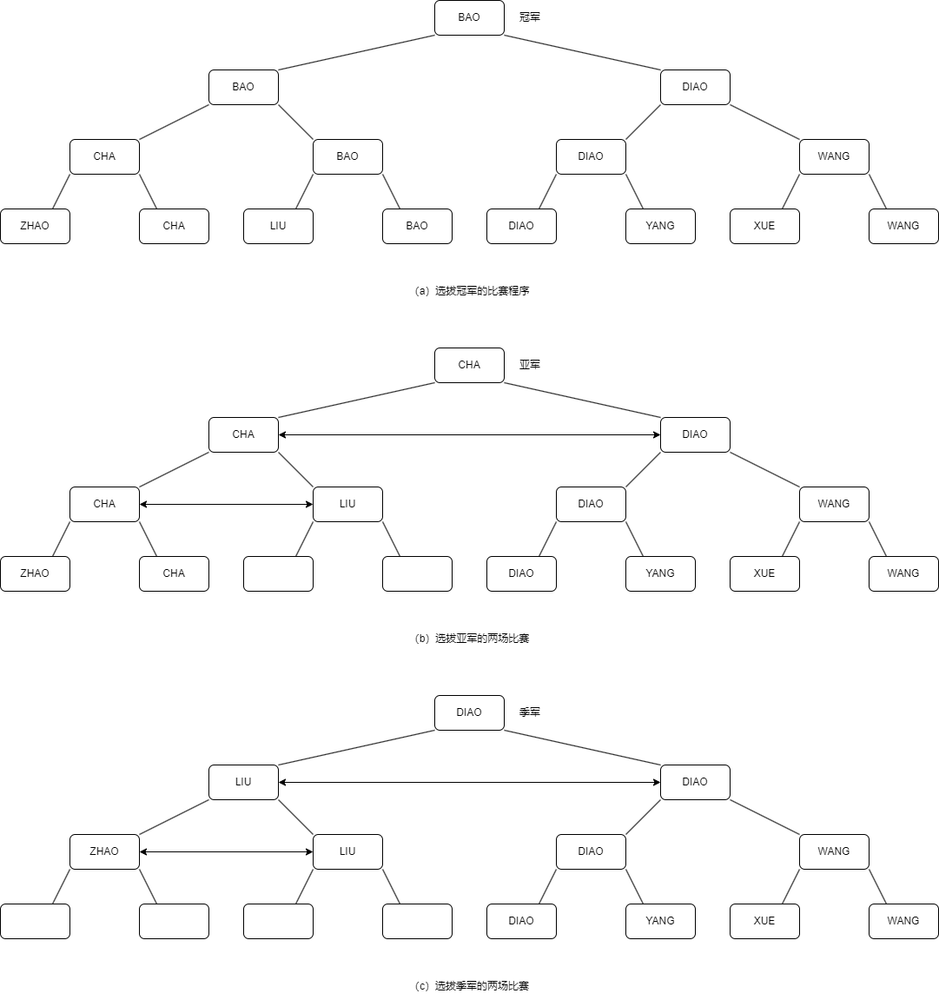
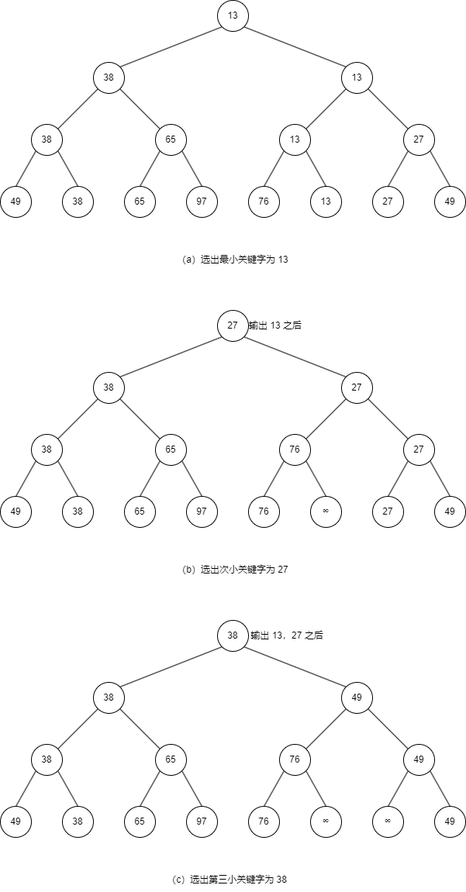
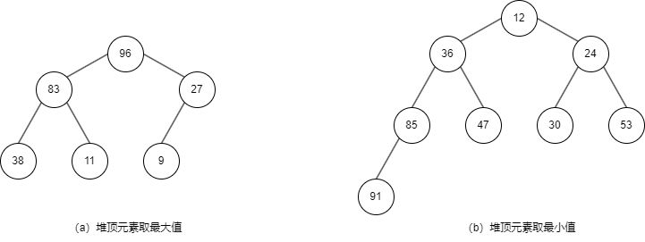
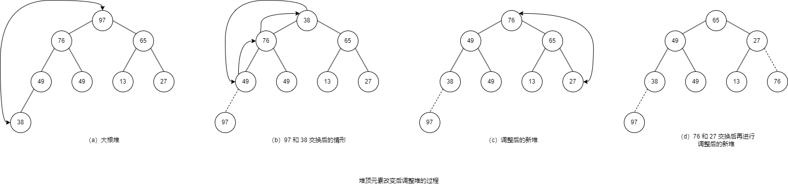

# 选择排序

选择排序的基本思想：每一趟从待排序的记录中选出关键字最小的记录，按顺序放在已排序的记录序列的最前，直到全部排完为止。

## 简单选择排序

**简单选择排序**（Simple Selection Sort）也称作直接选择排序。

算法步骤：

1. 设待排序的记录存放在数组 $r[0 \ldots n-1]$ 中。第一趟从 $r[0]$ 开始，通过 $n-1$ 次比较，从 $n$ 个记录中选出关键字最小的记录，记为 $r[k]$，交换 $r[0]$ 和 $r[k]$；
2. 第二趟从 $r[1]$ 开始，通过 $n-2$ 次比较，从 $n-1$ 个记录中选出关键字最小的记录，记为 $r[k]$，交换 $r[1]$ 和 $r[k]$；
3. 依次类推，第 $i$ 趟从 $r[i-1]$ 开始，通过 $n-i$ 次比较，从 $n-i+1$ 个记录中选出关键字最小的记录，记为 $r[k]$，交换 $r[i-1]$ 和 $r[k]$；
4. 经过 $n-1$ 趟，排序完成。

算法如下：

<<< ./select-sort.ts

### 时间复杂度

简单选择排序过程中，需要记录移动的次数较少。最好情况（正序）：不移动；最坏情况（逆序）：移动 $3(n-1)$ 次。

然而，无论记录的初始排列如何，所需进行的关键字比较次数相同，均为

$$
KCN=\sum_{i=1}^{n-1}(n-i)=\frac{n(n-1)}{2} \approx \frac{n^2}{2}
$$

因此，简单选择排序的时间复杂度是 $O(n^2)$。

### 空间复杂度

与冒泡排序一样，只有在两个记录交换时需要一个辅助空间，所以空间复杂度为 $O(1)$。

### 特点

- 排序方法本身是稳定的，但因为上述算法实现采用了“交换记录”的策略，造成了不稳定的现象。改变这个策略，可以写出稳定的算法；
- 可用于链式存储结构；
- 移动记录次数较少，当每一记录占用的空间较多时，此方法比直接插入排序快。

从上述可见，选择排序的主要操作是进行关键字的比较，因此改进简单选择排序应从如何减少比较次数考虑。显然，在 $n$ 个关键字中选出最小值，至少要进行 $n-1$ 次比较，然而，继续在剩余的 $n-1$ 个关键字中选择次小值并非一定要进行 $n-2$ 次比较，若能利用前 $n-1$ 次比较所得信息，则可减少以后各趟排序中的比较次数。现实生活中，体育比赛中的锦标赛就是一种选择排序。例如，在 8 个运动员中决出前 3 名至多需要 11 场比赛，而不是 $7+6+5=18$ 场比赛（它的前提是，若乙胜丙，甲胜乙，则认为甲必胜丙）。

如上图，最底层的 8 个选手经过第一轮的 4 场比赛之后选出 4 个优胜者，然后经过两场半决赛和一场决赛之后，选出冠军。显然，按照锦标赛的传递关系，亚军只能产生于分别在决赛、半决赛和第一轮比赛中输给冠军的选手中。由此，在经过“CHA”和“LIU”、“CHA”和“DIAO”的两场比赛之后，选出亚军，同理，选出季军的比赛只要在“ZHAO”、“LIU”和“DIAO”3 个选手之间进行即可。按照这种思想可导出树形选择排序。

## 树形选择排序

**树形选择排序**（Tree Selection Sort），又称**锦标赛排序**（Tournament Sort），是一种按照锦标赛的思想进行选择排序的方法。首先对 $n$ 个记录的关键字进行两两比较，然后在其中 $\lceil \frac{n}{2} \rceil$ 个较少者之间再进行两两比较，如此重复，直至选出最小关键字的记录为止。这个过程可用一颗有 $n$ 个叶子结点的完全二叉树表示。

如上图中的二叉树，表示从 8 个关键字中选出最小关键字的过程。8 个叶子结点中依次存放排序之前的 8 个关键字，每个非终端结点中的关键字均等于其左、右孩子结点中较小的关键字，则根结点中的关键字即为叶子结点中的最小关键字。在输出最小关键字之后，根据关系的可传递性，欲选出次小关键字，仅需将叶子结点中的最小关键字改为“最大值”，然后从该叶子结点开始，和其左（或右）兄弟的关键字进行比较，修改从叶子结点到根的路径上各结点的关键字，则根结点的关键字即为次小关键字。同理，可依次选出从小到大的所有关键字。由于含有 $n$ 个叶子结点的完全二叉树的深度为 $\lceil \log_2n \rceil + 1$，则在树形选择排序中，除了最小关键字外，每选择一个次小关键字仅需进行 $\lceil \log_2n \rceil$ 次比较，因此，它的时间复杂度为 $O(n\log_2n)$。但是，这种排序方法还有以下缺点：

- 需要较多辅助存储空间；
- 需要和最大值进行多余的比较。

为了改进这些缺点，J.Willioms 在 1964 年提出了另一种形式的选择排序 —— 堆排序。

## 堆排序

**堆排序**（Heap Sort）是一种树形选择排序，在排序过程中，将待排序记录 $r[0 \ldots n-1]$ 看成是一颗完全二叉树的顺序存储结构，利用完全二叉树中双亲结点和孩子结点之间的关系，在当前无序的序列中选择关键字最大（或最小）的记录。

### 堆的定义

$n$ 个元素的序列 $\{k_1,k_2,\ldots,k_n\}$ 称之为堆，当且仅当满足一下条件：

$$
(k_i \geqslant k_{2i} \text{且} k_i \geqslant k_{2i+1})
\ \text{或} \
(k_i \leqslant k_{2i} \text{且} k_i \leqslant k_{2i+1}) \
(1 \leqslant i \leqslant \lfloor \frac{n}{2} \rfloor )
$$

若将和此序列对应的一维数组（以一维数组作为此序列的存储结构）看成是一个完全二叉树，则堆实质上是满足如下性质的完全二叉树：

- 树中所有非终端结点的值均不大于（或不小于）其左、右孩子结点的值。

如上图所示，在这两种堆中，堆顶元素（或完全二叉树的根）必为序列中 $n$ 个元素的最大值（或最小值），分别称之为大根堆（或小根堆）。

堆排序利用了大根堆（或小根堆）堆顶记录的关键字最大（或最小）这一特征，使得当前无序的序列中选择关键字最大（或最小）的记录变得简单。下面讨论使用大根堆进行排序，堆排序的步骤如下：

1. 按堆的定义将待排序序列 $r[0 \ldots n-1]$ 调整为大根堆（这个过程称为建初堆），交换 $r[0]$ 和 $r[n-1]$，则 $r[n-1]$ 为关键字最大的记录；
2. 将 $r[0 \ldots n-2]$ 重新调整为堆，交换 $r[0]$ 和 $r[n-2]$，则 $r[n-2]$ 为关键字次大的记录；
3. 循环 $n-1$ 次，直到交换了 $r[0]$ 和 $r[1]$ 为止，得到了一个非递减的有序序列 $r[0 \ldots n-1]$。

同样，可以通过构造小根堆得到一个非递增的有序序列。

由此，实现堆排序需要解决以下两个问题：

- 建初堆：如何将一个无序序列建成一个堆？
- 调整堆：去掉堆顶元素，在堆顶元素改变之后，如何调整剩余元素成为一个新的堆？

因为建初堆要用到调整堆的操作，所以我们先讨论调整堆的实现。

### 调整堆

如上图所示，交换堆顶元素 97 和堆中最后一个元素 38 后，除根结点外，其余结点均满足堆的性质，由此仅需自上至下进行一条路径上的结点调整即可。首先以堆顶元素 38 和其左、右子树根结点的值进行比较，由于左子树根结点的值大于右子树根结点的值且大于根结点的值，所以交换 38 和 76；由于 38 代替了 76 之后破坏了左子树的堆，所以需进行和上述相同的调整，直至叶子结点，调整后的状态如图 c 所示。重复上述过程，将堆顶元素 76 和堆中最后一个元素 27 交换且调整，得到如图 d 所示新堆。

上述过程就像过筛子一样，把较小的关键字逐层筛下去，而将较大的关键字逐层选上来。因此，称此方法为“筛选法”。

假设 $r[s+1 \ldots m]$ 已经是堆的情况下，按“筛选法”将 $r[s \ldots m]$ 调整为以 $r[s]$ 为根的堆，算法步骤如下：

从 $r[2s]$ 和 $r[2s+1]$ 中选出关键字较大者，假设 $r[2s]$ 的关键字较大，比较 $r[s]$ 和 $r[2s]$ 的关键字。

1. 若 `r[s].key >= r[2s].key`，说明以 $r[s]$ 为根的子树已经是堆，不用做任何调整；
2. 若 `r[s].key < r[2s].key`，交换 $r[s]$ 和 $r[2s]$。交换后，以 $r[2s+1]$ 为根的子树仍是堆，如果是以 $r[2s]$ 为根的子树不是堆，则重复上述过程，将以 $r[2s]$ 为根的子树调整为堆，直至进行到叶子结点为止。

算法如下：

<<< ./heap-sort.ts#adjustHeap

::: tip
上述的算法步骤描述中的数组是以下标 `[1]` 开始的，而算法实现中是以下标 `[0]` 开始，所以算法中下标的值需要 +1。
:::

### 建初堆

要将一个无序序列调整为堆，就必须将其所对应的完全二叉树中以每一结点为根的子树都调整为堆。显然，只有一个结点的树必是堆，而在完全二叉树中，所有序号大于 $\lfloor \frac{n}{2} \rfloor$ 的结点都是叶子，因此以这些结点为根的子树均已是堆。这样，只需利用筛选法，从最后一个分支结点 $\lfloor \frac{n}{2} \rfloor$ 开始，依次将序号为 $\lfloor \frac{n}{2} \rfloor,\lfloor \frac{n}{2} \rfloor-1,\ldots,1$ 的结点作为根的子树都调整为堆即可。

算法步骤：

对于无序序列 $r[0 \ldots n-1]$，从 $i=\frac{n}{2}-1$ 开始（因为数组下标从 `[0]` 开始，需要 -1，如果从 `[1]` 开始，则是按照上述描述从 $i=\frac{n}{2}$ 开始），反复调用 `adjustHeap()`，依次将以 $r[i],r[i-1],\ldots,r[0]$ 为根的子树调整为堆。

算法如下：

<<< ./heap-sort.ts#createHeap

### 堆排序的实现

根据前面的描述，可知堆排序就是将无序序列建成初堆以后，反复进行交换和堆调整。

算法如下：

<<< ./heap-sort.ts#heapSort

### 时间复杂度

堆排序的运行时间主要耗费在建初堆和调整堆时进行的反复筛选上。

设有 $n$ 个记录的初始序列所对应的完全二叉树深度为 $h$，建初堆时，每个非终端结点都要自上而下进行筛选。由于第 $i$ 层上的结点数小于等于 $2^{i-1}$，且第 $i$ 层结点最大下移的深度为 $h-i$，每下移一层要做两次比较，所以建初堆时关键字的总比较次数为

$$
\sum_{i=h-1}^{1}2^{i-1} \cdot 2(h-i)=\sum_{i=h-1}^{1}2^{i} \cdot (h-i)=\sum_{j=1}^{h-1}2^{h-j} \cdot j \leqslant 2n\sum_{j=1}^{h-1}\frac{j}{2^j} \leqslant 4n
$$

调整建新堆时要做 $n-1$ 次筛选，每次筛选都要将根结点下移到合适的位置。$n$ 个结点的完全二叉树深度为 $\lfloor \log_2n \rfloor +1$，则重建堆时关键字总比较次数不超过

$$
2(\lfloor \log_2(n-1) \rfloor+\lfloor \log_2(n-2) \rfloor+4+\log_22)<2n(\lfloor \log_2n \rfloor)
$$

因此，堆排序在最坏的情况下，其时间复杂度也为 $O(n\log_2n)$。

实验研究表明，平均性能接近于最坏性能。

### 空间复杂度

仅需一个记录大小供交换使用的辅助存储空间，所以空间复杂度为 $O(1)$。

### 特点

- 不稳定排序；
- 只能用于顺序结构，不能用于链式结构；
- 初始建堆所需的比较次数较多，因此记录数较少时不宜采用。堆排序在最坏情况下时间复杂度为 $O(n\log_2n)$，相对于快速排序最坏情况下的 $O(n^2)$ 而言是一个优点，当记录较多时较为高效。
