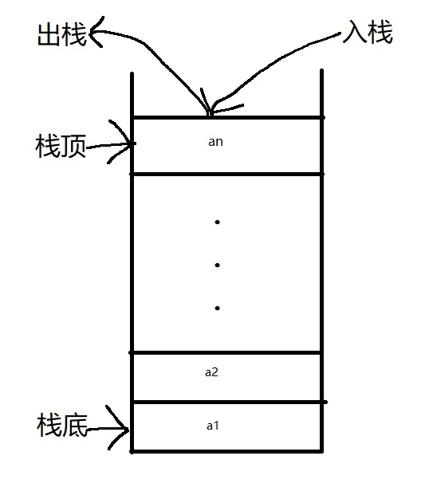
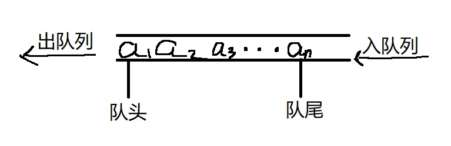
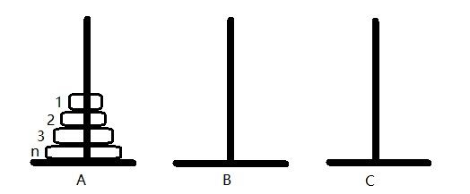
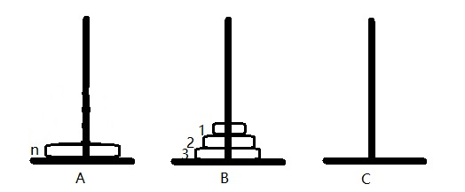
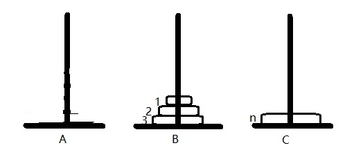
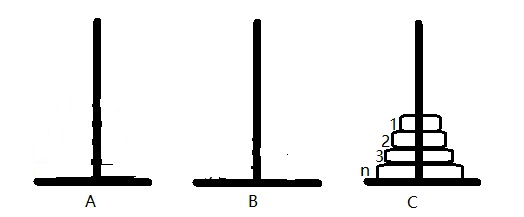

# 栈和队列

## 栈

**栈（stack）** 是限定只在表尾进行插入或删除的线性表。表尾被称为**栈顶（top）**，表头被称为**栈底（bottom）**。不含元素的空表称为**空栈**。

假设栈 $S=(a_1,a_2,\ldots,a_n)$，则称 $a_1$ 为栈底元素，$a_n$ 为栈顶元素。栈中元素按 $a_1,a_2,\ldots,a_n$ 的顺序进栈，退栈的第一个元素应为栈顶元素。也就是说，栈的修改是按后进先出的原则进行的。因此，栈又称为 **后进先出（Last In First Out, LIFO）** 的线性表。



在日常生活中，有很多类似栈的例子。例如，叠盘子时总是逐个往上叠放，而取用时总是从上往下逐个取用。栈的操作特点正是上述实际应用的抽象。在程序设计中，如果需要按照保存数据时相反的顺序使用数据，则可以利用栈来实现。

## 队列

**队列（queue）** 是一种 **先进先出（First In First Out, FIFO）** 的线性表。它只允许在表的一端进行插入，而在另一端删除元素。在队列中，允许插入的一端称为 **队尾（rear）**，允许删除的一端称为 **队头（front）**。假设队列为 $q=(a_1,a_2,\ldots,a_n)$，那么，$a_1$ 就是队头元素，$a_n$ 则是队尾元素。队列中的元素是按照 $a_1,a_2,\ldots,a_n$ 的顺序进入的，退出队列也只能按照这个顺序退出。



队列在程序设计中经常出现。一个最典型的例子就是操作系统中的作业排队。在允许多道程序运行得计算机系统中，同时有几个作业运行。如果运行的结果都需要通过通道输出，那就要按请求输入的先后次序排队。每当通道传输完毕可以接受新的输出任务时，队头的作业先从队列中退出。凡是申请输出的作业都从队尾进入队列。

## 栈的表示和实现

### 顺序栈的表示和实现

顺序栈是指利用顺序存储结构实现的栈，即利用一组地址连续的存储单元依次存放自栈底到栈顶的元素。

#### 初始化

顺序栈的初始化操作是分配一个数组空间。

```ts
const stack = []
```

#### 入栈

入栈操作是指在栈顶插入一个新的元素。

```ts
stack.push(e)
```

#### 出栈

出栈操作是将栈顶元素删除。

```ts
stack.pop()
```

#### 取栈顶元素

```ts
stack.at(-1)
```

### 链栈的表示和实现

链栈是指采用链式存储结构实现的栈。由于栈的主要操作是在栈顶插入和删除，显然以链表的头部作为栈顶是最方便的，而且没必要使用头结点。

#### 初始化

链栈的初始化操作是构造一个空栈，因为没有使用头结点，所以直接将栈顶指针设为 `null` 就行。

<<< ./stack.ts#init

#### 入栈

<<< ./stack.ts#push

#### 出栈

<<< ./stack.ts#pop

#### 取栈顶元素数据

<<< ./stack.ts#getTop

## 栈与递归

栈有一个重要应用是在程序设计语言中实现递归。递归是指，若在一个函数、过程或者数据结构定义的内部直接（或间接）出现定义本身的应用，则称它们是递归的，或者是递归定义的。在以下三种情况下，常常使用递归的方法。

### 递归的定义

有很多数学函数是递归定义的，如阶乘

$$
Fact(n)=
\begin{cases}
1 & \text{if }n\text{ = 0} \\
n * Fact(n-1) & \text{if }n\text{ > 0}
\end{cases}
$$

二阶 Fibonacci 数列

$$
Fib(n)=
\begin{cases}
1 & \text{if }n\text{ = 1 or }n\text{ = 2} \\
Fib(n-1) + Fib(n-2) & \text{other}
\end{cases}
$$

对于阶乘函数，可以使用递归来求解。

```ts
function Fact(n: number) {
  return !n ? 1 : n * Fact(n - 1)
}
```

类似地，可以使用递归来求解 Fibonacci 数列。

```ts
function fib(n: number) {
  return n === 1 || n === 2 ? 1 : fib(n - 1) + fib(n - 2)
}
```

### 递归的数据结构

某些数据结构本身具有递归的特性，则它们的操作可递归地描述。

例如，对于链表，其结点 `ListNode` 由数据域 `data` 和指针域 `next` 组成，而 `next` 又指向 `ListNode`，即 `ListNode` 的定义中又用到了其自身，所以链表是一种递归的数据结构。

### 问题的解法是递归的

还有一类问题，虽然问题本身没有明显的递归结构，但用递归求解比迭代求解更简单，如 Hanoi 塔问题、八皇后问题、迷宫问题等。

下面让我们来看下，$n$ 阶 Hanoi 塔问题是如何使用递归求解。

假设有 3 个分别命名为 A、B、C 的塔座，在塔座 A 上插有 $n$ 个直径大小不同，由小到大编号为 $1,2,\ldots,n$ 的圆盘。



现在要求将 A 上的 $n$ 个圆盘移到 C 上，并且仍按同样顺序叠放，圆盘移动时必须遵循下列规则：

- 每次只能移动一个圆盘
- 圆盘可以放在任一塔座上
- 任何时候都不能将一个较大圆盘放在较小圆盘上

设 A 上最初的盘数为 $n$，则当 $n=1$ 时，只要将盘移动到 C 上即可；否则，执行以下步骤：

1. 用 C 做过渡，将 A 上的 $n-1$ 个盘移动到 B 上
2. 将 A 上最后一个盘移到 C 上
3. 用 A 做过渡，将 B 上 $n-1$ 个盘移到 C 上

过程如下图所示：





根据这种解法，如何将 $n-1$ 个盘子从一个塔座移到另一个塔座的问题是一个和原问题具有相同特征属性的问题，只是问题规模小 1，因此可以用同样的方法求解。

代码如下：

<<<./hanoi.ts

## 递归算法的效率分析

### 时间复杂度

在算法分析中，当一个算法中包含递归调用时，其时间复杂度的分析可以转化为一个递归方程求解。实际上，这个问题是数学上求解渐近阶的问题，而递归方程的形式多种多样，求解方法也不尽相同。迭代法是求解递归方程的一种常用方法，其基本步骤是迭代展开递归方程右端，使之成为一个非递归的和式，然后对和式的估计来达到对方程左端的估计。

以阶乘 $Fact(n)$ 为例。设 $Fact(n)$ 的执行时间是 $T(n)$。此递归函数中 $n$ 为 0 时执行时间是 $O(1)$，递归调用 $Fact(n-1)$ 的执行时间是 $T(n-1)$，所以 $n\ast Fact(n-1)$ 的执行时间是 $O(1)+T(n-1)$。其中，设两数相乘和赋值操作的执行时间为 $O(1)$，则对某常数 $C\text{、}D$ 有如下递归方程：

$$
T(n)=
\begin{cases}
D & n=0 \\
C+T(n-1) & n \geqslant 1
\end{cases}
$$

设 $n>2$，利用上式对 $T(n-1)$ 展开可得

$$
T(n-1)=C+T(n-2)
$$

则有

$$
T(n)=2C+T(n-2)
$$

同理，当 $n>3$ 有

$$
T(n)=3C+T(n-3)
$$

依此类推，当 $n>i$时

$$
T(n)=iC+T(n-i)
$$

当 $n=i$ 时有

$$
T(n)=nC+T(0)=nC+D
$$

采用这种方法计算 Fibonacci 数列和 Hanoi 塔问题递归算法的时间复杂度均为 $O(2^n)$。

### 空间复杂度

递归函数在执行时，系统需设立一个递归工作栈存储每一层递归所需信息，此工作栈是递归函数执行的辅助空间，因此，分析递归算法空间复杂度需要分析工作栈大小。

对于递归算法，空间复杂度

$$
S(n)=O(f(n))
$$

$f(n)$ 为工作栈中记录的个数与问题规模 $n$ 的函数关系。

阶乘问题、Fibonacci 数列问题、Hanoi 塔问题的递归算法的空间复杂度均为 $O(n)$。

## 队列的表示和实现

### 循环队列 —— 队列的顺序表示和实现

使用一组地址连续的存储单元依次存放从列头到列尾的元素。
