# 树和二叉树

## 树

**树**（Tree）是 $n(n \geqslant 0)$ 个结点的有限集，它或为空树（$n=0$）；或为非空树，对于非空树 $T$

- 有且仅有一个称之为根的结点
- 除根结点外的其余结点可分为 $m(m \geqslant 0)$ 个互不相交的有限集 $T_1,T_2,\ldots,T_m$，其中每一个集合本身又是一棵树，并且称为根的子树（SubTree）

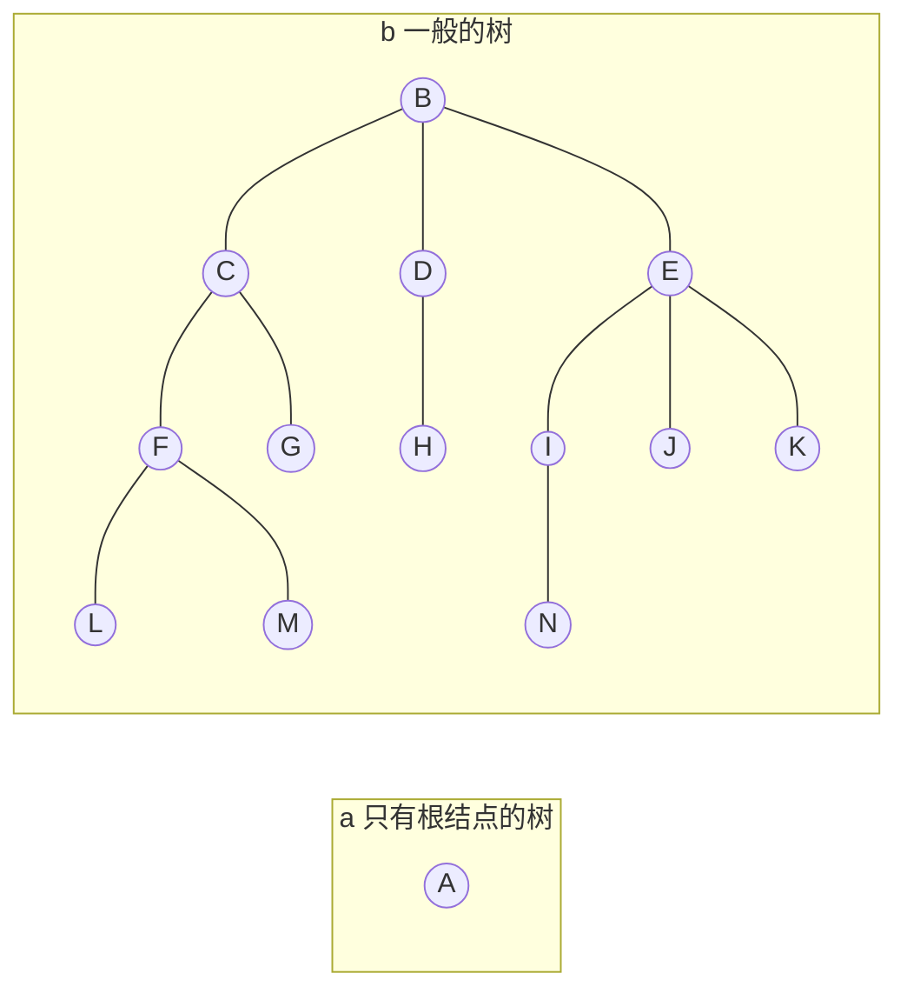

例如，上图中，b 是有 13 个结点的树，其中 B 是根，其余结点分成 3 个互不相交的子集：$T_1=\{C,F,G,L,M\},T_2=\{D,H\},T_3=\{E,I,J,K,N\}$。$T_1$、$T_2$ 和 $T_3$ 都是根 B 的子树，且本身也是一棵树。例如 $T_1$，其根为 C ，其余结点分为两个互不相交的子集：$T_{11}=\{F,L,M\},T_{12}=\{G\}$。$T_{11}$ 和 $T_{12}$ 都是 C 的子树。而 $T_{11}$ 中 F 是根，$\{L\}$ 和$\{M\}$ 是 F 的两颗互不相交的子树，其本身又是只有一个根结点的树。

### 基本术语

- **结点**：树中的一个独立单元。包含一个数据元素及若干指向其子树的分支，如上图 b 中的 B、C、D、E 等。
- **结点的度**：结点拥有的子树数称为结点的度。例如，B 的度是 3，D 的度是 1，G 的度是 0。
- **树的度**：树内各结点度的最大值。b 所示的树的度为 3。
- **叶子**：度为 0 的结点。也称为终端结点。结点 L、M、G、H、N、J、K 都是叶子。
- **非终端结点**：度不为 0 的结点。除根结点之外，非终端结点也称为内部结点。结点 B、C、D、E、F、I 都是非终端结点，其中除了 B 外的结点也称为内部结点。
- **双亲和孩子**：结点的子树的根称为该结点的孩子，相应地，该结点称为孩子的双亲。例如，C 的双亲为 B，C 的孩子有 F 和 G。
- **兄弟**：同一个双亲的孩子之间互称兄弟。例如，I、J、K 互为兄弟。
- **祖先**：从根到该结点所经分支上的所有结点。例如，N 的祖先为 B、E、I。
- **子孙**：以某结点为根的子树中的任一结点都称为该结点的子孙。如 C 的子孙为 F、G、L、M。
- **层次**：结点的层次从根开始定义，根为第一层，根的孩子为第二层。树中任一结点的层次等于其双亲结点的层次加 1。
- **堂兄弟**：双亲在同一层的结点互为堂兄弟。例如，结点 H 与 F、G、I、J、K 互为堂兄弟。
- **树的深度**：树中结点的最大层次称为树的深度或高度。b 所示的树的深度为 4。
- **有序树和无序树**：如果将树中结点的各子树看成从左至右是有次序的（即不能互换），则称该树为有序树，否则称为无序树。在有序树中最左边的子树的根称为第一个孩子，最右边的称为最后一个孩子。
- **森林**：是 $m(m \geqslant 0)$ 棵互不相交的树的集合。对树中每个结点而言，其子树的集合即为森林。由此，也可以用森林和树相互递归的定义来描述树。

就逻辑结构而言，任何一棵树都是一个二元组 $Tree=(root,F)$，其中 $root$ 是数据元素，称作树的根结点；$F$ 是 $m(m \geqslant 0)$ 棵树的森林，$F=(T_1,T_2,\ldots,T_m)$，其中 $T_i=(r_i,F_i)$ 称作根 $root$ 的第 $i$ 棵子树；当 $m \ne 0$ 时，在树根和其子树森林之间存在下列关系：

$$
RF=\{\langle root,r_i \rangle | i=1,2,\ldots,m,m>0\}
$$

### 存储结构

树的存储结构有多种形式。这里介绍 3 种常用的表示方法。

#### 双亲表示法

以一组连续的存储单元存储树的结点，每个结点除了数据域 data 外，还有一个 parent 域用于指示其双亲结点的位置。

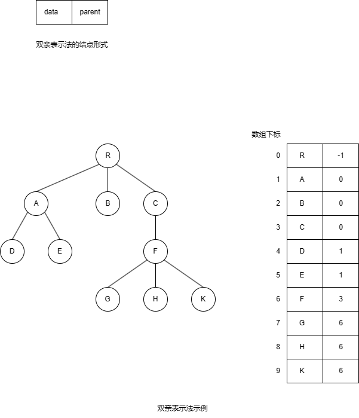

在这种结构下，查询结点的双亲很方便，但查询结点的孩子需要遍历整个结构。

#### 孩子表示法

由于树中每个结点可能有多棵子树，则可用多重链表，即每个结点设置多个指针域，每个指针指向一颗子树的根结点。结点格式如下图。

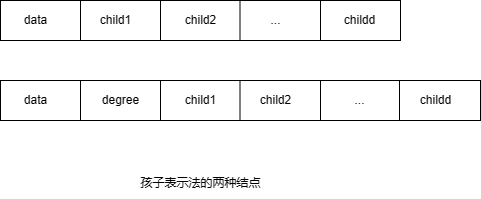

若采用第一种结点格式，则多重链表中的结点是同构的，其中 $d$ 为树的度。由于树中很多结点的度小于 $d$，所以链表中有很多空链域，空间较浪费，一颗有 $n$ 个结点度为 $k$ 的树中必有 $n(k-1)+1$ 个空链域。

若采用第二种结点格式，则多重链表中的结点是不同构的，其中 $d$ 为结点的度，degree 域的值同 $d$。此时，虽能节约存储空间，但操作麻烦。

另一种办法是，把每个结点的孩子结点排列起来，看成是一个线性表，且以单链表做存储结构，则 $n$ 个结点有 $n$ 个孩子链表（叶子的孩子链表为空表）。而 $n$ 个头指针又组成一个线性表，为了便于查找，可采用顺序存储结构。

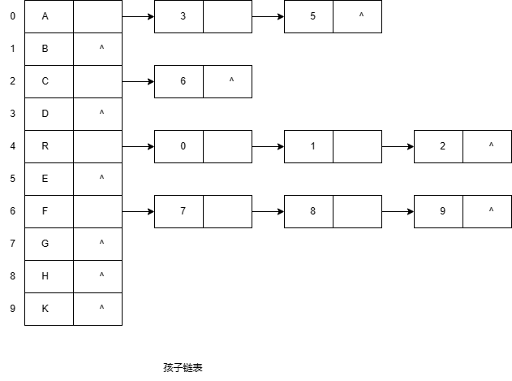

与双亲表示法相反，此种结构便于查询孩子，但不便于查询双亲。

我们可以把这两种方法结合起来，即将双亲表示和孩子链表合在一起。

#### 孩子兄弟法

又称二叉树表示法，或二叉链表表示法，即以二叉链表做树的存储结构。链表中结点的两个链域分别指向该结点的第一个孩子和下一个兄弟结点，分别命名为 firstchild 域和 nextsibling 域，结点形式如下图。

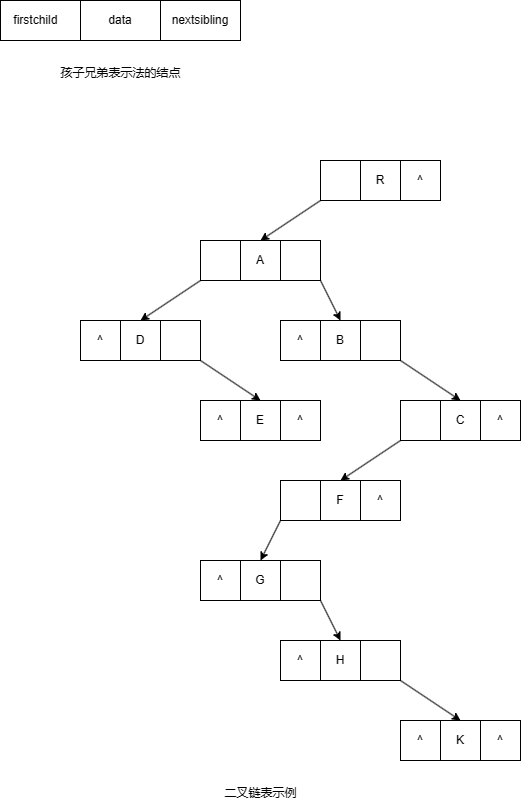

这种结构下，若要访问结点 X 的第 $i$ 个孩子，则只要先从 firstchild 域找到第一个孩子结点，然后沿着孩子结点的 nextsibling 域连续走 $i-1$ 步，便可找到 x 的第 $i$ 个孩子。当然，如果为每个结点增设一个 parent 域，则同样能方便地实现查找双亲的操作。

这种存储结构的优点是它和二叉树的二叉链表表示完全一样，便于将一般的树结构转换成二叉树进行处理，利用二叉树的算法来实现对树的操作。因此孩子兄弟法是应用较为普遍的一种树的存储表示方法。

## 二叉树

**二叉树（Binary Tree）** 是 $n(n \geqslant 0)$ 个结点所构成的集合，它或为空树 $(n=0)$，或为非空树，对于非空树 $T$：

- 有且仅有一个称之为根的结点
- 除根结点外的其余结点可分为两个互不相交的子集 $T_1$ 和 $T_2$，分别称为 $T$ 的左子树和右子树，且 $T_1$ 和 $T_2$ 本身又都是二叉树

二叉树与树的区别：

- 二叉树每个结点至多只有两颗子树（即二叉树中不存在度大于 2 的结点）
- 二叉树的子树有左右之分，其次序不能任意颠倒

二叉树的递归定义表明二叉树或为空，或是由一个根结点加上两颗分别称为左子树和右子树的、互不相交的二叉树组成。由于这两颗子树也是二叉树，则由二叉树的定义，它们也可以是空树。

### 性质

1. 在二叉树的第 $i$ 层上至多有 $2^{i-1}$ 个结点 $(i \geqslant 1)$

**证明**：利用归纳法易证得此性质。

$i=1$ 时，只有一个根结点。显然，$2^{i-1}=2^0=1$ 是对的。

假设对所有的 $j(1 \leqslant j < i)$，命题成立，即第 $j$ 层上至多有 $2^{j-1}$ 个结点。那么，可以证明 $j=i$ 时命题也成立。

由归纳假设：第 $i-1$ 层上至多有 $2^{i-2}$ 个结点。由于二叉树每个结点的度至多为 2，故在第 $i$ 层上的最大结点数为第 $i-1$ 层的最大结点数的 2 倍，即 $2 \times 2^{i-2}=2^{i-1}$。

2. 深度为 $k$ 的二叉树至多有 $2^k-1$ 个结点 $(k \geqslant 1)$

**证明**：由性质 1 可见，深度为 $k$ 的二叉树的最大结点数为

$$
\sum_{i=1}^{k}2^{i-1}=2^k-1
$$

3. 对任何一颗二叉树 $T$，如果其终端结点数为 $n_0$，度为 2 的结点数为 $n_2$，则 $n_0=n_2+1$

**证明**：设 $n_1$ 为二叉树 $T$ 中度为 1 的结点数。因为二叉树中所有结点的度都小于等于 2，所以其结点总数为

$$
n=n_0+n_1+n_2
$$

再看二叉树中的分支数。除了根结点外，其余结点都有一个分支进入，设 $B$ 为分支总数，则 $n=B+1$。由于这些分支是由度为 1 或 2 的结点射出的，所以又有 $B=n_1+2n_2$。则有

$$
n=n_1+2n_2+1
$$

结合上述式子可得

$$
n_0=n_2+1
$$

### 满二叉树

深度为 $k$ 且含有 $2^k-1$ 个结点的二叉树。

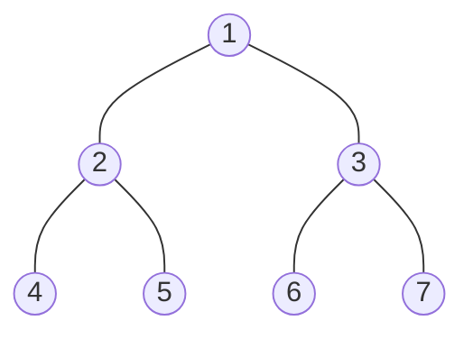

特点：每一层上的结点数都是最大结点数。

### 完全二叉树

对满二叉树的结点进行编号，约定编号从根结点起，自上而下，从左至右。

深度为 $k$ 的，有 $n$ 个结点的二叉树，当且仅当其每一个结点都与深度为 $k$ 的满二叉树中编号从 1 至 $n$ 的结点一一对应时，称之为完全二叉树。

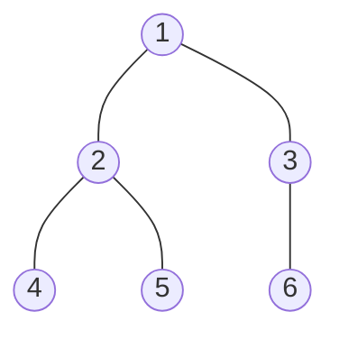

特点：

- 叶子结点只可能在层次最大的两层上出现
- 对任一结点，若其右分支下的子孙的最大层次为 $l$，则其左分支下的子孙的最大层次必为 $l$ 或 $l+1$

#### 性质

1. 具有 $n$ 个结点的完全二叉树的深度为 $\lfloor \log_{2}n \rfloor + 1$

**证明**：假设深度为 $k$，则根据二叉树性质 2 和完全二叉树的定义有

$$
2^{k-1} \leqslant n < 2^k \\
k-1 \leqslant \log_{2}n < k \\
\because k \in \mathbb{N} \\
\therefore k=\lfloor \log_{2}n \rfloor + 1
$$

2. 如果对一颗有 $n$ 个结点的深度为 $\lfloor \log_{2}n \rfloor + 1$ 的完全二叉树的结点按层序编号（从第 $1$ 层到 $\lfloor \log_{2}n \rfloor + 1$ 层，每层从左到右），则对任一结点 $i(1 \leqslant i \leqslant n)$，有

- 如果 $i=1$，则结点 $i$ 是树的根，无双亲；如果 $i>1$，则其双亲 $PARENT(i)$ 是结点 $\lfloor i/2 \rfloor$
- 如果 $2i>n$，则结点 $i$ 无左孩子（结点 $i$ 为叶子结点）；否则其左孩子 $LCHILD(i)$ 是结点 $2i$
- 如果 $2i+1>n$，则结点 $i$ 无右孩子；否则其右孩子 $RCHILD(i)$ 是结点 $2i+1$

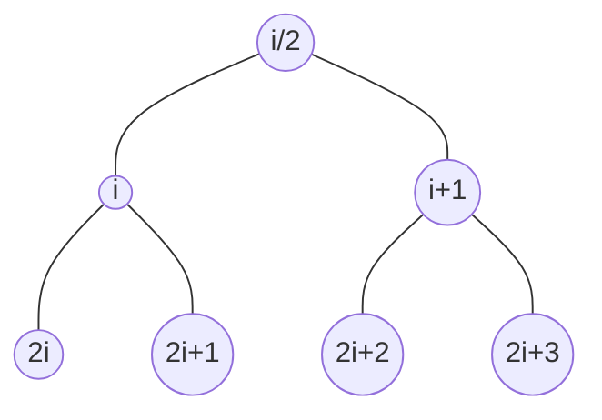

### 存储结构

#### 顺序存储

顺序存储结构使用一组地址连续的存储单元来存储元素，为了能够在存储结构中反映结点之间的逻辑关系，必须将二叉树中的结点按一定的规律放置。

对于完全二叉树，只要从根起按层序存储即可，依次自上而下、从左到右存储结点，即将完全二叉树上编号为 $i$ 的结点存储在一维数组中下标为 $i-1$ 的位置。

如下图的完全二叉树

对应的顺序存储结构为

$$
\begin{array}{|c|}
t \\
\hline
1 \\
2 \\
3 \\
4 \\
5 \\
6 \\
\end{array}
$$

对于一般二叉树，则应将其每个结点与完全二叉树上的结点相对照，存储在一维数组对应的位置中。

如下图的二叉树

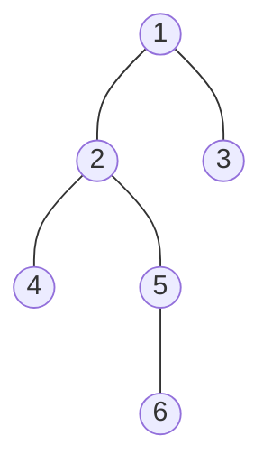

对应的顺序存储结构为

$$
\begin{array}{|c|}
t \\
\hline
1 \\
2 \\
3 \\
4 \\
5 \\
0 \\
0 \\
0 \\
6 \\
\end{array}
$$

从上图可见，这种顺序存储结构仅适用于完全二叉树。因为，在最坏的情况下，一个深度为 $k$ 且只有 $k$ 个结点的单支树（树中不存在度为 2 的结点）却需要长度为 $2^k-1$ 的一维数组。这造成了存储空间的极大浪费。对于一般二叉树，更适合使用下面的链式存储结构。

#### 链式存储

二叉树的链表中的结点至少包含 3 个域：数据域和左、右指针域。有时，为了便于找到结点的双亲，还可在结点结构中增加一个指向其双亲结点的指针域。利用这两种结点结构得到的存储结构分别称之为二叉链表和三叉链表。容易证得，在含有 $n$ 个结点的二叉链表中有 $n+1$ 个空链域。

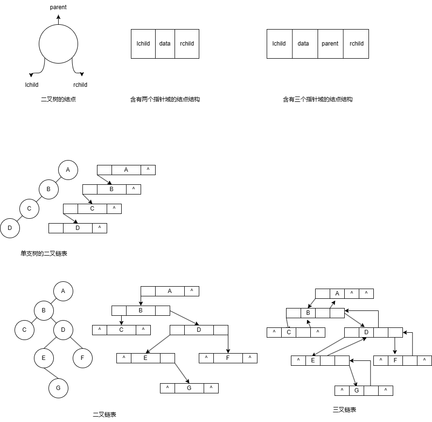

在不同的存储结构中，实现二叉树的操作方法也不同。因此，在具体应用中采用什么存储结构，除根据二叉树的形态之外还应考虑需要进行何种操作。

## 遍历二叉树

**遍历二叉树**（traversing binary tree）是指按某条搜索路径遍历树中每个结点，使得每个结点都能被且仅被访问一次。遍历是二叉树最基本的操作，也是二叉树其它各种操作的基础，遍历的实质是对二叉树进行线性化的过程，遍历的结果是将非线性结构的树中结点排成一个线性序列。

二叉树由 3 个基本单元组成：根结点、左子树和右子树。因此，若能一次遍历这三个部分，便是遍历了整个二叉树。使用 L、D、R 分别表示遍历左子树、访问根结点和遍历右子树，则有 DLR、LDR、LRD、DRL、RDL、RLD 这 6 种遍历二叉树的方式。若限定先左后右，则只有前 3 种情况，分别称之为先序遍历、中序遍历和后序遍历。

### 先序遍历

若二叉树为空，则空操作；否则

1. 访问根结点
2. 先序遍历左子树
3. 先序遍历右子树

### 中序遍历

若二叉树为空，则空操作；否则

1. 中序遍历左子树
2. 访问根结点
3. 中序遍历右子树

### 后序遍历

若二叉树为空，则空操作；否则

1. 后序遍历左子树
2. 后序遍历右子树
3. 访问根结点

### 例子

表示表达式 $a+b \ast (c-d)-e/f$ 的二叉树如下：

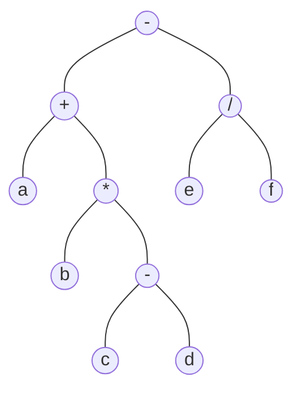

先序遍历：$-+a \ast b-cd/ef$

中序遍历：$a+b \ast c-d-e/f$

后序遍历：$abcd- \ast +ef/-$

从表达式来看，上述 3 个序列正好是表达式的前缀表示（波兰式）、中缀表示和后缀表示（逆波兰式）。

算法如下：

::: code-group
<<<./tree.ts#preorderTraverse [先序遍历]
<<<./tree.ts#inorderTraverse [中序遍历]
<<<./tree.ts#postorderTraverse [后序遍历]
:::

从上述二叉树遍历的定义可知，3 种遍历算法不同处仅在于访问根结点和遍历左、右子树的先后顺序。

我们还可以使用栈将递归算法改写成非递归算法：

::: code-group
<<<./tree-iterator.ts#preorderTraverse [先序遍历]
<<<./tree-iterator.ts#inorderTraverse [中序遍历]
<<<./tree-iterator.ts#postorderTraverse [后序遍历]
:::

无论是递归还是非递归算法，因为每个结点被访问一次，则不论按哪一种次序进行遍历，对含有 $n$ 个结点的二叉树，其时间复杂度为 $O(n)$。所需辅助空间位遍历过程中栈的最大容量，即树的深度，最坏情况下为 $n$，则空间复杂度为 $O(n)$。

除了上述 3 种遍历方式外，还有一种按层次遍历的方式，这种方式按照自上而下，从左到右的顺序遍历。层次遍历不是一个递归过程，算法的实现可以借助队列，此处不做详细讨论。

### 根据遍历序列确定二叉树

由二叉树的先序序列和中序序列，或由其后序序列和中序序列均能唯一确定一颗二叉树。

根据定义，二叉树的先序遍历是先访问根结点，其次再按先序遍历遍历根结点的左子树，最后按先序遍历遍历根结点的右子树。也就是说，在先序序列中，第一个结点是二叉树的根结点。另外，中序遍历是先遍历左子树，然后访问根结点，最后再遍历右子树。这样，根结点在中序序列中必然将中序序列分割成两个子序列，前一个子序列是根结点的左子树的中序序列，后一个是右子树的中序序列。根据这两个子序列，在先序序列中找到对应的左子序列和右子序列。在先序序列中，左子序列的第一个结点是左子树的根结点，右子序列的第一个结点是右子树的根结点。这样，就确定了二叉树的三个结点。同时，左子树和右子树的根结点又可以分别把左子序列和右子序列划分成两个子序列，如此递归下去，当取尽先序序列中的结点时，便可以得到一颗二叉树。

同理，由二叉树的后序序列和中序序列也可唯一确定一颗二叉树。因为，依据后序遍历和中序遍历的定义，后序序列的最后一个结点，就如同先序序列的第一个结点一样，可将中序序列分成两个子序列，分别为这个结点左子树的中序序列和右子树的中序序列，再拿出后序序列的倒数第二个结点，并继续分割中序序列，如此递归下去，当倒着取尽后序序列中的结点时，便可以得到一颗二叉树。

#### 例子

已知一颗二叉树的中序序列和后序序列分别是 BDCEAFHG 和 DECBHGFA，请画出这颗二叉树。

1. 由后序遍历特征，根结点必在后序序列尾部，所以根结点是 A
2. 由中序遍历特征，根结点必在其中间，而且其左边必全部是左子树子孙（BDCE），其右边必全部是右子树子孙（FHG）
3. 根据后序中的 DECB 子树可确定 B 为 A 的左孩子，根据 HGF 可确定 F 为 A 的右孩子；依此类推，可以唯一确定一颗二叉树

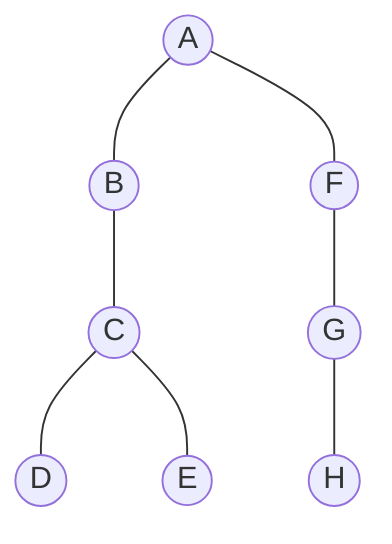

### 二叉树遍历算法的应用

#### 创建二叉链表

这里我们使用先序遍历的方式建立二叉链表。算法如下：

<<<./tree.ts#createBiTree

#### 复制二叉树

这里我们使用先序遍历的方式复制二叉树。算法如下：

<<<./tree.ts#copy

#### 计算二叉树深度

二叉树的深度为树中结点的最大层次，即左右子树深度的较大者，空树为 0。算法如下：

<<<./tree.ts#depth

#### 统计二叉树中结点个数

如果是空树，则结点个数为 0；否则，结点个数为左子树的结点数加右子树的结点数加根结点。算法如下：

<<<./tree.ts#count

## 线索二叉树

### 基本概念

遍历二叉树实质上是对一个非线性结构进行线性化操作，使每个结点（除第一个和最后一个外）在这些线性序列中有且仅有一个直接前驱和直接后继。

但是，当以二叉链表作为存储结构时，只能找到结点的左右孩子信息，而不能直接得到结点在任一序列中的前驱和后继信息，这种信息只有在遍历的过程中才能得到，为此引入线索二叉树来保存这些信息。

虽然可以在每个结点中增加两个指针域来存放在遍历时得到的有关前驱和后继信息，但这样做使得结构的存储密度大大降低。由于有 $n$ 个结点的二叉链表中必定存在 $n+1$ 个空链域，因此可以充分利用这些空链域存放结点的前驱和后继信息。

试做如下规定：若结点有左子树，则其 lchild 域指示其左孩子，否则令 lchild 域指示其前驱；若结点有右子树，则其 rchild 域指示其右孩子，否则令 rchild 域指示其后继。为了避免混淆，尚需改变结点结构，增加两个标志域。如下图所示：

$$
ltag=
\begin{cases}
0 & \text{lchild域指示结点的左孩子} \\
1 & \text{lchild域指示结点的前驱} \\
\end{cases}
rtag=
\begin{cases}
0 & \text{rchild域指示结点的右孩子} \\
1 & \text{rchild域指示结点的后继} \\
\end{cases}
$$

使用此种存储结构的二叉链表叫做**线索链表**，其中指向结点前驱和后继的指针，叫做**线索**。加上线索的二叉树称之为**线索二叉树**（**Threaded Binary Tree**）。对二叉树以某种次序遍历使其变为线索二叉树的过程叫做**线索化**。

### 构造线索二叉树

线索二叉树构造的实质是将二叉链表中的空指针改为指向前驱或后继的线索，而前驱或后继的信息只有在遍历时才能得到，因此线索化的过程即为在遍历的过程中修改空指针的过程。对二叉树使用不同遍历方法可以得到不同的线索二叉树，包括先序线索二叉树、中序线索二叉树和后序线索二叉树。

在这里我们使用中序遍历构造线索二叉树。为了方便，我们在链表上添加一个头结点，令其 lchild 指向根结点，rchild 指向中序序列的最后一个结点；同时，令序列中第一个结点的 lchild 和最后一个结点的 rchild 均指向头结点。这样，我们既可以从第一个结点顺后继进行遍历，也可以从最后一个结点顺前驱进行遍历。

算法如下：

<<<./tree.ts#inorderThreading

### 遍历线索二叉树

由于有了前驱和后继信息，线索二叉树的遍历和在指定次序下查找结点的前驱和后继算法都变得简单。因此，若需经常查找结点在所遍历线性序列中的前驱和后继，则采用线索链表作为存储结构。

下面我介绍遍历中序线索二叉树的算法，至于先序线索二叉树和后序线索二叉树，读者可以自行实现。

<<<./tree.ts#inorderTraverseThread

该算法时间复杂度为 $O(n)$，空间复杂度为 $O(1)$。

## 树和森林

### 森林与二叉树的转换

从树的孩子兄弟法可知，任何一棵和树对应的二叉树，其根结点的右子树必空。若把森林中第二棵树的根结点看成是第一棵树的根结点的兄弟，则同样可导出森林和二叉树的对应关系。如下图所示。

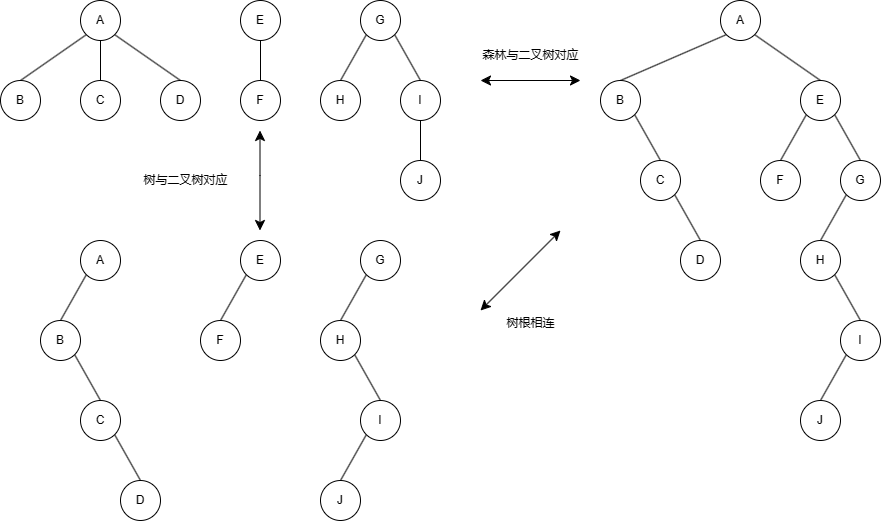

这个一一对应的关系说明森林或树与二叉树可以相互转换。

#### 森林转换成二叉树

如果 $F=\{T_1,T_2,\ldots,T_m\}$ 是森林，则可按如下规则转换成一颗二叉树 $B=(root,LB,RB)$：

1. 若 $F$ 为空，则 $B$ 为空树
2. 若 $F$ 非空，则 $B$ 的根 root 即为森林中第一棵树的根 $ROOT(T_1)$；$B$ 的左子树 $LB$ 是从 $T_1$ 中根结点的子森林 $F_1=\{T_{11},T_{12},\ldots,T_{1m}\}$ 转换而成的二叉树；其右子树 $RB$ 是从森林 ${F'}=\{T_2,T_3,\ldots,T_m\}$ 转换而成的二叉树

#### 二叉树转换成森林

如果 $B=(root,LB,RB)$ 是一颗二叉树，则可按如下规则转换成森林 $F=\{T_1,T_2,\ldots,T_m\}$：

1. 若 $B$ 为空，则 $F$ 为空
2. 若 $B$ 非空，则 $F$ 中第一棵树 $T_1$ 的根 $ROOT(T_1)$ 即为二叉树 $B$ 的根 root；$T_1$ 中根结点的子树森林 $F_1$ 是由 $B$ 的左子树 $LB$ 转换而成的森林；$F$ 中除 $T_1$ 之外其余树组成的森林 ${F'}=\{T_2,T_3,\ldots,T_m\}$ 是由 $B$ 的右子树 $RB$ 转换而成的森林

从上述递归定义容易写出相互转换的递归算法。同时，森林和树的操作亦可转换成二叉树的操作来实现。

### 树和森林的遍历

#### 树的遍历

由树结构的定义可引出两种次序遍历树的方法：

- 先根遍历：先访问树的根结点，然后依次先根遍历根的每颗子树
- 后根遍历：先依次后根遍历每棵子树，然后访问根结点

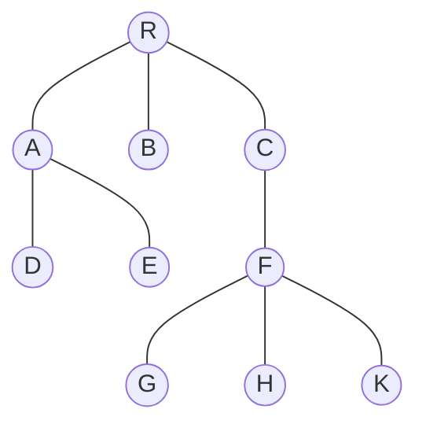

例如，对上图进行先根遍历，可得树的先根序列：RADEBCFGHK

若对此树进行后根遍历，则得树的后根序列：DEABGHKFCR

按照森林和树相互递归的定义，可推出森林的两种遍历方法：先序遍历和中序遍历。

#### 森林的遍历

##### 先序遍历

若森林非空，则可按如下规则遍历：

1. 访问森林中第一棵树的根结点
2. 先序遍历第一棵树的根结点的子树森林
3. 先序遍历除第一棵树之外的剩余的树构成的森林

##### 中序遍历

1. 中序遍历森林中第一棵树的根结点的子树森林
2. 访问第一棵树的根结点
3. 中序遍历除第一棵树之外的剩余的树构成的森林

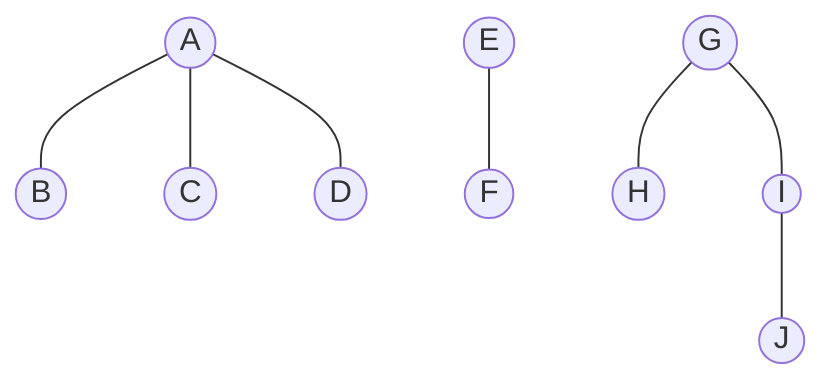

若对上图所示森林进行先序遍历，可得先序序列：ABCDEFGHIJ

若进行中序遍历，可得中序序列：BCDAFEHJIG

由森林与二叉树之间转换的规则可知，当森林转换成二叉树时，其第一棵树的子树森林转换成左子树，剩余树的森林转换成右子树，则上述森林的先序和中序遍历即为其对应的二叉树的先序和中序遍历。

由此可见，当以二叉链表做树的存储结构时，树的先根遍历和后根遍历可用二叉树的先序遍历和中序遍历实现。

## 哈夫曼树及其应用

### 基本概念

**哈夫曼（Huffman）树**又称**最优树**，是一类带权路径长度最短的树，在实际中有广泛的用途。哈夫曼树的定义，涉及路径、路径长度、权等概念，下面给出这些概念的定义。

- **路径**：从树中一个结点到另一个结点之间的分支构成这两个结点之间的路径
- **路径长度**：路径上的分支数目称作路径长度
- **树的路径长度**：从树根到每一结点的路径长度之和
- **权**：赋予某个实体的一个量，是对实体屙某个或某些属性的数值化描述。在数据结构中，实体有结点（元素）和边（关系）两大类，所以对应有结点权和边权。结点权或边权具体代表什么意义，由具体情况决定。如果在一颗树中的结点上带有权值，则对应的就有带权树等概念
- **结点的带权路径长度**：从该结点到树根之间的路径长度与结点上权的乘积
- **树的带权路径长度**：树中所有叶子结点的带权路径长度之和，通常记作 $WPL=\sum_{k=1}^{n}w_kl_k$
- **哈夫曼树**：假设有 $m$ 个权值 $\{w_1,w_2,\ldots,w_m\}$，可以构造一颗含有 $n$ 个叶子结点的二叉树，每个叶子结点的权为 $w_i$，则其中带权路径长度 $WPL$ 最小的二叉树称作最优二叉树或哈夫曼树

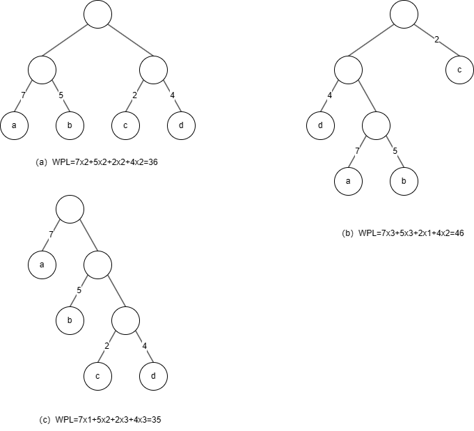

如上图所示的 3 棵二叉树，都含 4 个叶子结点 a、b、c、d，分别带权 7、5、2、4，它们的带权路径长度如上图所示，其中（c）树的最小。可以验证，它恰为哈夫曼树。

从上面的例子中，我们可以看出哈夫曼树的特点是权值越大的结点离根结点越近。根据这个特点，哈夫曼最早给出了一个构造哈夫曼树的方法，称哈夫曼算法。

### 构造算法

#### 构造过程

1. 根据给定的 $n$ 个权值 $\{w_1,w_2,\ldots,w_n\}$，构造 $n$ 棵只有根结点的二叉树，这 $n$ 棵二叉树构成森林 $F$
2. 在森林 $F$ 中选取两棵根结点的权值最小的树作为左右子树构造一颗新的二叉树，且置新的二叉树的根结点的权值为其左右子树根结点的权值之和
3. 在森林 $F$ 中删除这两棵树，同时将得到的新二叉树加入 $F$ 中
4. 重复 2 和 3，直到 $F$ 只含一棵树为止。这棵树便是哈夫曼树

过程如下图：

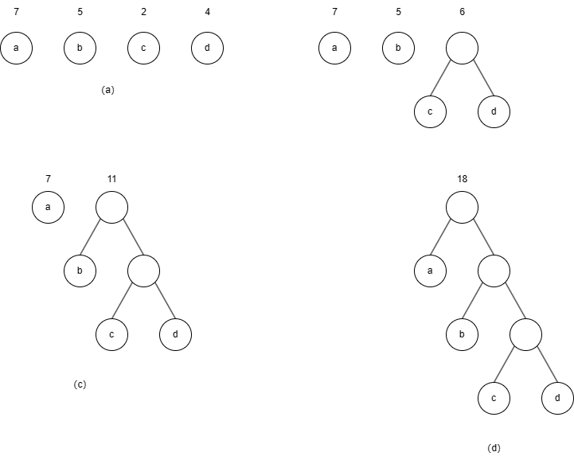

在构造哈夫曼树时，首先选择权小的，这样保证权大的离根较近，这样一来，在计算树的带权路径长度时，自然会得到最小带权路径长度，这种生成算法是一种典型的贪心法。

#### 实现

哈夫曼树是一种二叉树，这意味着我们可以使用之前介绍过的二叉树存储方法，由于哈夫曼树中没有度为 1 的结点，则一棵有 $n$ 个叶子结点的哈夫曼树共有 $2n-1$ 个结点，可以存储在一个大小为 $2n-1$ 的一维数组中。树中每个结点还要包含其双亲信息和孩子结点的信息，由此，每个结点的存储结构如图所示。

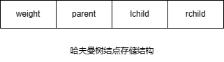

为了实现方便，数组的 0 号单元不使用，从 1 号单元开始使用，所以数组的大小为 $2n$。将叶子结点集中存储在前面 $1 \sim n$ 个位置，而后面的 $n-1$ 个位置存储其余非叶子结点。

<<<./tree.ts#HTNode

### 哈夫曼编码（TODO）
