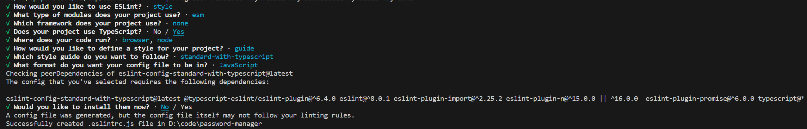

# 项目代码规范工具的使用

## 安装 ESLint 和 Prettier

::: code-group

```sh [npm]
npm i -D eslint prettier
```

```sh [yarn]
yarn add -D eslint prettier
```

```sh [pnpm]
pnpm add -D eslint prettier
```

:::

接下来让我们配置一下这两个工具。

首先，运行以下命令创建 `eslint` 的配置文件：

::: code-group

```sh [npm]
npm init @eslint/config
```

```sh [yarn]
yarn create @eslint/config
```

```sh [pnpm]
pnpm create @eslint/config
```

:::

该命令会弹出一些提示来引导你创建配置文件。



::: warning
注意：最后一步可能会询问你是否安装缺失依赖，此时选择安装的话默认会使用 `npm` 进行安装，如果你使用的是其它包管理器，你需要选择否并自行安装相关依赖，否则，可能会出现问题。
:::

根据你的选择，配置文件内容类似以下：

```js
module.exports = {
  env: {
    browser: true,
    es2021: true,
    node: true,
  },
  extends: 'standard-with-typescript',
  overrides: [
    {
      env: {
        node: true,
      },
      files: ['.eslintrc.{js,cjs}'],
      parserOptions: {
        sourceType: 'script',
      },
    },
  ],
  parserOptions: {
    ecmaVersion: 'latest',
    sourceType: 'module',
  },
  rules: {},
}
```

当然，你也可以根据自己的需要更改配置文件。

接下来，让我们创建 `prettier` 的配置文件。文件名为 `.prettierrc.json`，内容如下：

```json
{
  "singleQuote": true,
  "semi": false
}
```

我们还要安装 `eslint-config-prettier`，这个依赖是用来关闭 `eslint` 中所有与 `prettier` 冲突的规则的。

运行以下命令安装 `eslint-config-prettier`：

::: code-group

```sh [npm]
npm i -D eslint-config-prettier
```

```sh [yarn]
yarn add -D eslint-config-prettier
```

```sh [pnpm]
pnpm add -D eslint-config-prettier
```

:::

然后修改 `eslint` 配置文件如下：

```js
module.exports = {
  env: {
    browser: true,
    es2021: true,
    node: true,
  },
  extends: ['standard-with-typescript', 'prettier'],
  overrides: [
    {
      env: {
        node: true,
      },
      files: ['.eslintrc.{js,cjs}'],
      parserOptions: {
        sourceType: 'script',
      },
    },
  ],
  parserOptions: {
    ecmaVersion: 'latest',
    sourceType: 'module',
  },
  rules: {},
}
```

::: warning
要注意 `prettier` 要放在 `extends` 数组的最后一个，这样它才有机会覆盖其它配置。
:::

## 安装 husky

运行以下命令安装 husky：

::: code-group

```sh [npm]
npm i -D husky
```

```sh [yarn]
yarn add -D husky
```

```sh [pnpm]
pnpm add -D husky
```

:::

启用 Git hooks：

::: code-group

```sh [npm]
npx husky install
```

```sh [yarn]
yarn dlx husky install
```

```sh [pnpm]
pnpm husky install
```

:::

如果想安装完后自动启用 Git hooks，可以运行以下命令编辑 `package.json`：

```sh
npm pkg set scripts.prepare="husky install"
```

运行完之后，你的 `package.json` 类似以下：

```json
{
  "scripts": {
    "prepare": "husky install"
  }
}
```

## 安装 lint-staged

::: code-group

```sh [npm]
npm i -D lint-staged
```

```sh [yarn]
yarn add -D lint-staged
```

```sh [pnpm]
pnpm add -D lint-staged
```

:::

设置 `pre-commit` git hook 以运行 `lint-staged`。

::: code-group

```sh [npm]
npx husky add .husky/pre-commit "npx lint-staged"
```

```sh [yarn]
yarn dlx husky add .husky/pre-commit "yarn dlx lint-staged"
```

```sh [pnpm]
pnpm husky add .husky/pre-commit "pnpm lint-staged"
```

:::

在 `package.json` 中配置 `lint-staged` 如下：

```json
{
  "lint-staged": {
    "*.{js,ts,vue,tsx}": "eslint --cache --fix",
    "*.{js,css,md,ts,vue,tsx}": "prettier --write"
  }
}
```

## 安装 commitlint

::: code-group

```sh [npm]
npm i -D @commitlint/cli @commitlint/config-conventional
```

```sh [yarn]
yarn add -D @commitlint/cli @commitlint/config-conventional
```

```sh [pnpm]
pnpm add -D @commitlint/cli @commitlint/config-conventional
```

:::

创建配置文件 `commitlint.config.js`，内容如下：

```js
module.exports = {
  extends: ['@commitlint/config-conventional'],
}
```

设置 `commit-msg` git hook 以运行 `commitlint`。

::: code-group

```sh [npm]
npx husky add .husky/commit-msg 'npx --no -- commitlint --edit "$1"'
```

```sh [yarn]
yarn dlx husky add .husky/commit-msg 'yarn dlx commitlint --edit "$1"'
```

```sh [pnpm]
pnpm husky add .husky/commit-msg 'pnpm commitlint --edit "$1"'
```

:::

## References

- [ESLint](https://eslint.org/docs/latest/use/getting-started)
- [Prettier](https://prettier.io/docs/en/configuration)
- [husky](https://typicode.github.io/husky/getting-started.html)
- [lint-staged](https://github.com/okonet/lint-staged)
- [commitlint](https://commitlint.js.org/#/)
