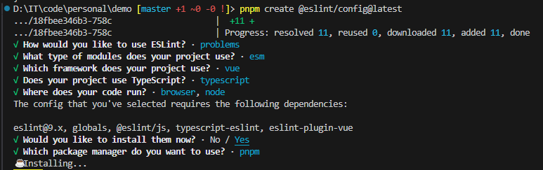

# 项目规范工具的使用

## JavaScript 项目

在 JavaScript 项目中，我将使用以下工具进行项目的规范化：

- [ESLint](https://eslint.org/) —— 检查代码质量；
- [Prettier](https://prettier.io/) —— 检查代码风格；
- [Husky](https://typicode.github.io/husky/) —— 配置 git hooks；
- [lint-staged](https://github.com/lint-staged/lint-staged#readme) —— 在 staged 文件上运行 linters；
- [commitlint](https://commitlint.js.org/) —— 规范化 commit message。

### 配置 ESLint

首先，我们按照 ESLint [文档](https://eslint.org/docs/latest/use/getting-started)中所描述的那样安装并配置 ESLint。

在执行初始化命令之后，会出现如下提示，你只需要根据自身选择即可：



命令执行完毕之后会创建如下配置文件：

::: code-group

```js [eslint.config.mjs]
import globals from 'globals'
import pluginJs from '@eslint/js'
import tseslint from 'typescript-eslint'
import pluginVue from 'eslint-plugin-vue'

export default [
  { languageOptions: { globals: { ...globals.browser, ...globals.node } } },
  pluginJs.configs.recommended,
  ...tseslint.configs.recommended,
  ...pluginVue.configs['flat/recommended'],
]
```

:::

#### 配置智能提示

我们可以安装 [@types/eslint](https://www.npmjs.com/package/@types/eslint)，并且通过 IDE 和 jsdoc 的配合来实现智能提示：

::: code-group

```js [eslint.config.mjs]{6}
import globals from 'globals'
import pluginJs from '@eslint/js'
import tseslint from 'typescript-eslint'
import pluginVue from 'eslint-plugin-vue'

/** @type {import('@types/eslint').Linter.FlatConfig} */
export default [
  { languageOptions: { globals: { ...globals.browser, ...globals.node } } },
  pluginJs.configs.recommended,
  ...tseslint.configs.recommended,
  ...pluginVue.configs['flat/recommended'],
]
```

:::

#### 配置 rules

::: code-group

```js [eslint.config.mjs]{12-19}
import globals from 'globals'
import pluginJs from '@eslint/js'
import tseslint from 'typescript-eslint'
import pluginVue from 'eslint-plugin-vue'

/** @type {import('@types/eslint').Linter.FlatConfig} */
export default [
  { languageOptions: { globals: { ...globals.browser, ...globals.node } } },
  pluginJs.configs.recommended,
  ...tseslint.configs.recommended,
  ...pluginVue.configs['flat/recommended'],
  {
    rules: {
      '@typescript-eslint/no-non-null-assertion': 'off',
      '@typescript-eslint/no-explicit-any': 'off',
      'no-undef': 'off',
      'vue/multi-word-component-names': 'off',
    },
  },
]
```

:::

#### 集成

请参考[文档](https://eslint.org/docs/latest/use/integrations)。

### 配置 Prettier

该节参考 prettier [install](https://prettier.io/docs/en/install) 文档。

1. 运行以下命令安装 prettier：

::: code-group

```sh [npm]
npm i -D prettier
```

```sh [yarn]
yarn add -D prettier
```

```sh [pnpm]
pnpm add -D prettier
```

:::

2. 创建配置文件：

::: code-group

```json [.prettierrc.json]
{
  "singleQuote": true,
  "semi": false
}
```

```[.prettierignore]
# Ignore artifacts:
dist/
node_modules/
```

:::

如果没有 `.prettierignore` 文件但是相同目录下存在 `.gitignore` 文件，prettier 会遵循 `.gitignore` 定义的规则。

#### 集成

与编辑器集成请参考该[文档](https://prettier.io/docs/en/editors)。

::: warning
需要注意，如果你是使用 VSCode，并且在使用 prettier 扩展时出现问题的话，请尝试重新加载 VSCode 窗口，这可能会解决你遇到的问题。
:::

如果你是搭配 eslint 一起使用的话，需要安装 [eslint-config-prettier](https://github.com/prettier/eslint-config-prettier#installation)，这个包是用来关闭与 prettier 冲突的 eslint 规则的。

::: code-group

```sh [npm]
npm i -D eslint-config-prettier
```

```sh [yarn]
yarn add -D eslint-config-prettier
```

```sh [pnpm]
pnpm add -D eslint-config-prettier
```

:::

然后修改 eslint 配置文件，prettier 配置对象需要放置在数组中合适的位置以覆盖其它规则：

::: code-group

```js [eslint.config.mjs]{5,13}
import globals from 'globals'
import pluginJs from '@eslint/js'
import tseslint from 'typescript-eslint'
import pluginVue from 'eslint-plugin-vue'
import eslintConfigPrettier from 'eslint-config-prettier'

/** @type {import('@types/eslint').Linter.FlatConfig} */
export default [
  { languageOptions: { globals: { ...globals.browser, ...globals.node } } },
  pluginJs.configs.recommended,
  ...tseslint.configs.recommended,
  ...pluginVue.configs['flat/recommended'],
  eslintConfigPrettier,
  {
    rules: {
      '@typescript-eslint/no-non-null-assertion': 'off',
      '@typescript-eslint/no-explicit-any': 'off',
      'no-undef': 'off',
      'vue/multi-word-component-names': 'off',
    },
  },
]
```

:::

### 配置 Husky

请参考该[文档](https://typicode.github.io/husky/get-started.html)进行安装和初始化。

### 配置 lint-staged

1. 安装 lint-staged

::: code-group

```sh [npm]
npm i -D lint-staged
```

```sh [yarn]
yarn add -D lint-staged
```

```sh [pnpm]
pnpm add -D lint-staged
```

:::

2. 设置 `pre-commit` git hook 以运行 `lint-staged`

::: code-group

```sh [npm]
echo "npx lint-staged" > .husky/pre-commit
```

```sh [yarn]
echo "yarn dlx lint-staged" > .husky/pre-commit
```

```sh [pnpm]
echo "pnpm lint-staged" > .husky/pre-commit
```

:::

3. 在 `package.json` 中配置 `lint-staged` 如下

```json
{
  "lint-staged": {
    "*.{js,ts,vue,tsx}": "eslint --cache --fix",
    "*.{js,css,md,ts,vue,tsx}": "prettier --write"
  }
}
```

### 配置 commitlint

该节参考[文档](https://commitlint.js.org/guides/getting-started.html)。

1. 安装 commitlint

::: code-group

```sh [npm]
npm i -D @commitlint/cli @commitlint/config-conventional
```

```sh [yarn]
yarn add -D @commitlint/cli @commitlint/config-conventional
```

```sh [pnpm]
pnpm add -D @commitlint/cli @commitlint/config-conventional
```

:::

2. 创建配置文件 `commitlint.config.ts`，内容如下

```ts
import { type UserConfig } from '@commitlint/types'

export default {
  extends: ['@commitlint/config-conventional'],
} as UserConfig
```

需要注意，如果你使用 pnpm 安装依赖，你需要把 `@commitlint/types` 进行提升。

::: code-group

```[.npmrc]
public-hoist-pattern[]=@commitlint/types
```

:::

3. 设置 `commit-msg` git hook 以运行 `commitlint`

::: code-group

```sh [npm]
echo 'npx --no -- commitlint --edit $1' > .husky/commit-msg
```

```sh [yarn]
echo 'yarn dlx commitlint --edit $1' > .husky/commit-msg
```

```sh [pnpm]
echo 'pnpm commitlint --edit $1' > .husky/commit-msg
```

:::

额外的，你可以使用 [prompt](https://commitlint.js.org/guides/use-prompt.html) 来快速编写符合 commit 规范的 commit message。

## C++ 项目
