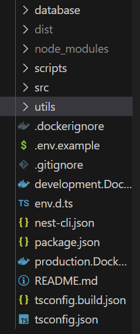
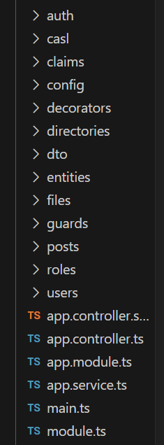
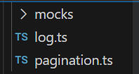
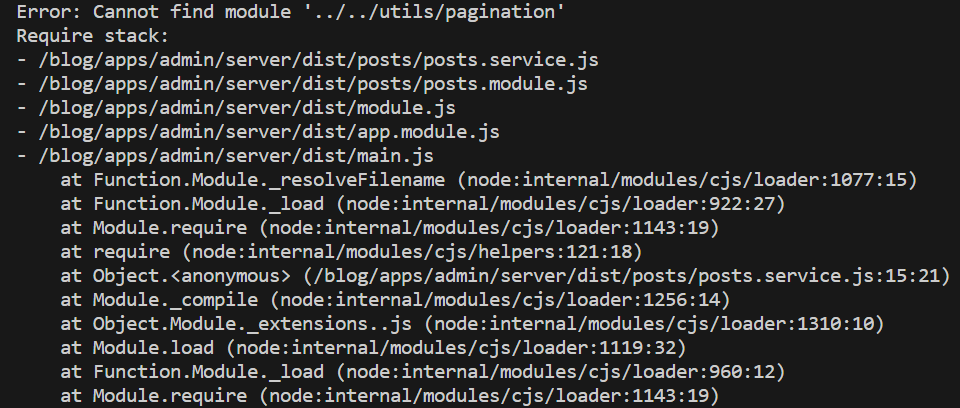
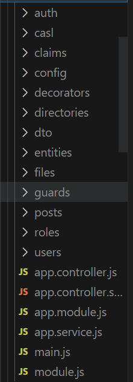
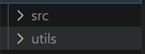

# 在 Nest 中使用 swc 遇到的坑

## 背景

[Nest](https://nestjs.com/) 在 v10 版本之后支持使用 [SWC](https://swc.rs/) 作为编译器加快 TypeScript 编译。于是我决定升级 Nest 的版本并使用 SWC。

::: tip
SWC 要比 TSC 快 大约 20 倍
:::

## 安装

首先我们先升级 Nest 相关的依赖到最新版本。因为我的仓库是托管在 github 上的，所以这里我使用了 [Renovate](https://github.com/apps/renovate) 来进行依赖版本的管理。读者可以使用自己喜欢的工具进行依赖版本的管理。

接下来，我们安装 SWC 的依赖。

::: code-group

```bash [pnpm]
pnpm add -D @swc/core @swc/cli
```

```bash [npm]
npm i -D @swc/core @swc/cli
```

```bash [yarn]
yarn add -D @swc/core @swc/cli
```

:::

## 配置

安装完成后，我们来配置一下 Nest 以使用 SWC 作为编译器。

找到 `nest-cli.json` 文件，设置 `compilerOptions.builder` 为 `swc`：

```json
{
  "compilerOptions": {
    "builder": "swc"
  }
}
```

SWC 不会执行类型检查，如果你想执行类型检查的话，需要设置 `compilerOptions.typeCheck` 为 `true`：

```json
{
  "compilerOptions": {
    "builder": "swc",
    "typeCheck": true
  }
}
```

这样，我们的配置就算完成了。当我们执行运行命令时，你会发现启动速度会比之前快很多。

## 坑

在描述问题之前，我先介绍一下项目之前的目录结构：



这里我们只关注 `src`、`utils` 目录以及 `nest-cli.json` 文件。其中，`src` 是存放源码的目录，`utils` 是存放通用方法的目录，`nest-cli.json` 是 `@nestjs/cli` 的配置文件。

`src` 内容：



`utils` 内容：



`nest-cli.json` 内容：

```json
{
  "$schema": "https://json.schemastore.org/nest-cli",
  "collection": "@nestjs/schematics",
  "sourceRoot": "src",
  "compilerOptions": {
    "deleteOutDir": true,
    "builder": "swc",
    "typeCheck": true
  }
}
```

现在让我们回到我将要遇到的坑上来。在上述配置完成之后，我尝试运行命令启动，结果报错了，错误如下：



奇怪的是，错误中所指向的源码我并没有修改过，我查看源码后也再三确认了并不是源码的问题。在我仔细地查看了报告的错误后，发现错误是来自于 `dist` 目录下的，该目录在打包后才会产生，此时我怀疑是打包的问题，于是我运行打包命令看一下生成的 `dist` 目录是什么情况。结果果然是打包的问题。

使用 `SWC` 打包后的 `dist`：



之前使用默认的 `tsc` 打包的 `dist`：



对比上面两张图片可以发现，`SWC` 只打包了 `src` 目录的内容。

一开始我以为是 `SWC` 的问题，于是一直在查找文档以及相关 issue，在我修改了 `SWC` 的各种配置后结果都是无用功。就在我打算放弃使用 `SWC` 改回默认的 `tsc` 时，我打开了 `nest-cli.json` 文件，发现里面有一个 `sourceRoot` 属性，突然我想到有没有可能是这个属性的问题呢？我尝试着把这个属性的值修改为 `utils`，然后运行打包命令，结果发现打包后的 `dist` 目录下只有 `utils` 的内容，这时，我确定了就是这个属性的问题。

在查阅 `@nest/cli` 源码后发现它把 `sourceRoot` 的值传到 `@swc/cli` 的 `cliOptions` 中的 `filenames` 去了。最后我把 `utils` 目录移动到 `src` 目录下并修改所有使用了该目录下的文件的引用路径才最终解决了这个问题。
