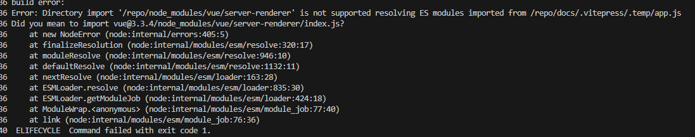

# 在 VitePress 中使用 unplugin-vue-components 遇到的坑

vitepress version: 1.0.0-beta.2

在 VitePress 中使用 unplugin-vue-components 插件，在 docker 中 build 的时候会出现以下错误：



解决方法是在配置中加上如下 alias：

```ts
{
  vite: {
    resolve: {
      alias: {
        'vue/server-renderer': require.resolve('vue/server-renderer'),
      },
    },
  }
}
```

暂时还未找出错误原因。

## References

- [Rollup failed to resolve import "vue/server-renderer"](https://github.com/vuejs/vitepress/issues/3035)
- [unplugin-vue-components issue #271](https://github.com/unplugin/unplugin-vue-components/issues/271)
