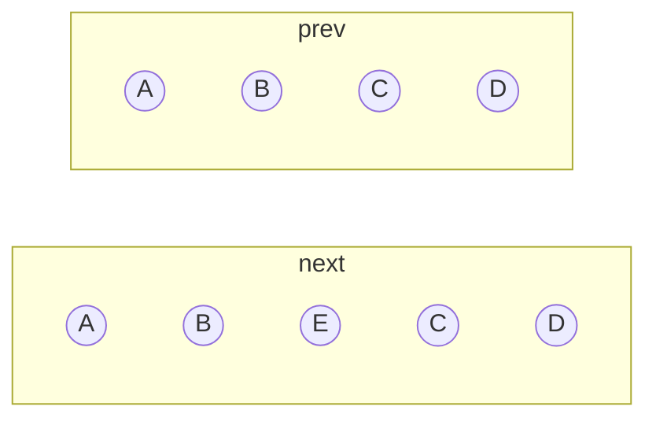
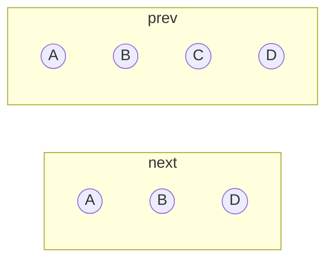
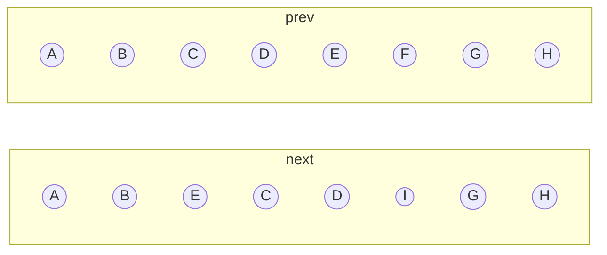

# diff 算法

## 是什么

`diff` 算法是一种通过同层的树节点进行比较的高效算法。通过对比新旧节点的 `VNode`，以较低成本完成节点的更新为目的，求解生成新节点 DOM。

`diff` 算法有两个特点：

- 比较只会在同层级进行，不会跨层级比较
- 在比较的过程中，循环从两边向中间比较

## 怎么做

新节点的变化无非是更新、添加、删除和移动，我们只需在新旧节点的比较中，应用这些变化即可。

在绝大部分情况下，在上述这些操作完成后，节点数组头尾很有可能存在相同的节点序列，针对这些情况，我们可以进行一些优化，优先从两边向中间循环同步相同的节点序列，对这些节点我们只需做更新操作即可。

例如以下两个示例：

**添加**



**删除**



从上面两个例子可以看出，在类似上述两种情况下新旧节点中头尾会存在相同序列的节点。接下来我们对头尾相同的节点序列进行同步。

设旧节点数组为 `c1`，新节点数组为 `c2`，设置以下变量存储索引位置：

```ts
let i = 0
const l2 = c2.length
let e1 = c1.length - 1 // 旧节点数组尾部索引
let e2 = l2 - 1 // 新节点数组尾部索引
```

进行相同类型节点的更新：

1. 从节点数组的头部开始遍历节点，对相同类型的节点进行 `patch()`，如果遇到类型不同的节点则终止遍历
2. 从节点数组的尾部开始遍历节点，对相同类型的节点进行 `patch()`，如果遇到类型不同的节点则终止遍历

```ts
// 1. sync from start
// (a b) c
// (a b) d e
while (i <= e1 && i <= e2) {
  const n1 = c1[i]
  const n2 = (c2[i] = optimized
    ? cloneIfMounted(c2[i] as VNode)
    : normalizeVNode(c2[i]))
  if (isSameVNodeType(n1, n2)) {
    patch(
      n1,
      n2,
      container,
      null,
      parentComponent,
      parentSuspense,
      namespace,
      slotScopeIds,
      optimized,
    )
  } else {
    break
  }
  i++
}

// 2. sync from end
// a (b c)
// d e (b c)
while (i <= e1 && i <= e2) {
  const n1 = c1[e1]
  const n2 = (c2[e2] = optimized
    ? cloneIfMounted(c2[e2] as VNode)
    : normalizeVNode(c2[e2]))
  if (isSameVNodeType(n1, n2)) {
    patch(
      n1,
      n2,
      container,
      null,
      parentComponent,
      parentSuspense,
      namespace,
      slotScopeIds,
      optimized,
    )
  } else {
    break
  }
  e1--
  e2--
}
```

完成上述操作后，我们还要考虑以下 3 中情况：

- 处理添加的节点
- 处理删除的节点
- 未知节点序列

对于前两种情况，如果新旧节点数组仅有头或尾有相同的节点序列，那么我们可以认为用户仅进行了添加或删除操作，在经过上述对相同节点序列进行同步的操作后，此时我们可以通过索引来处理变化的节点。

```ts
// 3. common sequence + mount
// (a b)
// (a b) c
// i = 2, e1 = 1, e2 = 2
// (a b)
// c (a b)
// i = 0, e1 = -1, e2 = 0
if (i > e1) {
  if (i <= e2) {
    const nextPos = e2 + 1
    const anchor = nextPos < l2 ? (c2[nextPos] as VNode).el : parentAnchor
    while (i <= e2) {
      patch(
        null,
        (c2[i] = optimized
          ? cloneIfMounted(c2[i] as VNode)
          : normalizeVNode(c2[i])),
        container,
        anchor,
        parentComponent,
        parentSuspense,
        namespace,
        slotScopeIds,
        optimized,
      )
      i++
    }
  }
}

// 4. common sequence + unmount
// (a b) c
// (a b)
// i = 2, e1 = 2, e2 = 1
// a (b c)
// (b c)
// i = 0, e1 = 0, e2 = -1
else if (i > e2) {
  while (i <= e1) {
    unmount(c1[i], parentComponent, parentSuspense, true)
    i++
  }
}
```

接下来我们要处理第 3 种情况。如下例所示：



此时 `i=2`、`e1=5`、`e2=5`。很明显我们无法应用上面提及的优化。对于未知节点子序列 `[E,C,D,I]` 和 `[C,D,E,F]` 有以下处理：

- 当两个节点类型相同时，执行更新操作
- 当新节点子序列中没有旧节点子序列中的某些节点时，执行删除操作
- 当新节点子序列中有旧节点子序列中没有的节点时，执行添加操作
- 当节点排列顺序发生变化时，执行移动操作

很明显，上述操作需要我们遍历新旧节点序列以作节点比较，这就需要嵌套循环遍历两个序列，时间复杂度是 $O(n^2)$。为了降低时间复杂度，Vue 中提供了一个特殊 Attribute —— `key`，这个 attribute 主要用作 Vitural DOM 算法提示，在比较新旧节点列表时用于识别 vnode。具有相同 `key` 的节点被认为是相同的，可以直接执行 `patch()` 更新。我们可以通过 `key` 来建立索引，把时间复杂度降低到 $O(n)$。

```ts
const s1 = i // prev starting index
const s2 = i // next starting index

// 5.1 build key:index map for newChildren
const keyToNewIndexMap: Map<PropertyKey, number> = new Map()
for (i = s2; i <= e2; i++) {
  const nextChild = (c2[i] = optimized
    ? cloneIfMounted(c2[i] as VNode)
    : normalizeVNode(c2[i]))
  if (nextChild.key != null) {
    if (__DEV__ && keyToNewIndexMap.has(nextChild.key)) {
      warn(
        `Duplicate keys found during update:`,
        JSON.stringify(nextChild.key),
        `Make sure keys are unique.`,
      )
    }
    keyToNewIndexMap.set(nextChild.key, i)
  }
}
```

接下来，我们遍历旧节点子序列，根据旧节点的 `key` 去获取该节点在新子序列中的索引，如果索引不存在，则说明该节点需要被删除；否则，将旧节点与该索引所指的新节点进行比较并进行更新。

这里，我们可以对删除逻辑进行优化。定义变量 `patched` 和 `toBePatched`，`patched` 用于记录更新次数，`toBePatched` 记录新节点子序列的长度。在每次进行节点更新时 `patched` 加 1，然后在每次循环开头判断 `patched` 是否大于等于 `toBePatched`，如果是，则说明所有新节点都已经被比较完毕，剩余的旧节点肯定没有对应的新节点，所以需要被删除。

```ts
// 5.2 loop through old children left to be patched and try to patch
// matching nodes & remove nodes that are no longer present
let j
let patched = 0
const toBePatched = e2 - s2 + 1

for (i = s1; i <= e1; i++) {
  const prevChild = c1[i]
  if (patched >= toBePatched) {
    // all new children have been patched so this can only be a removal
    unmount(prevChild, parentComponent, parentSuspense, true)
    continue
  }
  let newIndex
  if (prevChild.key != null) {
    newIndex = keyToNewIndexMap.get(prevChild.key)
  } else {
    // key-less node, try to locate a key-less node of the same type
    for (j = s2; j <= e2; j++) {
      if (isSameVNodeType(prevChild, c2[j] as VNode)) {
        newIndex = j
        break
      }
    }
  }
  if (newIndex === undefined) {
    unmount(prevChild, parentComponent, parentSuspense, true)
  } else {
    patch(
      prevChild,
      c2[newIndex] as VNode,
      container,
      null,
      parentComponent,
      parentSuspense,
      namespace,
      slotScopeIds,
      optimized,
    )
    patched++
  }
}
```

接下来，我们遍历新节点子序列。由于我们的节点添加操作是使用插入的方式，所以为了方便获取要插入到哪个节点之前（该节点我们称为锚点元素），我们使用倒序遍历。这样，我们只要在遍历中取当前索引加 1，即获取当前元素的下一个元素，则该元素便是锚点元素。为了判断新节点是否要执行添加操作，我们需要定义索引 `newIndexToOldIndexMap` 用于映射新节点在旧子序列中的索引，如果新节点在此索引中的值为 0，则说明此节点需要执行添加操作。

::: tip
定义索引的好处是避免了嵌套循环查找节点是否在另一个序列中，提高了性能。
:::

::: warning
需要将新节点在旧子序列中的索引值加 1，以避免新节点在旧子序列中的索引值为 0 的情况。
:::

```ts
// looping backwards so that we can use last patched node as anchor
for (i = toBePatched - 1; i >= 0; i--) {
  const nextIndex = s2 + i
  const nextChild = c2[nextIndex] as VNode
  const anchor =
    nextIndex + 1 < l2 ? (c2[nextIndex + 1] as VNode).el : parentAnchor
  if (newIndexToOldIndexMap[i] === 0) {
    // mount new
    patch(
      null,
      nextChild,
      container,
      anchor,
      parentComponent,
      parentSuspense,
      namespace,
      slotScopeIds,
      optimized,
    )
  }
}
```

定义了索引 `newIndexToOldIndexMap` 之后，我们需要在遍历旧子序列进行更新操作时，把节点在旧子序列中的索引值记录到 `newIndexToOldIndexMap` 中。

```ts
// 5.2 loop through old children left to be patched and try to patch
// matching nodes & remove nodes that are no longer present
let j
let patched = 0
const toBePatched = e2 - s2 + 1
// works as Map<newIndex, oldIndex>
// Note that oldIndex is offset by +1
// and oldIndex = 0 is a special value indicating the new node has
// no corresponding old node.
// used for determining longest stable subsequence
const newIndexToOldIndexMap = new Array(toBePatched) // [!code ++]
for (i = 0; i < toBePatched; i++) newIndexToOldIndexMap[i] = 0 // [!code ++]

for (i = s1; i <= e1; i++) {
  const prevChild = c1[i]
  if (patched >= toBePatched) {
    // all new children have been patched so this can only be a removal
    unmount(prevChild, parentComponent, parentSuspense, true)
    continue
  }
  let newIndex
  if (prevChild.key != null) {
    newIndex = keyToNewIndexMap.get(prevChild.key)
  } else {
    // key-less node, try to locate a key-less node of the same type
    for (j = s2; j <= e2; j++) {
      if (
        newIndexToOldIndexMap[j - s2] === 0 && // [!code ++]
        isSameVNodeType(prevChild, c2[j] as VNode)
      ) {
        newIndex = j
        break
      }
    }
  }
  if (newIndex === undefined) {
    unmount(prevChild, parentComponent, parentSuspense, true)
  } else {
    newIndexToOldIndexMap[newIndex - s2] = i + 1 // [!code ++]
    patch(
      prevChild,
      c2[newIndex] as VNode,
      container,
      null,
      parentComponent,
      parentSuspense,
      namespace,
      slotScopeIds,
      optimized,
    )
    patched++
  }
}
```

最后我们只剩下最麻烦的移动操作，我们需要判断哪些节点需要移动，如何移动。

让我们看一个例子：

```ts
const prev = [1, 2, 3, 4, 5, 6]
const next = [1, 3, 2, 6, 4, 5]
```

上述例子中，从 `prev` 变为 `next`，元素的排列顺序发生了变化。现在有一个问题，我们需要找到一种方法使得把 `prev` 变为 `next` 时，元素的移动次数最少。

为什么我会提出这样一个例子？试想一下，假设 `prev` 存储的不是普通的数字，而是节点在旧节点数组的索引，则每一个索引都能够映射一个节点，索引的排列顺序则代表了节点的排列顺序。因而，当我们解决了上述问题，我们就解决了节点的移动问题。

一种思路是，在 `next` 中找出递增子序列，则任何不在此序列中的节点都被认为是移动了的。之后，我们倒序遍历 `next`，移动所有不在递增子序列中的节点即可。

例如上述例子中，`next` 的其中一个递增子序列是 `[1,2,4,5]`，而节点 6 和 3 不在此序列中，那么节点 6 和 3 被认为是移动了的。之后，我们只需移动节点 6 和 3 即可。

显而易见，我们找到的递增子序列越长，我们所需要移动的元素的次数就越少。所以我们需要找到最长递增子序列。

求解**最长递增子序列**是一道经典的算法题，多数解法是使用动态规划的思想，时间复杂度是 $O(n^2)$。而 Vue 使用的是“贪心 + 二分查找”的算法，贪心算法的时间复杂度是 $O(n)$，二分查找的时间复杂度是 $O(\log n)$，总时间复杂度是 $O(n\log n)$。

```ts
// https://en.wikipedia.org/wiki/Longest_increasing_subsequence
function getSequence(arr: number[]): number[] {
  const p = arr.slice()
  const result = [0]
  let i, j, u, v, c
  const len = arr.length
  for (i = 0; i < len; i++) {
    const arrI = arr[i]
    if (arrI !== 0) {
      j = result[result.length - 1]
      if (arr[j] < arrI) {
        p[i] = j
        result.push(i)
        continue
      }
      u = 0
      v = result.length - 1
      while (u < v) {
        c = (u + v) >> 1
        if (arr[result[c]] < arrI) {
          u = c + 1
        } else {
          v = c
        }
      }
      if (arrI < arr[result[u]]) {
        if (u > 0) {
          p[i] = result[u - 1]
        }
        result[u] = i
      }
    }
  }
  u = result.length
  v = result[u - 1]
  while (u-- > 0) {
    result[u] = v
    v = p[v]
  }
  return result
}
```

求出了最长递增子序列后，我们便可以进行移动操作了，需要注意的是 Vue 中的最长递增子序列存储的是 `newIndexToOldIndexMap` 本身的索引而不是元素，例如对 `next` 调用 `getSequence()` 后返回的是 `[0,2,4,5]` 而不是 `[1,2,4,5]`。

```ts
// 5.3 move and mount
// generate longest stable subsequence only when nodes have moved
const increasingNewIndexSequence = getSequence(newIndexToOldIndexMap) // [!code ++]
j = increasingNewIndexSequence.length - 1 // [!code ++]
// looping backwards so that we can use last patched node as anchor
for (i = toBePatched - 1; i >= 0; i--) {
  const nextIndex = s2 + i
  const nextChild = c2[nextIndex] as VNode
  const anchor =
    nextIndex + 1 < l2 ? (c2[nextIndex + 1] as VNode).el : parentAnchor
  if (newIndexToOldIndexMap[i] === 0) {
    // mount new
    patch(
      null,
      nextChild,
      container,
      anchor,
      parentComponent,
      parentSuspense,
      namespace,
      slotScopeIds,
      optimized,
    )
  } else {
    // move if:
    // There is no stable subsequence (e.g. a reverse)
    // OR current node is not among the stable sequence
    if (j < 0 || i !== increasingNewIndexSequence[j]) {
      move(nextChild, container, anchor, MoveType.REORDER) // [!code ++]
    } else {
      j-- // [!code ++]
    }
  }
}
```

实际上求解最长递增子序列性能开销也不小，而且也不是所有情况下都存在节点移动，所以我们可以做一些优化，只有在节点有移动的情况下才进行最长递增子序列的求解。

首先我们定义变量 `moved` 和 `maxNewIndexSoFar`，然后在遍历旧子序列时，把通过 `key` 取出的 `newIndex` 与 `maxNewIndexSoFar` 进行比较，如果 `newIndex < maxNewIndexSoFar` 则说明节点移动了。

```ts
// 5.2 loop through old children left to be patched and try to patch
// matching nodes & remove nodes that are no longer present
let j
let patched = 0
const toBePatched = e2 - s2 + 1
let moved = false // [!code ++]
// used to track whether any node has moved
let maxNewIndexSoFar = 0 // [!code ++]
// works as Map<newIndex, oldIndex>
// Note that oldIndex is offset by +1
// and oldIndex = 0 is a special value indicating the new node has
// no corresponding old node.
// used for determining longest stable subsequence
const newIndexToOldIndexMap = new Array(toBePatched)
for (i = 0; i < toBePatched; i++) newIndexToOldIndexMap[i] = 0

for (i = s1; i <= e1; i++) {
  const prevChild = c1[i]
  if (patched >= toBePatched) {
    // all new children have been patched so this can only be a removal
    unmount(prevChild, parentComponent, parentSuspense, true)
    continue
  }
  let newIndex
  if (prevChild.key != null) {
    newIndex = keyToNewIndexMap.get(prevChild.key)
  } else {
    // key-less node, try to locate a key-less node of the same type
    for (j = s2; j <= e2; j++) {
      if (
        newIndexToOldIndexMap[j - s2] === 0 &&
        isSameVNodeType(prevChild, c2[j] as VNode)
      ) {
        newIndex = j
        break
      }
    }
  }
  if (newIndex === undefined) {
    unmount(prevChild, parentComponent, parentSuspense, true)
  } else {
    newIndexToOldIndexMap[newIndex - s2] = i + 1
    if (newIndex >= maxNewIndexSoFar) {
      maxNewIndexSoFar = newIndex // [!code ++]
    } else {
      moved = true // [!code ++]
    }
    patch(
      prevChild,
      c2[newIndex] as VNode,
      container,
      null,
      parentComponent,
      parentSuspense,
      namespace,
      slotScopeIds,
      optimized,
    )
    patched++
  }
}
```

```ts{27}
// 5.3 move and mount
// generate longest stable subsequence only when nodes have moved
const increasingNewIndexSequence = getSequence(newIndexToOldIndexMap) // [!code --]
const increasingNewIndexSequence = moved // [!code ++]
  ? getSequence(newIndexToOldIndexMap) // [!code ++]
  : EMPTY_ARR // [!code ++]
j = increasingNewIndexSequence.length - 1
// looping backwards so that we can use last patched node as anchor
for (i = toBePatched - 1; i >= 0; i--) {
  const nextIndex = s2 + i
  const nextChild = c2[nextIndex] as VNode
  const anchor =
    nextIndex + 1 < l2 ? (c2[nextIndex + 1] as VNode).el : parentAnchor
  if (newIndexToOldIndexMap[i] === 0) {
    // mount new
    patch(
      null,
      nextChild,
      container,
      anchor,
      parentComponent,
      parentSuspense,
      namespace,
      slotScopeIds,
      optimized,
    )
  } else if (moved) {
    // move if:
    // There is no stable subsequence (e.g. a reverse)
    // OR current node is not among the stable sequence
    if (j < 0 || i !== increasingNewIndexSequence[j]) {
      move(nextChild, container, anchor, MoveType.REORDER)
    } else {
      j--
    }
  }
}
```

至此，diff 算法已经描述完毕。

完整源码请看[这里](https://github.com/vuejs/core/blob/dadb3632a0f824f6e6a1c246ed8788bea5cbcad6/packages/runtime-core/src/renderer.ts#L1628)。

## 参考

- [视频](https://www.bilibili.com/video/BV1cV4y1F74A/?p=4&spm_id_from=pageDriver&vd_source=4f7b160f9f2a17e79bd4ab2785a8d769)
- [面试题](https://vue3js.cn/interview/vue/diff.html)
