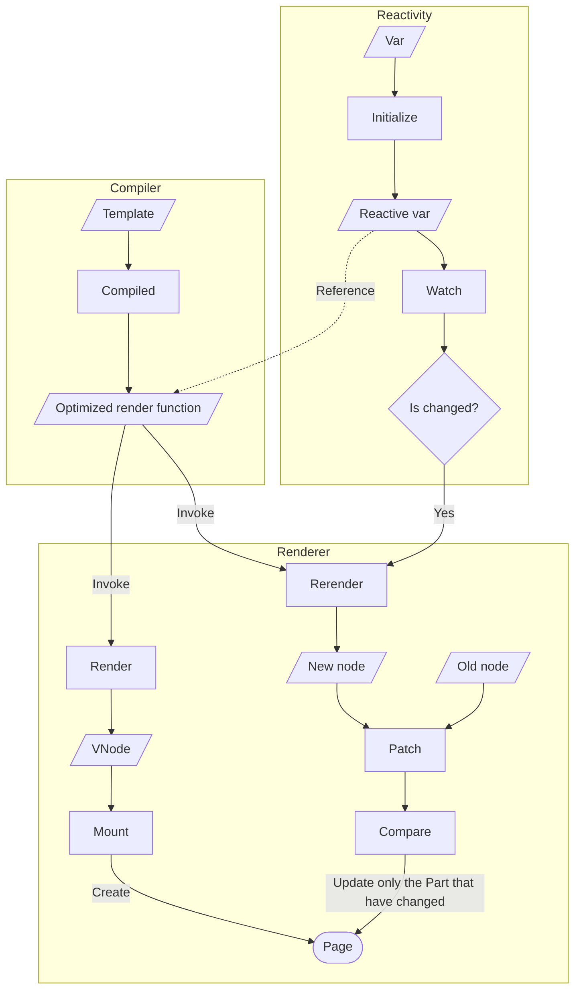

# Mini Vue

实现一个非常简单的 Vue 框架

Vue 可以分为三个核心模块：

- [Reactivity Module](./reactivity/)
- [Compiler Module](https://github.com/vuejs/core/tree/main/packages/compiler-sfc) —— 这里不会实现编译器模块，有兴趣可以查看源码
- [Renderer Module](./renderer/)

流程图如下:

