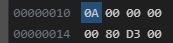

# 强制转换（类型转换）

在 C++ 中，在合适的条件下，我们可以把一种类型强制转换成其它类型。

## C 语言风格的强制转换

C 语言风格的强制转换有以下两种写法：

- (type)expression
- type(expression)

```cpp
int a = 10;
double b = (double)a;
double c = double(a);
```

同时，C++ 中存在隐式转换。

```cpp
int a = 10;
double b = a;
```

## 强制转换运算符

除了 C 语言风格的写法，C++ 中还提供了一些运算符来进行强制转换。

### const_cast

从某个类删除 `const`、`volatile` 和 `__unaligned` 属性，一般用于移除 `const` 限定。

语法：`const_cast<type-id>(expression)`

例如以下代码：

```cpp
class Person {};

const Person* p = new Person();
Person* p2 = p; // [!code error]
```

其中第 4 行会报错。这时我们就可以使用 `const_cast` 解决这个问题。

```cpp
class Person {};

const Person* p = new Person();
Person* p2 = const_cast<Person*>(p);
```

当然我们也可以使用 C 语言风格：

```cpp
class Person {};

const Person* p = new Person();
Person* p2 = (Person*)p;
```

这两种方式在汇编上没有任何区别。

### dynamic_cast

将操作数 `expression` 转换为 `type-id` 类型的对象，一般用于多态类型的转换，有运行时安全监测。

语法：`dynamic_cast<type-id>(expression)`

<<< ./expressions-1.cpp

`dynamic_cast` 与 C 语言风格的转换区别是：`dynamic_cast` 有运行时安全监测，如果转换是不安全的，会返回 nullptr；而 C 语言风格不会有任何的安全检测。

### static_cast

仅根据表达式中存在的类型，将 `expression` 转换为 `type-id` 类型。

语法：`static_cast<type-id>(expression)`

- 与 `dynamic_cast` 相比，缺乏运行时安全检测；
- 不是同一继承体系的，无法转换（不能交叉转换）；
- 通常用于基本数据类型的转换、非 `const` 转换成 `const`。

<<< ./expressions-2.cpp

### reinterpret_cast

属于比较底层的强制转换，没有任何类型检查和格式转换，仅仅是简单的二进制数据拷贝。

语法：`reinterpret_cast<type-id>(expression)`

让我们看以下例子：

<<< ./expressions-3.cpp#first

可能你会以为第 2 行的语句与第 6 行的语句相同，但事实并非如此。这是因为整型与浮点数在计算机中存储方式是不同的，处理相关方面的汇编语句也有所区别。

变量 `a` 的赋值语句对应的汇编：

```asm
mov     dword ptr [a],0Ah
```

内存布局：


变量 `b` 的赋值语句对应的汇编：

```asm
cvtsi2sd     xmm0,dword ptr [a]
movsd        mmword ptr [b],xmm0
```

内存布局：


变量 `c` 的赋值语句对应的汇编：

```asm
movsd     xmm0,mmword ptr [a]
movsd     mmword ptr [c],xmm0
```

内存布局：



由于变量 `a` 是整型，只占 4 个字节，变量 `c` 是双精度浮点型，占用 8 个字节，而 `reinterpret_cast` 只是进行简单的二进制数据拷贝，这里的拷贝将会把 `a` 的数据拷贝到 `c` 的低位的 4 个字节上，而高位的 4 个字节则是未知，所以最终造成 `c` 的值是一个随机值。

需要注意的区别是：变量 `b` 的赋值语句实际上对 `a` 进行了隐式类型转换，而变量 `c` 的赋值仅仅是简单的二进制数据拷贝，不会做类型转换。

`reinterpret_cast` 一般在以下两个场景使用。

#### 将任何指针转换为任何其他指针类型（可以交叉转换）

<<< ./expressions-3.cpp#second

#### 将任何整数类型转换为任何指针类型以及反向转换

<<< ./expressions-3.cpp#third

## References

- [强制转换](https://learn.microsoft.com/zh-cn/cpp/cpp/casting?view=msvc-160)
- [视频](https://www.bilibili.com/video/BV1KM4y1F7tR/?p=110&spm_id_from=pageDriver&vd_source=4f7b160f9f2a17e79bd4ab2785a8d769)
