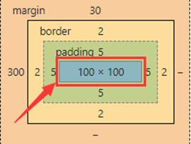
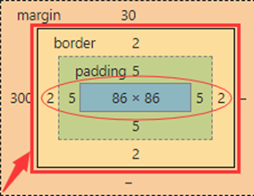

# 盒子模型

浏览器的渲染引擎对文档进行布局的时候，会根据 w3c 标准的 **CSS 基础框盒模型**（**CSS basic box model**），将所有元素表示为矩形的盒子。由 CSS 定义盒子的尺寸、位置以及属性（如颜色、背景、边框等）。

每个盒子由四个区域组成：_内容边界（Content Edge）、内边距边界（Padding Edge）、边框边界（Border Edge）、外边距边界（Margin Edge）_。

更详细内容请查看[文档](https://developer.mozilla.org/zh-CN/docs/Web/CSS/CSS_box_model/Introduction_to_the_CSS_box_model)。

除了 w3c 标准的 CSS 基础框盒模型，还有一种模型是 IE 盒子模型。通常我们把 w3c 标准的 CSS 基础框盒模型称为**标准盒模型**，把 IE 盒子模型称为**怪异盒模型**。这两种模型主要的区别在于计算盒子尺寸时存在差异。

## 标准盒模型

盒子总宽度 = width（content width） + padding（左右）+ border（左右）+ margin（左右）

## 怪异盒模型

盒子总宽度 = width（包含了 content width、左右 padding、左右 border） + margin（左右）

两种盒子的高度计算类似以上宽度的计算。在 CSS 中，我们可以通过 [box-sizing](https://developer.mozilla.org/zh-CN/docs/Web/CSS/box-sizing) 属性来决定元素采用哪种盒子模型。

## 参考

- [CSS 盒子模型](https://leetcode.cn/leetbook/read/7-day-interview-qian-duan/dm4o91/)
