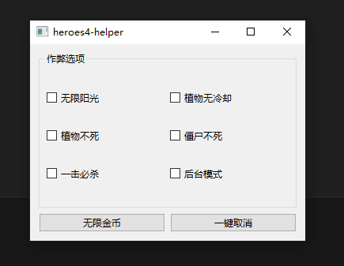

# 快速入门（TODO）

网上对逆向工程的介绍有很多，这里就不重复了。本教程将带你们实现一个植物大战僵尸的外挂，以快速了解逆向的基本过程。

::: warning 注意
编译型语言与解释型语言的逆向过程并不一样，由于大多数人学习逆向是为了制作游戏外挂，而大多数游戏是由编译型语言编码的，所以本教程使用游戏作为例子。
:::

完成本教程所有内容后，我们最终应该得到如下应用：

## References

- [视频](https://www.bilibili.com/video/BV1KM4y1F7tR?p=131&vd_source=4f7b160f9f2a17e79bd4ab2785a8d769)
