# 身份

|      | 身份一                       | 身份二                 | 身份三                              |
| ---- | ---------------------------- | ---------------------- | ----------------------------------- |
| 方向 | 主战斗                       | 主学习                 | 主探索                              |
| 名称 | 元                           | 陈                     | R-1                                 |
| 别名 |                              | 小陈、锋               |                                     |
| 关联 | 奇幻、玄幻、魔幻、仙侠、修真 | 龙人、基因、血肉、进化 | 智能、电子、机械、数字化、科技、scp |
| 性别 | 男                           | 女                     |                                     |

这三个身份思想既独立，又通过思想共享技术共享思想

## 元

- 形象：古代、修仙小说人物，由于涉及到西方元素，所以需要融合一下西方元素，参考 DNF 中的角色装扮，黑色短发

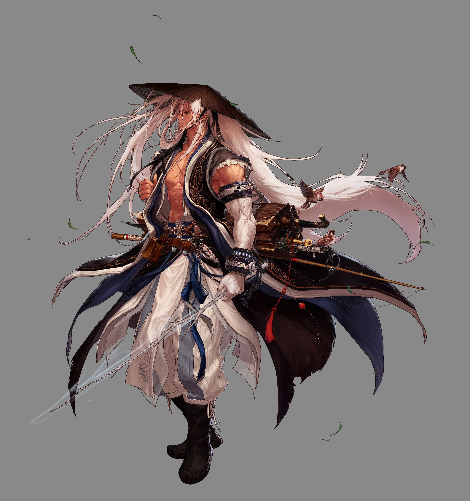

### 装备

- 特性：装备可能带有特性，特性分为常规、专属、唯一
- 技能：装备可能带有技能，技能分为常规、专属、唯一
- 常规：可以通过学习招式学会装备的常规技能
- 专属：表示只有该类装备才会出现，无法通过招式学会
- 唯一：表示只有该装备才会出现，且只有首次出现的装备带有该唯一特性或技能，除非该装备的存在被抹除
- 器灵：在某些情况下装备可能会自己产生灵性，即器灵，也可以使用某些方法把其它器灵移植到该装备上。每个器灵都具有一定的智慧，某些器灵可能具有特殊的潜质，这些潜质可能会给装备赋予新的特性或新的技能或使原来的特性或技能产生变异（这种变异的好坏视乎具体情况）。概念性武器绝对不会产生器灵、也不能够移植别的器灵

#### 闪烁之刃

外观参考梦想世界 3 的背饰剑，功能参考魔兽争霸的同名装备

##### 技能

- 能够将人物传送到刀刃所在地方
- 能够将人物与刀刃位置互换
- 能够传送到目视的所有地方，必须用气接触到该物品才能使用

#### 刀

这是把概念性武器，即，该武器表示的是刀这个概念本身，所以它的外观可以变化为该概念下的任何其它武器外观

##### 特性

- 锋利
- 变形：可以变形为该概念下的任何武器，并使用对应的所有技能（唯一性技能除外）
- 吞噬（专属）：概念性武器专属特性，可以吞噬该概念下的所有武器，吞噬困难程度视乎对应武器是否有器灵、位格高低，吞噬之后变形为该武器可以使用唯一性特性或技能。吞噬之后会抹除该武器的器灵

##### 技能

- 拔刀斩
  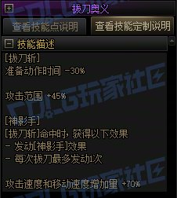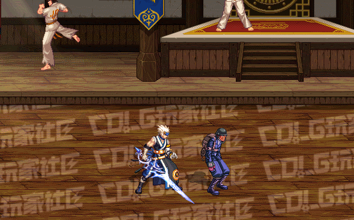
- 破空拔刀斩
  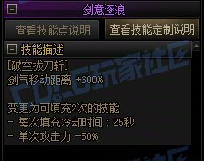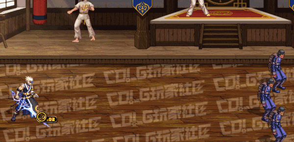
- 极 · 神剑术（破空斩）
  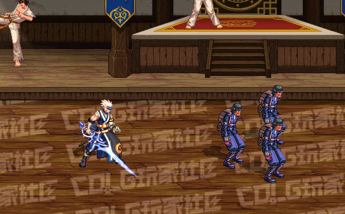
- 极 · 神剑术 (瞬斩)
  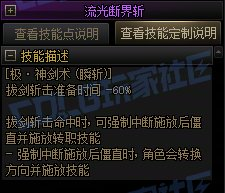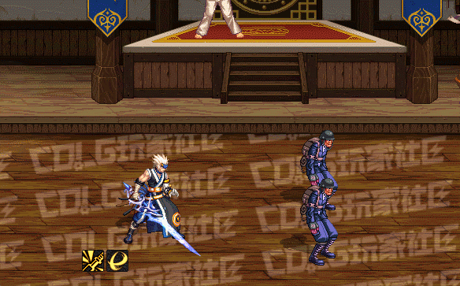

所有技能的施放必须以拔刀 - 收刀为一整套动作，完成这套动作才能施放下一个技能

#### 星剑

剑身为宇宙星辰，深邃、神秘，自带星辰之力，剑身附着星阵

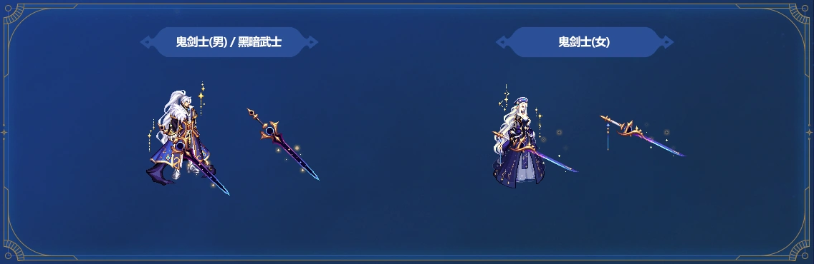

##### 特性

- 星阵：自带星宿阵法，可用于困敌、隐藏、修炼、杀敌、超远距离传送、保护

##### 技能

- 六合剑影：参考梦想世界 3 干将莫邪彩蛋欧冶子单体技能
- 八荒剑阵：参考梦想世界 3 干将莫邪彩蛋欧冶子群招技能
- 天石骤雨：参考梦想世界 3 鬼谷技能
- 星辰坠落 (Starfall)：参考《魔兽争霸3》（Warcraft III）中，月之女祭司（Priestess of the Moon，通常被称为白虎）的6级终极技能

#### 耀世-枪

带有龙族气息，金光普照、烛龙主题的长枪造型，外观参考梦想世界 3 160 级枪开窍造型

[梦想世界 3 160 级枪外观](https://mx.duoyi.com/news/news_31522.shtm)

##### 特性

- 穿刺
- 爆破
- 坚硬
- 龙威

##### 技能

- 枪出如龙
- 突破：超高速冲刺，全力一击，往前进行突刺，对目标造成极高伤害，对其背后造成极大范围杀伤

#### 天威-枪

外观参考梦想世界 3 150 级枪开窍造型

[梦想世界 3 150 级枪外观](https://mx.duoyi.com/news/news_26359.shtm)

##### 特性

- 雷霆

##### 技能

- 行云 : 风
- 夺命雷霆枪
  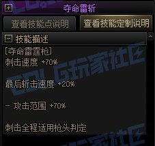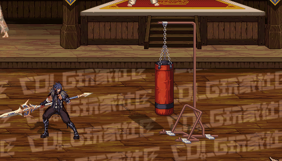

#### 潜龙-枪

外观参考梦想世界 3 140 级枪开窍造型

[梦想世界 3 140 级枪外观](https://news.17173.com/content/03112020/121308247.shtml)

##### 特性

- 龙威

##### 技能

- 龙息炮

#### 雷劫-剑

紫电缠绕剑身，动态雷光效果，外观参考梦想世界 3 160级剑开窍造型

[梦想世界 3 160 级剑外观](https://mx.duoyi.com/news/news_31512.shtm)

##### 特性

- 锋利
- 雷霆：天界雷池中淬炼而成的神兵，据说剑出之时能引九霄雷劫，万钧雷霆冲天贯日。配合雷法使用，可增强雷法招式

##### 技能

- 御雷术
- 雷霆万钧

#### 焚天-剑

焚天被挥舞时，有滚滚热浪喷涌而出，犹如巨人咆哮，也如火龙吐息，携焚天煮海之势，抹去一切敌人。外观参考梦想世界 3 150级剑开窍造型

[梦想世界 3 150 级剑外观](https://mx.duoyi.com/news/news_26359.shtm)

##### 特性

- 锋利
- 炽热

##### 技能

- 里 · 鬼剑术
- DNF 中狂战的双刀
  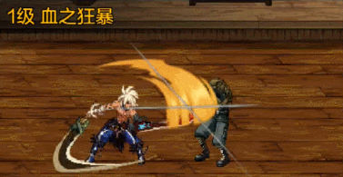

#### 火枪

外观参考 DNF 中的枪类武器

##### 特性

- 必中
- 爆头

##### 技能

- 聚合弹
  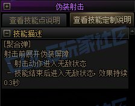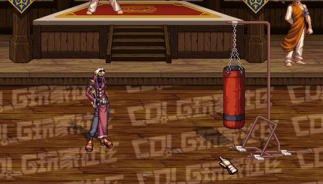
- 爆炎弹
- 银弹
- 冰冻弹
- 凝固汽油弹
  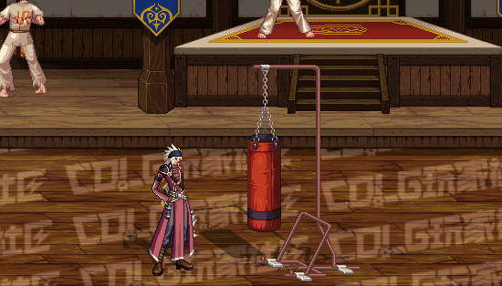
- 溃灭射击
- 疾风骤雨
  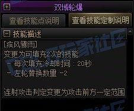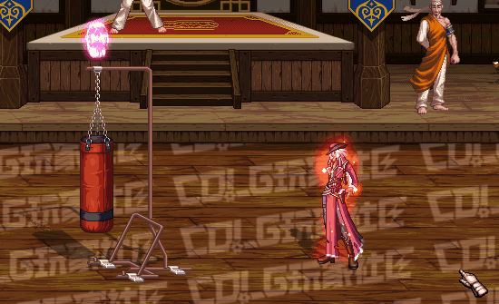

#### 天御之灾

参考 DNF 中的天御套

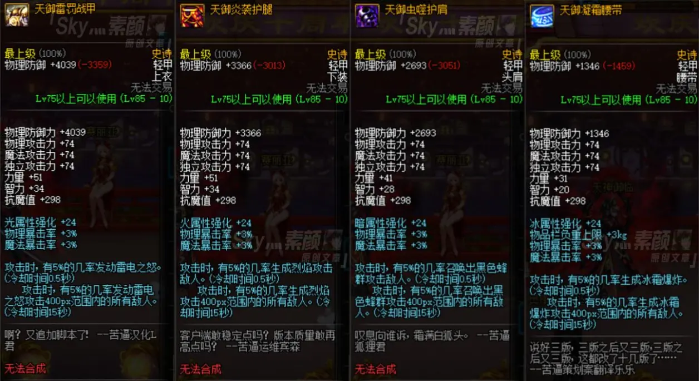
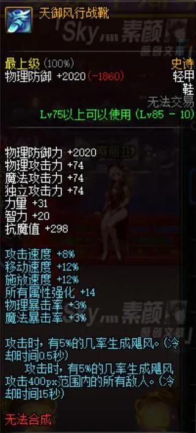
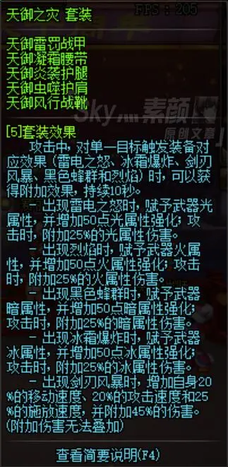

#### 生物机甲

由陈制造，参考 Warframe 中的星际战甲

#### 光剑

参考 DNF 中的狄瑞吉光剑武器

##### 技能

- 寒光掠影：剑意三千境，一招足以制胜。表现为以自身为圆心小范围的剑意风暴
- 幻影剑舞
  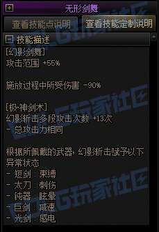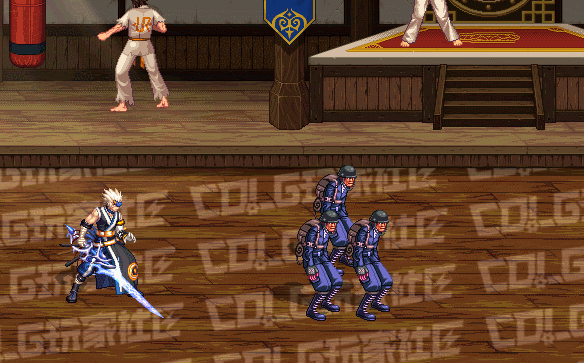
- 猛龙断空斩
  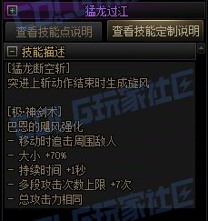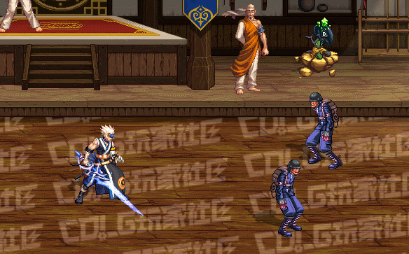
- 破军斩龙击
  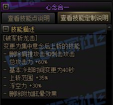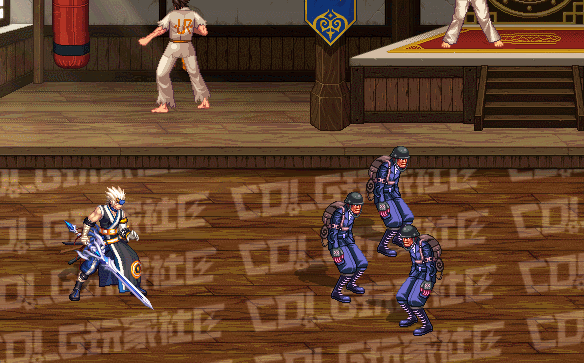
- 万剑归宗
- 极 · 神剑术 (无形斩)

### 法术、招式

法术基本以雷系法术为主，其它法术为辅，物理招式基本以剑为主，其它武器招式为辅

由于雷法特性，法术自带光、火、高速等特性

::: info
招式主要指以武器为媒介放出的物理招式，武器自带的技能不属于招式
:::

#### 雷法

参考幻唐志、网络小说、火影忍者、全职猎人的奇犽

- 星雷贯日：参考幻唐志鬼谷招式
- 五雷连珠：参考幻唐志鬼谷招式
- 雷遁：需要雷电体质才能使用，使用时在两点之间开通一条通路，身体变为能量体通过这条通路以光速进行移动，到达目的地后变为原身
- 雷切（千鸟）：参考火影忍者卡卡西或佐助的招式
- 雷厉风行：消耗翅膀的能量进行高速移动
- 电光石火：需要雷电体质才能使用，消耗法力使全身充满电能，提高移速、反应速度、自带净化效果，参考全职猎人奇犽的招式

#### 剑修

- 剑气四射：参考幻唐志
- 剑荡河山：参考幻唐志
- 剑气成丝：参考风云 2 电影里的效果

#### 枪修

- 百鸟朝凤
- 龙行八荒
- 追魂刺
- 三环套日
- 潜龙卧渊
- 九星连珠
- 横扫千军
- 众星捧月
- 日月争辉
- 龙腾四海
- 混沌归元
- 龙飞九天

#### 道法

参考道教内丹学

- 一气化三清：这 3 个分身在思想上是整体统一的，无独立性。这 3 分身共享所有的宝物、法宝、符咒
- 三花聚顶： 参考梦想世界 3 道法百级招

|      | 身份一                       | 身份二                                           | 身份三                         |
| ---- | ---------------------------- | ------------------------------------------------ | ------------------------------ |
| 名称 | 元                           |                                                  |                                |
| 别名 |                              |                                                  |                                |
| 血脉 |                              |                                                  |                                |
| 体质 | 雷电之体                     | 魔体（魔气入体）、龙体（借用了一点陈的龙人基因） |                                |
| 装备 | 刀、雷劫、星剑、筋斗云、翅膀 | 耀世、天威、潜龙、焚天、天御之灾、风火轮、混天绫 | 闪烁之刃、火枪、生物机甲、光剑 |
| 功法 | 雷法、符道、道法、阿修罗     | 剑修、枪修、三头六臂、魔修                       | 枪斗术                         |

#### 三头六臂

炼体功法

#### 魔修

参考风云 2 聂风入魔表现

[【怀旧DNF】地下城与勇士《帝血弑天》技能展示](https://www.bilibili.com/video/BV1sKXPBJEDW)
[【DNF】地下城与勇士《极诣·狂战士》技能展示（3）](https://www.bilibili.com/video/BV1RGu9zjEVL)

- 杀意波动 + 嗜血：结合这两个技能，领域、范围性技能，兼探测、攻击、防御一体
- 嗜血 - 嗜魂之手：结合吸星大法的功能，能够吸取对手的生命力、法力、修为等
- 怒气爆发
- 暴怒狂斩
  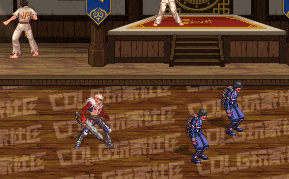
- 嗜魂封魔斩
  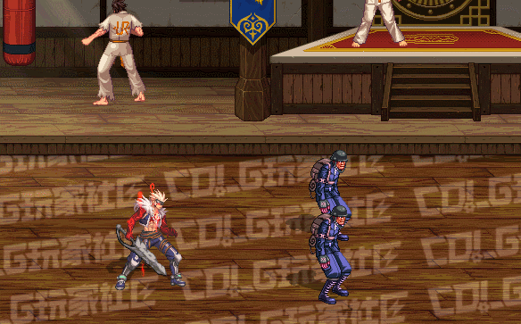
- 血气之刃
  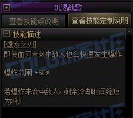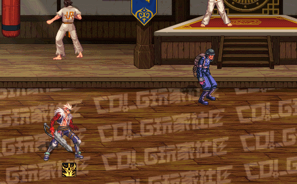
- 崩山裂地斩
  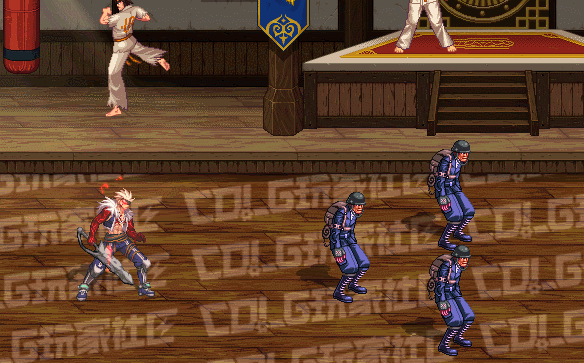
- 魔狱血刹
- 强悍碾压
  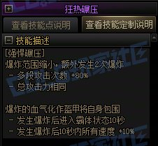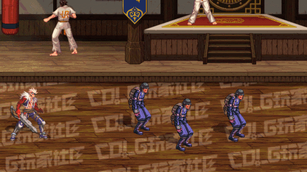
- 浴血之怒
  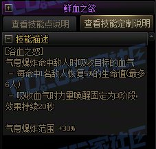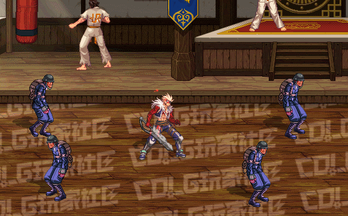
- 血气爆发
- 致命血陨
  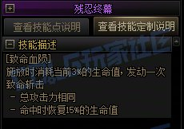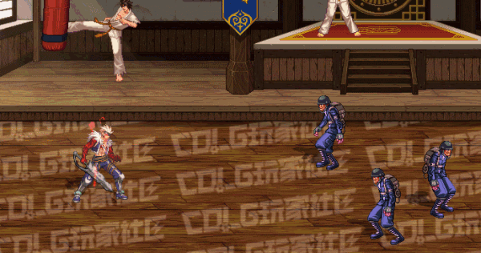
- 魔煞血陨

#### 枪斗术

参考 DNF 中男、女漫游的技能

- 乱射
  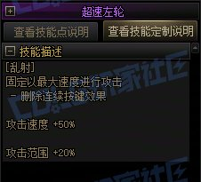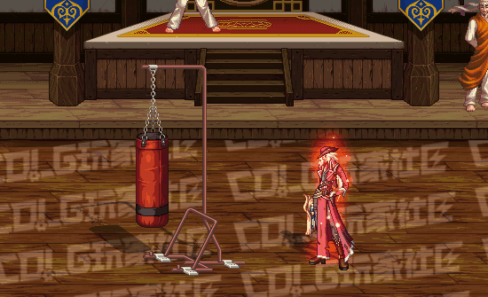
- 枪舞
  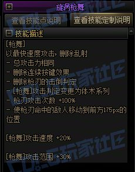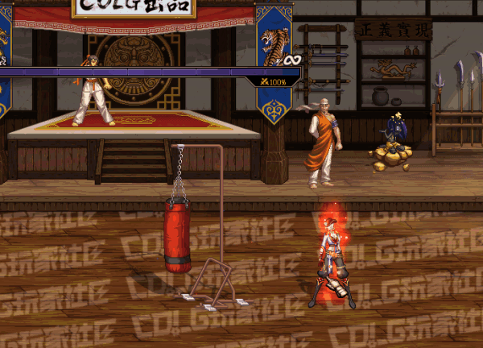
- 双鹰回旋
  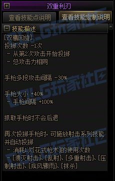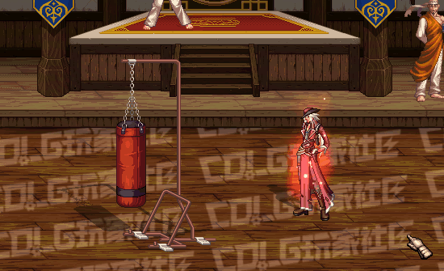
- 压制射击
  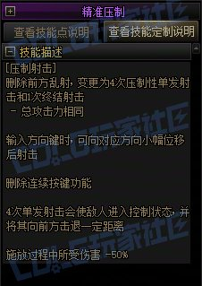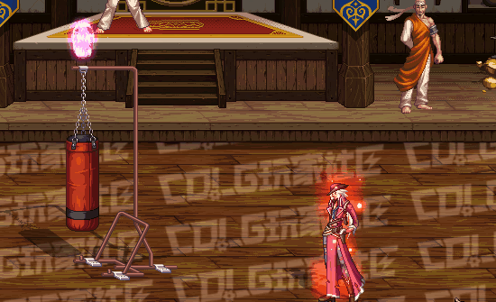
- 压制射击
  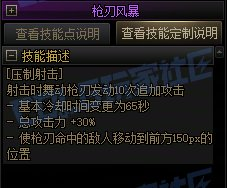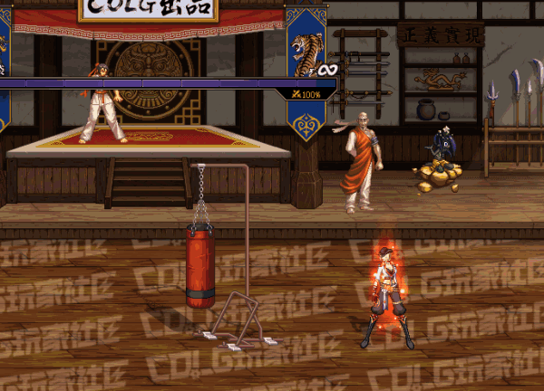
- 抹杀
  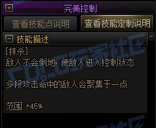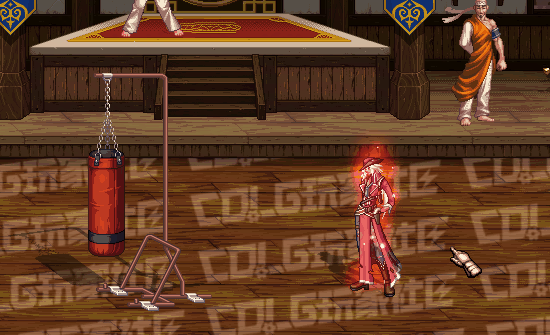

#### 符道

参考 DNF 中的驱魔师职业技能：

[【DNF】地下城与勇士《光启·驱魔师》技能展示（41）](https://www.bilibili.com/video/BV1PYy9BiEMw)
[【DNF】地下城与勇士《光启·驱魔师》技能展示（45）](https://www.bilibili.com/video/BV1wMkmBrEQk)

- 式神 : 热炎朱雀
- 式神 : 地之玄武
- 式神 : 空之白虎
  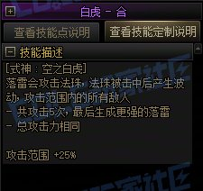
- 式神 : 幻海青龙
  
- 升龙·开阵
  
- 四座千泰门
- 因果业火符
  
- 退魔阴阳符
  
- 唤雷符 - 乾坤之境

#### 阿修罗

参考 DNF 中的阿修罗职业技能

[【怀旧DNF】地下城与勇士《天帝》技能展示](https://www.bilibili.com/video/BV1LvZrBXExG)
[【DNF】地下城与勇士《极诣·阿修罗》技能展示（4）](https://www.bilibili.com/video/BV1PvhczTEP2)

- 冰刃·波动剑
- 爆炎·波动剑
  
- 极冰·裂波剑
  
- 旧极炎·裂波剑
- 新极炎·裂波剑
  
- 邪光波动阵
  
- 天雷·波动剑
  
- 天雷·降魔杵：综合 VP 1 和 VP 2 技能效果，雷云无限时间，降魔杵白色、红色随机
  
  
- 雷神之息：习得后，所有阿修罗技能都会得到增强（形态优化，电、光属性附加等）

### 境界

职业、招式、法术等类似东西之中包含一种叫境界的概念。境界表示的是对职业、招式、法术等类似东西的理解程度

境界越高越容易领悟高级的技能、法术、招式，越高级的技能、法术、招式越需要高级的境界才能学习

提升境界能够增强对技能、法术、招式的运用，某些境界能够产生一些实质的东西影响现实世界，例如：刀意、剑意，剑气成丝就是一种对剑意的运用

### 宠物

[梦想世界 3 召唤兽系统](https://mx.duoyi.com/game/game_5293.shtm?refer_source=www.google.com)

### 坐骑与精灵

- 筋斗云：形象参考梦想世界 3 飞行坐骑
- 风火轮：配合耀世使用

[梦想世界 3 坐骑与精灵](https://mx.duoyi.com/game/game_5401.shtm)

### 宝物、法宝、符咒、饰品

- 塔罗牌：启示、预言、命运相关
- 裁判牌：参考 LOL 中卡牌的技能，参考体育比赛中的裁判牌效果
- 空间戒指：改造之后空间连接到了陈所处的星球
- 20 面骰：参考 DND 中的骰子
- 混天绫
- 铜钱剑：主要用于驱邪

### 翅膀

参考吞噬星空罗峰的翅膀，形象参考梦想世界 3 的翅膀

[梦想世界 3 人物翅膀](https://mx.duoyi.com/game/game_5399.shtm)

### 领域

[梦想世界 3 光环与脚印](https://mx.duoyi.com/game/game_5400.shtm)

参考 DNF 中的光环

## 陈

- 形象：服装为现代改良的仿古服装，额头有两个小犄角，龙女形象，黑发，银白色龙尾，寿命及其漫长，成长阶段也极其漫长（从幼儿到成人），目前成长阶段类似人类的女高中生
- 融合：与外星生物进行了融合
- 位置：长期居住在外星星球

该身份作为三个身份之中的锚点

在地球还留下了一位利用剩余的微量龙人基因混合人类基因制作的女性身份，外观为普通的女高中生，身体素质比一般人类高，用以监控地球的发展

## R-1

- 形象：参考漫威钢铁侠、DC 钢骨，外观基本类人（头不是人型的），六臂

### 装备

#### 基地车

参考红警的基地车

#### 各种用途的 🚗

参考 QQ 飞车、智能式方程赛车（动画）的形象，平时不用的时候存放在基地车中

- [终极摇滚系列皮肤](https://speed.qq.com/cp/a20260202mmxcsdj/)

### 技能

参考 DNF 中的枪炮师、机械师、弹药专家技能

## 参考

- [一气化三清](https://www.google.com/search?client=firefox-b-d&q=%E4%B8%80%E6%B0%94%E5%8C%96%E4%B8%89%E6%B8%85)
- [Warframe](https://www.warframe.com/zh-hans)
- [梦想世界3](https://mx.duoyi.com/)
- [神武4：幻唐志](https://htz.duoyi.com/)
- [风云 2](<https://zh.wikipedia.org/wiki/%E9%A2%A8%E9%9B%B2II_(%E9%9B%BB%E5%BD%B1)>)
- [DNF](https://dnf.qq.com/)
- [DNF 全职业技能进化系统展示](https://bbs.colg.cn/page_collect/330.html)
- [Colg 外观图鉴](https://bbs.colg.cn/colg_creator-platform.html?uid=2672812)
- [DNF 相关内容集合贴](https://seicing.com/html/index-dnf.html)
- 凡人修仙传
- 诡秘之主
- 宿命之环
- 永夜君王，参考武器效果
- 星辰变
- 无限恐怖
- 道诡异仙
- 吞噬星空
- 英雄无敌 4
- 星际争霸
