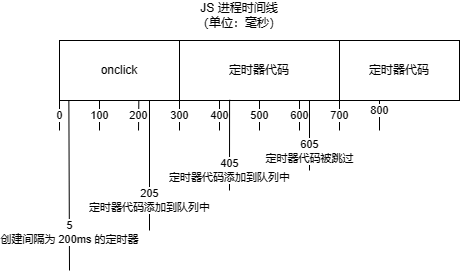

<script setup lang="ts">
import SetTimeout from './SetTimeout.vue'
import SetInterval from './SetInterval.vue'
</script>

# 定时器

Web API 中提供了一些定时器 API，这些 API 能够在一定时间间隔后运行一段代码。

## setTimeout

全局的 `setTimeout()` 函数可以接受一个函数、可选的间隔时间以及可选的附加参数。

语法：

```js
setTimeout(functionRef)
setTimeout(functionRef, delay)
setTimeout(functionRef, delay, param1)
setTimeout(functionRef, delay, param1, param2, /* … ,*/ paramN)
```

`functionRef`

定时器到期后，执行的函数。

`delay`

可选。定时器需要等待的时间，单位：ms。默认为 0。

`param1`，...，`paramN`

可选。传递到函数的参数。

示例：

```vue
<template>
  <button class="btn" @click="handleClick">在两秒后显示一条消息</button>
</template>

<script setup lang="ts">
const handleClick = () => {
  setTimeout(() => {
    alert('Hello, world!')
  }, 2000)
}
</script>
```

<ClientOnly>
  <SetTimeout />
</ClientOnly>

## setInterval

全局的 `setInterval()` 函数可以接受一个函数、可选的间隔时间以及可选的附加参数，与 `setTimeout()` 的区别是，`setInterval()` 会重复调用传入的函数。

语法：

```js
setInterval(functionRef)
setInterval(functionRef, delay)
setInterval(functionRef, delay, param1)
setInterval(functionRef, delay, param1, param2, /* … ,*/ paramN)
```

参数说明同 `setTimeout`。

示例：

```vue
<template>
  <p>Current time: {{ dateStr }}</p>
</template>

<script setup lang="ts">
const dateStr = ref('')

setInterval(() => {
  dateStr.value = new Date().toLocaleTimeString()
}, 1000)
</script>
```

<ClientOnly>
  <SetInterval />
</ClientOnly>

## 注意事项

### “this” 指针

当你向定时器传递一个函数时，该函数的 `this` 指针默认指向全局对象（如：`window`）。

<<< ./this.ts

**解决方案**：

1. 使用包装函数：

```ts
setTimeout(() => {
  example.getA()
}, 1000)
```

2. 绑定 `this` 指针

```ts
setTimeout(example.getA.bind(example), 1000)
```

### 延时比指定值更长

有些人会误解定时器是单独的线程，其实 JS 是运行在单线程的环境中的（虽然现在也有让 JS 运行在多线程的 API）。定时器只是计划在未来某个时间运行某段代码，执行时机是不确定的，因为在页面的生命周期中，可能有其它代码正在执行。实际上 JS 中没有代码是立刻执行的，所有代码存在于代码队列中，当 JS 进程空闲时会尽快执行队列中的下个代码。随着页面在其生命周期中的推移，代码会按照执行顺序添加入队列。例如，当某个按钮被点击时，其事件处理程序代码会被添加到队列中，并在 JS 进程空闲时执行。当接收到某个请求的响应时，回调函数代码会被添加到队列中，并在 JS 进程空闲时执行。

定时器的 `delay` 设置实际上是在过去 `delay` 时间后，将代码添加到队列中，当 JS 进程空闲时，它会被尽快执行。例如，当我们设置一个 150ms 的定时器，在 150ms 后，定时器会将代码添加到队列中。如果这个时候 JS 进程中没有其它代码在执行，那么定时器中的代码会被立即执行，否则，定时器中的代码需要等待其它代码执行完毕才会被执行。

由于 JS 进程会阻塞页面其它处理，所以在执行完一套代码后，JS 进程会返回很短的一段时间用以进行页面其它处理，以避免 UI 被锁定。定时器的延时设置则很好地保证了代码执行前至少有间隔执行页面其它处理，所以定时器也常用于进行执行时间长的 JS 代码的优化。

`setInterval()` 还有其它问题。`setInterval()` 会重复在间隔 `delay` 时间后把代码添加到队列中。如果定时器代码在代码再次被添加到队列之前还没有执行完毕，将会导致定时器代码连续运行，而且之间没有任何停顿。幸好，JS 引擎对此做了处理。当使用 `setInterval()` 时，仅当队列中没有任何其它定时器代码实例时，才会把定时器代码添加到队列中。这确保了定时器代码添加到队列中的最小时间间隔为指定的 `delay` 间隔。

即使如此，`setInterval()` 还有两个问题：

- 某些间隔会被跳过；
- 多个定时器代码的执行间隔可能比设置的 `delay` 小。

例如，某个 `onclick` 事件处理程序使用 `setInterval()` 设置了 200ms 间隔的重复定时器。假设事件处理程序的执行都需要花费 300ms，定时器代码的执行需要 400ms，就会同时出现跳过间隔且连续运行定时器代码的情况。



**解决方案**：

使用链式 `setTimeout()` 调用替换 `setInterval()`。

```js
setTimeout(function () {
  setTimeout(arguments.callee, interval)
}, interval)
```

这样能够确保在前一个定时器代码执行完毕之前，不会向队列中添加新的定时器代码，不会有任何缺失的间隔。而且，也保证了在下一次定时器代码执行之前，至少等待了 `delay` 时间，避免了连续的运行。

**造成延时比指定值更长的原因有很多**：

1. 嵌套超时

[HTML 标准](https://html.spec.whatwg.org/multipage/timers-and-user-prompts.html#timers) 中规定了，一旦对定时器的嵌套调用达到了 5 次，浏览器将强制执行 4ms 的最小延时。

2. 非活动标签页的超时

为了优化后台标签的加载损耗（以及降低耗电量），浏览器会在非活动标签中强制执行一个最小的超时延迟。但是如果页面正在使用 [AudioContext](https://developer.mozilla.org/zh-CN/docs/Web/API/AudioContext) 播放声音，也可以不执行延迟。

具体延迟与浏览器有关：

- Firefox 桌面版和 Chrome 针对不活动标签都有一个 1 秒的最小超时值；
- 安卓版 Firefox 浏览器对不活动的标签有一个至少 15 分钟的超时，并可能完全卸载它们；
- 如果页面中包含 [AudioContext](https://developer.mozilla.org/zh-CN/docs/Web/API/AudioContext)，Firefox 不会对非活动标签页进行节流。

3. 追踪型脚本的节流

Firefox 对它识别为追踪型脚本的脚本实施额外的节流。当在前台运行时，节流的最小延迟仍然是 4ms。然而，在后台标签中，节流的最小延迟是 10000ms，即 10s，在文档首次加载后 30s 开始生效。

详情参考：[跟踪保护](https://wiki.mozilla.org/Security/Tracking_protection)。

4. 超时延迟

如果当前 JS 进程中正在执行其它代码，时间间隔可能比预期的晚。例如，当前执行的代码中调用了 `setTimeout()`，定时器中的代码在当前代码执行完毕前都不会被执行。

```js
setTimeout(() => {
  console.log('test 被调用') // 第二个输出
})

console.log('setTimeout 之后') // 这个会先输出
```

5. 在加载页面时推迟超时

当前标签页正在加载时，Firefox 将推迟触发 `setTimeout()` 计时器。直到主线程被认为是空闲的，或者直到加载事件触发完毕，才开始触发。

6. WebExtension 背景页面和定时器

在 [WebExtension](https://developer.mozilla.org/zh-CN/docs/Mozilla/Add-ons/WebExtensions) 中，`setTimeout()` 不会可靠工作。应使用 [alarms](https://developer.mozilla.org/zh-CN/docs/Mozilla/Add-ons/WebExtensions/API/alarms) 作为替代。

7. 最大延时值

浏览器内部以 32 位带符号整数存储延时。这就会导致如果一个延时大于 2147483647ms（大约 24.8 天）时就会溢出，导致定时器将会被立即执行。

## 高级用法

### 数据分块

需要进行大量处理的循环通常会导致脚本长时间运行。这种循环通常遵循以下模式：

```js
for (let i = 0, len = data.length; i < len; i++) {
  process(data[i])
}
```

在这种模式中，需要处理的数据数量是不可知的。假设 `process()` 执行一次需要 100ms，那么 10 个数据就需要 1s。数据越多，循环执行时间就越长。由于 JS 执行是一个阻塞操作，脚本执行时间越长，用户无法与页面交互的时间就越长。

在我们寻找方法解决这个问题之前，先思考两个问题：

- 该处理是否必须同步完成？如果对数据的处理必须与其它操作进行同步，那么最好不要改动。否则，将某些处理延后。
- 数据是否必须按顺序完成？如果不是，那么可以将某些处理延后。

如果你对于以上两个问题的回答都是“否”，那么你可以使用定时器将这个循环进行分割。这种技术被称为**数组分块**（array chunking），通过将大量数据分成一小块一小块地处理，以减少循环执行的时间。

思路：创建一个队列，然后使用定时器取出下一个要处理的数据，接着再设置一个定时器。模式如下：

```js
setTimeout(function () {
  let item = array.shift()
  process(item)

  if (array.length > 0) {
    setTimeout(arguments.callee, 100)
  }
}, 100)
```

简单实现：

```js
function chunk(array, process, context) {
  setTimeout(function () {
    let item = array.shift()
    process.call(context, item)

    if (array.length > 0) {
      setTimeout(arguments.callee, 100)
    }
  }, 100)
}
```

::: warning
这里使用的是匿名函数而非 [箭头函数表达式](https://developer.mozilla.org/zh-CN/docs/Web/JavaScript/Reference/Functions/Arrow_functions)。这是因为箭头函数表达式没有独立的 `arguments`。

当然你也可以使用具名函数，这样的话就不需要使用 `arguments`，普通函数或箭头函数表达式都可以使用。
:::

::: tip
一旦某个循环单次执行的时间超过 50ms，那么最好看看能否使用**数组分块**技术。
:::

### 函数节流

在浏览器中，DOM 操作要比非 DOM 操作需要更多的内存和 CPU 时间。连续进行多次 DOM 相关操作可能导致浏览器挂起，甚至乎崩溃。可以通过对相关代码使用定时器进行**节流**来避免这个问题。

节流的基本思想：某些代码不可以在没有间隔的情况下连续重复执行。

思路：第一次调用函数，创建定时器，在指定时间间隔之后运行代码。当第二次调用该函数时，它会清除前一次的定时器并新设置一个。目的是只有在函数执行完毕一段时间后才能再次执行函数代码。模式如下：

<<< ./debounce.ts

可以使用函数简化：

```js
function debounce(func, context) {
  clearTimeout(func.tid)
  func.tid = setTimeout(() => {
    func.call(context)
  }, 100)
}
```

::: tip
只要代码是周期性执行的，你都可以使用函数节流。
:::

## References

- [setTimeout](https://developer.mozilla.org/zh-CN/docs/Web/API/setTimeout)
- [setInterval](https://developer.mozilla.org/zh-CN/docs/Web/API/setInterval)
- [clearTimeout](https://developer.mozilla.org/zh-CN/docs/Web/API/clearTimeout)
