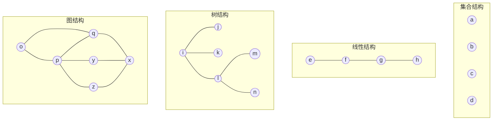
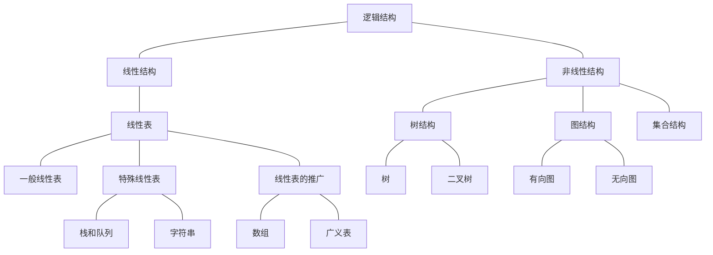

# 数据结构

计算机除了可以进行数值计算，也可以进行非数值计算，如处理字符串、表格和图像等具有一定结构的数据。这些数据存在某种内在的联系，只有分析清楚数据的内在联系，合理地组织数据，才能对它们进行有效的处理，设计出高效的算法。而这正是数据结构研究的内容。

## 基本概念和术语

### 数据、数据元素、数据项和数据对象

**数据**（Data）是客观事物的符号表示，是所有能输入到计算机中进行处理的符号总称。如数字、字符串以及被多媒体程序处理的图形、图像、声音及动画等通过特殊编码的数据。

**数据元素**（Data Element）是数据的基本单位，也称作元素、记录等。用于完整描述一个对象，如学生系统中的一名学生记录。

**数据项**（Data Item）是组成数据元素的、有独立含义的、不可分割的最小单位。也就是数据元素的属性。如学生的学号、姓名、性别等。

**数据对象**（Data Object）是性质相同的数据元素的集合，是数据的一个子集。如整数数组对象是集合 $N=\{0, \pm1, \pm2, \ldots\}$

## 数据结构

**数据结构**（Data Structure）是相互之间存在一种或多种关系的的数据元素的集合。包括逻辑结构和存储结构。

### 逻辑结构

**逻辑结构**是指数据元素之间的逻辑关系。根据元素之间关系的不同特性，通常有四类基本结构。



假设我们以一个班级学生为数据对象（元素是学生的学籍档案记录），来分别考察元素之间的关系。

#### 集合结构

元素之间除了 “属于同一集合” 的关系外，没有其它关系。例如，判断一名学生是否属于该班级。

#### 线性结构

元素之间存在一对一关系。例如，按入学时间对学生进行排序，将组成一个线性结构。

#### 树结构

元素之间存在一对多关系。例如，在班级管理体系中，班长管理多个组长，每个组长管理多个组员。

#### 图结构

元素之间存在多对多关系。例如，多位同学之间的社交关系，任何两位同学都可以是朋友。

#### 线性结构与非线性结构

线性结构如下：

- 线性表 —— 典型的线性结构，如学生基本信息表
- 栈和队列 —— 具有特殊限制的线性表，只能在表的一端或两端操作数据
- 字符串 —— 也是特殊线性表，特殊在它的元素仅由一个字符组成
- 数组 —— 线性表的推广，它的元素是一个线性表
- 广义表 —— 也是线性表的推广，它的元素是一个单元素或线性表

非线性结构如下：

- 树 —— 具有多个分支的层次结构（只具有两个分支的叫二叉树）
- 图 —— 有向图（边是顶点的有序对）和无向图（边是顶点的无序对）
- 集合 —— 由具有同一性质的元素组成



### 存储结构

数据对象在计算机中的存储表示称为数据的**存储结构**，也称为**物理结构**。有两种基本的存储结构，顺序存储结构和链式存储结构。

#### 顺序存储结构

顺序存储结构，顾名思义它的所有元素依次存放在一片连续的存储空间中。通常使用程序设计语言的数组来实现。

#### 链式存储结构

链式存储结构无需连续的存储空间。但为了表示结点间的关系，需要给每个结点增加指针字段，用于存放与它有关系的元素的存储地址。通常使用程序设计语言的指针来实现。

## 算法和算法分析

### 算法的定义及特性

**算法**是为了解决某类问题而规定的一个有限长的操作序列。

一个算法必须满足以下五个重要特性：

- **有穷性** —— 一个算法必须在执行有穷步后结束，且每一步都必须在有穷时间内完成
- **确定性** —— 对于每种情况下所应执行的操作，在算法中都有确切的规定，不会产生二义性，使算法的执行者或阅读者都能明确其含义及如何执行
- **可行性** —— 算法中的所有操作都可以通过已经实现的基本操作运算执行有限次来实现
- **输入** —— 一个算法有零个或多个输入
- **输出** —— 一个算法有一个或多个输出

### 评价算法优劣的基本标准

- **正确性** —— 在合理的数据输入下，能够在有限的运行时间内得到正确的结果
- **可读性** —— 可读性强的算法有助于人们对算法的理解，而难懂的算法易于隐藏错误，且难于调试和修改
- **健壮性** —— 好的算法能够对非法的输入进行合理的处理
- **高效性** —— 高效性包括时间和空间两个方面。时间高效是指算法设计合理，执行效率高，可以用时间复杂度来衡量；空间高效是指算法占用存储容量合理，可以用空间复杂度来衡量

### 算法的时间复杂度

衡量算法效率的方法主要有两类：事后统计法和事前分析估算法。事后统计法需要先将算法实现，然后测算其时间和空间开销。这种方法的缺点很明显，一是必须先实现算法，二是时空开销的测算结果受计算机的软硬件影响，这容易掩盖算法本身的优劣。所以我们通常采用事前分析估算法，通过计算算法的渐近复杂度来衡量算法的效率。

#### 问题规模和语句频度

在不考虑软硬件影响下，影响算法时间代价的最主要因素是问题规模。**问题规模**是算法求解问题输入量的多少，是问题大小的本质表示，一般用整数 $n$ 表示。$n$ 对不同问题含义不同，例如，在排序运算中 $n$ 为参加排序的记录数，在矩阵运算中 $n$ 为矩阵的阶数，在多项式运算法中 $n$ 为项数，在集合运算中 $n$ 为元素个数，在有关树的运算中 $n$ 为结点个数，在有关图的运算中 $n$ 为顶点数或边数。显然，$n$ 越大算法执行时间越长。

一个算法的执行时间大致上等于其所有语句执行时间的总和，而语句的执行时间则为该条语句的重复执行次数和执行一次所需时间的乘积。一条语句的重复执行次数称作**语句频度（Frequency Count）**。

由于语句的执行要由源程序经编译程序编译成目标代码，因此语句执行一次实际所需的时间与机器的软硬件（如机器速度、编译程序质量等）是密切相关的。所以， 所谓的算法分析并非精确统计算法实际执行所需时间，而是针对算法中语句的执行次数做出估计，从中得到算法执行时间的信息。

设每条语句执行一次所需的时间均是单位时间，则一个算法的执行时间可用该算法中所有语句频度之和来计算。

示例：求两个 $n$ 阶矩阵的乘积算法

```ts
// 频度 n + 1
for (let i = 1; i <= n; i++) {
  // 频度 n * (n + 1)
  for (let j = 1; j <= n; j++) {
    c[i][j] = 0 // 频度 n^2

    // 频度 n^2 * (n + 1)
    for (let k = 1; k <= n; k++) {
      c[i][j] = c[i][j] + a[i][k] * b[k][j] // 频度 n^3
    }
  }
}
```

该算法中所有语句频度之和，是矩阵阶数 $n$ 的函数， 用 $f(n)$ 表示：$f(n)=2n^3+3n^2+2n+1$。

#### 时间复杂度定义

对于上述例子中的简单算法，可以直接计算所有语句的频度，但对于稍微复杂一点的算法，则通常是比较困难的，即便能够给出，也可能是个非常复杂的函数。因此，为了客观反映一个算法的执行时间，可以只用算法中的**基本语句**^[算法中重复执行次数和算法的执行时间成正比并且对运行时间影响最大的语句。]的执行次数来度量算法的工作量。通常，算法的执行时间是随问题规模增长而增长，因此对算法的评价通常只需考虑其随问题规模增长的趋势。

在这种情况下，我们只需考虑当问题规模充分大时，算法中基本语句的执行次数在渐近意义下的阶。如上述示例，当 $n$ 趋向无穷大时，有

$$
\begin{aligned}
\lim_{n \to \infty}f(n)/n^3=\lim_{n \to \infty}(2n^3+3n^2+2n+1)/n^3=2
\end{aligned}
$$

即 $f(n)$ 和 $n^3$ 是同阶的，或者说 $f(n)$ 和 $n^3$ 的数量级（Order of Magnitude）相同。在这里，我们用 $O$ 来表示数量级，记作 $T(n)=O(f(n))=O(n^3)$。

一般情况下，算法中基本语句重复执行的次数是问题规模 $n$ 的某个函数 $f(n)$，算法的时间量度记作：

$$
T(n)=O(f(n))
$$

它表示随问题规模 $n$ 的增大，算法执行时间的增长率和 $f(n)$ 的增长率相同，称做算法的**渐近时间复杂度**，简称**时间复杂度（Time Complexity）**。

::: info
$O$ 的严格定义：

若 $T(n)$ 和 $f(n)$ 是定义在正整数集合上的两个函数，则 $T(n)=O(f(n))$ 表示存在正的常数 $C$ 和 $n_0$，使得当 $n \geqslant n_0$ 时都满足 $0 \leqslant T(n) \leqslant Cf(n)$。

该定义说明了函数 $T(n)$ 和 $f(n)$ 具有相同的增长趋势，并且 $T(n)$ 的增长至多趋向于函数 $f(n)$ 的增长。$O$ 用来描述增长率的上限，它表示当问题规模 $n>n_0$ 时，算法的执行时间不会超过 $f(n)$。
:::

#### 时间复杂度分析举例

分析算法时间复杂度的基本方法：找出所有语句中语句频度最大的那条语句作为基本语句，计算基本语句的频度得到问题规模 $n$ 的某个函数 $f(n)$，取其数量级用 $O$ 表示。

若算法可用递归方法描述，则算法的时间复杂度通常可用递归方程表示，此时涉及递归方程求解问题。有关递归算法的时间复杂度将在后续章节说明。

下面举例说明如何求非递归算法的时间复杂度。

##### 常量阶示例

```ts
{
  x++
  s = 0
}
```

两条语句频度都是 1，算法的执行时间是一个与问题规模 $n$ 无关的常数，所以算法的时间复杂度是 $T(n)=O(1)$，称为常量阶。

实际上，如果算法的执行时间不随问题规模 $n$ 的增加而增长，算法的时间复杂度就是 $O(1)$。如下例：

```ts
for (i = 0; i < 10000; i++) {
  x++
  s = 0
}
```

##### 线性阶示例

```ts
for (i = 0; i < n; i++) {
  x++
  s = 0
}
```

循环体内两条语句的频度都是 $f(n)=n$，所以算法的时间复杂度为 $T(n)=O(n)$，称为线性阶。

##### 平方阶示例

```ts
x = 0
y = 0
for (k = 1; k <= n; k++) {
  x++
  for (i = 1; i <= n; i++) {
    for (j = 1; j <= n; j++) {
      y++
    }
  }
}
```

对循环语句只需考虑循环体中语句的执行次数，上述例子中频度最大的是 `y++`，为 $f(n)=n^2$，所以该算法的时间复杂度为 $T(n)=O(n^2)$，称为平方阶。

::: tip
多数情况下，当有若干个循环语句时，算法的时间复杂度是由最深层循环内的语句频度 $f(n)$ 决定的。
:::

##### 立方阶示例

```ts
x = 1
for (i = 1; i <= n; i++) {
  for (j = 1; j <= i; j++) {
    for (k = 1; k <= j; k++) {
      x++
    }
  }
}
```

上述例子中频度最大的是 `x++`，由内向外可分析出 $f(n)$ 为：

$$
\begin{aligned}
\sum_{i=1}^{n}\sum_{j=1}^{i}\sum_{k=1}^{j}1=\sum_{i=1}^{n}\sum_{j=1}^{i}j=\sum_{i=1}^{n}i(i+1)/2=(n(n+1)(2n+1)/6+n(n+1)/2)/2
\end{aligned}
$$

该算法时间复杂度为 $T(n)=O(n^3)$，称为立方阶。

##### 对数阶示例

```ts
for (i = 1; i <= n; i *= 2) {
  x++
  s = 0
}
```

设循环体内两条语句频度为 $f(n)$，则有 $2^f(n) \leqslant n$，$f(n) \leqslant \log_{2}n$，所以算法的时间复杂度为 $T(n)=O(\log_{2}n)$，称为对数阶。

常见的时间复杂度按数量级递增排列依次为：常数阶 $O(1)$、对数阶 $O(\log_{2}n)$、线性阶 $O(n)$、线性对数阶 $O(n\log_{2}n)$、平方阶 $O(n^2)$、立方阶 $O(n^3)$、$\ldots$、k 次方阶 $O(n^k)$、指数阶 $O(2^n)$等。

#### 最好、最坏和平均时间复杂度

对于某些算法，其基本语句的频度不仅仅与问题规模相关，还依赖于其他因素。

例如：在一维数组 `a` 中顺序查找某个值等于 `e` 的元素，并返回其所在位置。

```ts
for (i = 0; i < n; i++) {
  if (a[i] === e) return i + 1
  return 0
}
```

此算法中 `if (a[i] === e) return i + 1` 的频度不仅与 $n$ 有关，还与数组 `a` 的各元素值及 `e` 的取值有关。

假设 `a[i]` 必定存在值等于 `e` 的元素，则查找必定成功，且 `for` 循环内的语句的频度将随值等于 `e` 的元素在数组中的位置不同而不同。最好情况是，每次要找的元素就是数组的第一个元素，则不论 $n$ 有多大，`if (a[i] === e) return i + 1` 的频度都为 $f(n)=1$。最坏情况是，每次要找的元素就是数组的最后一个元素，则`if (a[i] === e) return i + 1` 的频度为 $f(n)=n$。

对于一个算法来说，需要考虑各种可能出现的情况，以及每种情况出现的概率，一般情况下，可假设待查找的元素在数组上所有位置出现的可能性均相同，则可取 `if (a[i] === e) return i + 1` 的频度在最好情况与最坏情况下的平均值，即 $f(n)=n/2$，作为它的度量。

我们称算法在最好情况下的时间复杂度为**最好时间复杂度**，指的是算法计算量可能达到的最小值；称算法在最坏情况下的时间复杂度为**最坏时间复杂度**，指的是算法计算量可能达到的最大值；算法的**平均时间复杂度**是指算法在所有可能情况下，按照输入实例以等概率出现时，算法计算量的加权平均值。

通常我们更关心最坏情况下和平均情况下的时间复杂度。然而在很多情况下，算法的平均时间复杂度难以确定。因此，通常只讨论算法在最坏情况下的时间复杂度。之后章节讨论的时间复杂度，除特别指明外，均指最坏情况下的时间复杂度。

### 算法的空间复杂度

类似于时间复杂度，我们采用 **渐近空间复杂度（Space Complexity）** 作为算法所需存储空间的量度，简称空间复杂度，它也是问题规模 $n$ 的函数，记作：

$$
S(n)=O(f(n))
$$

一般情况下，一个程序在机器上执行时，除了需要寄存本身所有指令、常数、变量和输入数据外，还需要一些对数据进行操作的辅助存储空间。其中，对于输入数据所占的具体存储量取决于问题本身，与算法无关，因此我们只需分析该算法在实现时所需要的辅助空间就可以了。

示例：数组逆序，将一维数组 `a` 中的 $n$ 个数逆序存放到原数组中。

算法 1：

```ts
for (i = 0; i < n / 2; i++) {
  t = a[i]
  a[i] = a[n - i - 1]
  a[n - i - 1] = t
}
```

算法 2：

```ts
for (i = 0; i < n; i++) {
  b[i] = a[n - i - 1]
}
for (i = 0; i < n; i++) {
  a[i] = b[i]
}
```

算法 1 仅需要另外借助一个变量 `t`，与问题规模 $n$ 大小无关，所以其空间复杂度为 $O(1)$。

算法 2 需要另外借助一个大小为 $n$ 的辅助数组 `b`，所以其空间复杂度为 $O(n)$。

对于一个算法，其时间复杂度和空间复杂度往往是互相影响的，当追求一个较好的时间复杂度时，可能会导致占用较多存储空间，反之亦然。不过，通常情况下，鉴于运算空间较为充足，人们都以算法的时间复杂度作为算法优先衡量指标。
